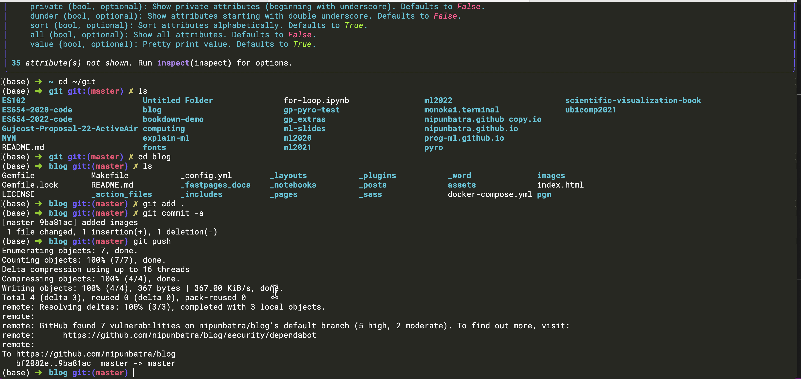
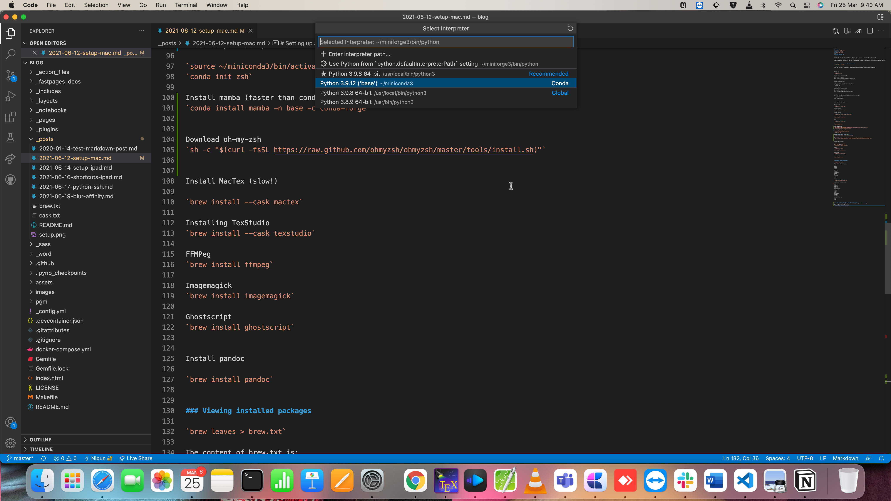

---
aliases:
- /setup/2021/06/12/setup-mac
author: Nipun Batra
badges: true
categories:
- setup
- macos
- development-environment
- productivity
- tools
date: '2021-06-12'
description: My Mac Setup
layout: post
title: My Mac Setup
toc: true
---

# Setting up a new Mac

Here is a screenshot.



This guide covers how I set up a new Mac for development. I use Homebrew as my package manager - it makes it easy to install and maintain all packages.

---

## 1. Core System Setup

### Install Xcode Command Line Tools

```bash
xcode-select --install
```

### Install Homebrew

```bash
/bin/bash -c "$(curl -fsSL https://raw.githubusercontent.com/Homebrew/install/HEAD/install.sh)"
```

### Essential CLI Tools

```bash
# Version control
brew install git

# Git credential manager
brew tap microsoft/git
brew install --cask git-credential-manager-core

# File operations
brew install wget

# Fuzzy finder
brew install fzf

# Better find alternative
brew install fd

# Better grep alternative
brew install ripgrep

# Smart cd command
brew install zoxide
```

---

## 2. Terminal Setup

### Install Ghostty

[Ghostty](https://ghostty.org/) is a modern, fast terminal emulator with excellent graphics protocol support.

```bash
brew install --cask ghostty
```

### Install Oh My Zsh

```bash
sh -c "$(curl -fsSL https://raw.github.com/ohmyzsh/ohmyzsh/master/tools/install.sh)"
```

### Install Powerline Fonts

```bash
git clone https://github.com/powerline/fonts
cd fonts
./install.sh
cd ..
rm -rf fonts
```

Configure in Terminal preferences:
- Font: Roboto Mono Light for Powerline, 18pt

### Install Monokai Theme

```bash
git clone git://github.com/stephenway/monokai.terminal.git
cd monokai.terminal
open monokai.terminal
cd ..
rm -rf monokai.terminal
```

Set as default theme in Terminal preferences.

### Terminal Image Viewers

```bash
# Fast image viewer using kitty protocol
brew install viu

# Versatile image viewer
brew install chafa
```

Usage:

```bash
viu image.jpg
viu -w 80 image.png
chafa image.jpg
```

### File Manager with Preview

[Yazi](https://github.com/sxyazi/yazi) - modern terminal file manager with image preview:

```bash
brew install yazi ffmpegthumbnailer font-symbols-only-nerd-font
```

Key bindings:
| Key | Action |
|-----|--------|
| `j/k` | Navigate files |
| `Enter` / `l` | Open file/directory |
| `h` | Parent directory |
| `Space` | Select/deselect |
| `T` | Toggle preview |
| `q` | Quit |

### Preview Tools for Yazi

```bash
brew install poppler    # PDF preview
brew install w3m bat    # HTML and text preview
brew install p7zip      # Archive preview
brew install jq         # JSON preview
```

### Yazi Configuration

Create `~/.config/yazi/yazi.toml`:

```toml
[preview]
tab_size = 2
max_width = 900
max_height = 900
cache_dir = ""
image_filter = "triangle"
image_quality = 75
sixel_fraction = 15
ueberzug_scale = 1
ueberzug_offset = [ 0, 0, 0, 0 ]

[opener]
edit = [
  { run = '${EDITOR:-vim} "$@"', block = true, desc = "Edit with default editor" },
]
open = [
    { run = 'mpv "$@"', for = "unix", desc = "Play with mpv" },
    { run = 'open "$@"', for = "mac", desc = "Open with default app" },
    { run = 'xdg-open "$@"', for = "linux", desc = "Open with default app" },
]

[plugin]
prepend_previewers = [
  { name = "*.ipynb", run = "nbpreview" },
  { name = "*.html", run = "lynx -dump" },
]
```

### Jupyter Notebook Preview in Yazi

Install the nbpreview CLI tool and Yazi plugin:

```bash
# Install nbpreview CLI
uv tool install nbpreview

# Install the Yazi plugin
ya pack -a AnirudhG07/nbpreview
```

This enables previewing `.ipynb` files directly in Yazi's preview pane with syntax highlighting, images, and formatted output.

### Ghostty Configuration

Create `~/.config/ghostty/config`:

```
keybind = shift+enter=text:

window-padding-x = 5
window-padding-y = 10
```

This configuration:
- **shift+enter keybind**: Sends a literal newline character (useful for multi-line input in REPLs)
- **window-padding**: Adds comfortable padding around the terminal content (5px horizontal, 10px vertical)

---

## 3. Python Environment with uv

### Install uv

```bash
curl -LsSf https://astral.sh/uv/install.sh | sh
export PATH="$HOME/.local/bin:$PATH"
```

Verify:

```bash
uv --version
```

### Install Python 3.12

```bash
uv python install 3.12
```

> **Note:** PyTorch GPU wheels are available only up to Python 3.12.

### Create Global Environment

```bash
uv venv ~/.uv/nb-base --python 3.12
source ~/.uv/nb-base/bin/activate
```

Auto-activation (optional):

```bash
echo 'source ~/.uv/nb-base/bin/activate' >> ~/.zshrc
```

### Install Core Packages

```bash
uv pip install -U pip setuptools wheel
uv pip install -U \
    jupyterlab ipykernel \
    numpy pandas scipy \
    matplotlib seaborn \
    scikit-learn \
    tqdm requests
```

### Install PyTorch (Mac)

For Apple Silicon (M1/M2/M3) with Metal Performance Shaders:

```bash
uv pip install torch torchvision torchaudio
```

Verify:

```bash
python -c "import torch; print(f'PyTorch {torch.__version__}'); print(f'MPS available: {torch.backends.mps.is_available()}')"
```

> **Note:** Macs don't support CUDA. Apple Silicon uses MPS for GPU acceleration; Intel Macs use CPU only.

### Register Jupyter Kernel

```bash
python -m ipykernel install --user --name nb-base --display-name "Python (nb-base)"
```

### Verify Installation

```bash
which python
python --version
jupyter kernelspec list
```

Expected output:

```
/Users/<user>/.uv/nb-base/bin/python
Python 3.12.x
nb-base   /Users/<user>/.local/share/jupyter/kernels/nb-base
```

### Update Packages

```bash
source ~/.uv/nb-base/bin/activate
uv pip list --outdated
uv pip install -U <package-name>
```

---

## 4. Applications

### Development

```bash
brew install --cask visual-studio-code
brew install --cask texstudio
```

### Productivity

```bash
brew install --cask firefox
brew install --cask zoom
```

### Media

```bash
brew install --cask vlc
brew install --cask obs
```

### Media Processing

```bash
brew install ffmpeg
brew install imagemagick
brew install ghostscript
brew install pandoc
```

---

## 5. VSCode Configuration

### Set Python Interpreter

1. Open any `.ipynb` file
2. Kernel picker -> Select Another Kernel -> Jupyter Kernel -> Python (nb-base)

Or use Command Palette:
- `Cmd + Shift + P` -> Select Python Interpreter -> `~/.uv/nb-base/bin/python`



### Workspace Settings

Create `.vscode/settings.json`:

```json
{
  "python.defaultInterpreterPath": "/Users/<user>/.uv/nb-base/bin/python",
  "jupyter.jupyterServerType": "local"
}
```

---

## 6. LaTeX Setup

### Install TinyTeX via Quarto

First, install [Quarto](https://quarto.org/docs/get-started/).

```bash
quarto install tool tinytex
```

### Install Essential LaTeX Packages

```bash
# Core collections
tlmgr install collection-fontsrecommended collection-latexrecommended \
    collection-fontsextra collection-latexextra

# Graphics and plotting
tlmgr install pgfplots tikz-cd pgf pgfgantt tikzscale tikz-3dplot

# Fonts
tlmgr install psnfss type1cm cm-super sourcesanspro sourcecodespro \
    lato roboto fira libertine

# Beamer and presentations
tlmgr install beamertheme-metropolis beamer-verona pgfopts appendixnumberbeamer

# Bibliography
tlmgr install biblatex biber logreq natbib

# Math and symbols
tlmgr install amsmath amscls amsfonts mathtools unicode-math \
    stmaryrd bbm-macros dsfont

# Tables
tlmgr install booktabs multirow longtable array tabularx \
    threeparttable siunitx

# Figures and floats
tlmgr install adjustbox collectbox subcaption wrapfig float caption placeins

# Code listings
tlmgr install listings minted fancyvrb

# Utilities
tlmgr install underscore ucs xstring etoolbox xifthen \
    enumitem parskip geometry fancyhdr hyperref cleveref \
    todonotes comment csquotes microtype

# PDF and graphics
tlmgr install pdfpages dvipng epstopdf graphicx xcolor

# Algorithms
tlmgr install algorithm2e algorithms algorithmicx

# Icons
tlmgr install fontawesome5 academicons

# Misc
tlmgr install appendix blindtext lipsum standalone
```

### Create Symlink for dvipng

```bash
ln -s ~/Library/TinyTeX/bin/*/dvipng /usr/local/bin/
```

### Find Missing Packages

```bash
tlmgr search --global --file "/sourcesanspro.sty"
```

---

## 7. macOS Customization

### Dock Settings

Disable magnification:

```bash
defaults write com.apple.dock magnification -bool false
killall Dock
```

Enable auto-hide with fast animation:

```bash
defaults write com.apple.dock autohide -bool true
defaults write com.apple.dock autohide-delay -float 0
defaults write com.apple.dock autohide-time-modifier -float 0.1
killall Dock
```

For near-instant animation:

```bash
defaults write com.apple.dock autohide-time-modifier -float 0.01
killall Dock
```

Revert auto-hide:

```bash
defaults write com.apple.dock autohide -bool false
killall Dock
```

### Dock Position

```bash
# Left
defaults write com.apple.dock orientation -string left && killall Dock

# Bottom (default)
defaults write com.apple.dock orientation -string bottom && killall Dock

# Right
defaults write com.apple.dock orientation -string right && killall Dock
```

---

## 8. Package Lists

### View Installed Packages

```bash
# Homebrew formulae
brew leaves > brew.txt

# Homebrew casks
brew list --cask > casks.txt
```

### My Current Formulae

```
boost
cmake
ffmpeg
fish
git
graphviz
ilmbase
imagemagick
pandoc
r
rtmpdump
swig
vim
wget
```

### My Current Casks

```
anydesk
arduino
audacity
firefox
google-chrome
inkscape
keycastr
mactex
notion
obs
pdf-expert
pycharm
rstudio
simplenote
texstudio
visual-studio-code
vlc
zoom
```
