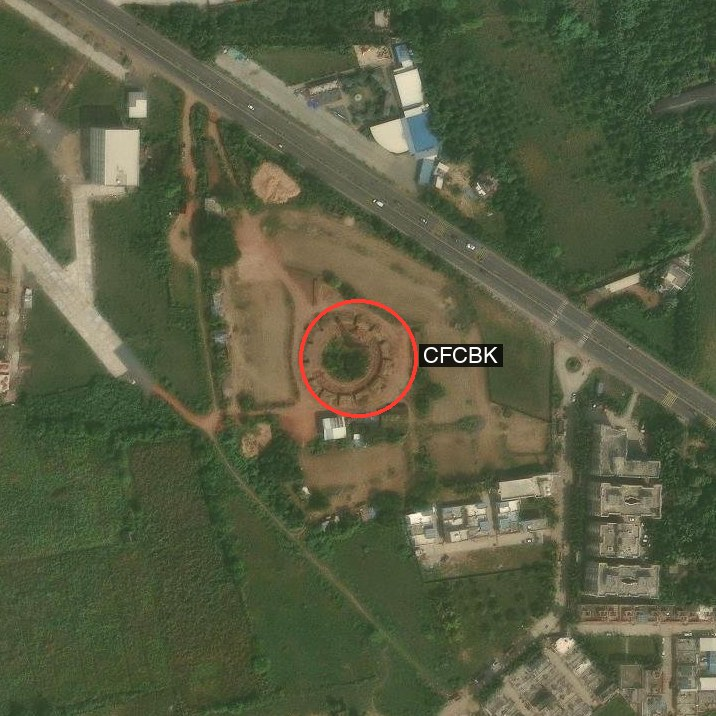
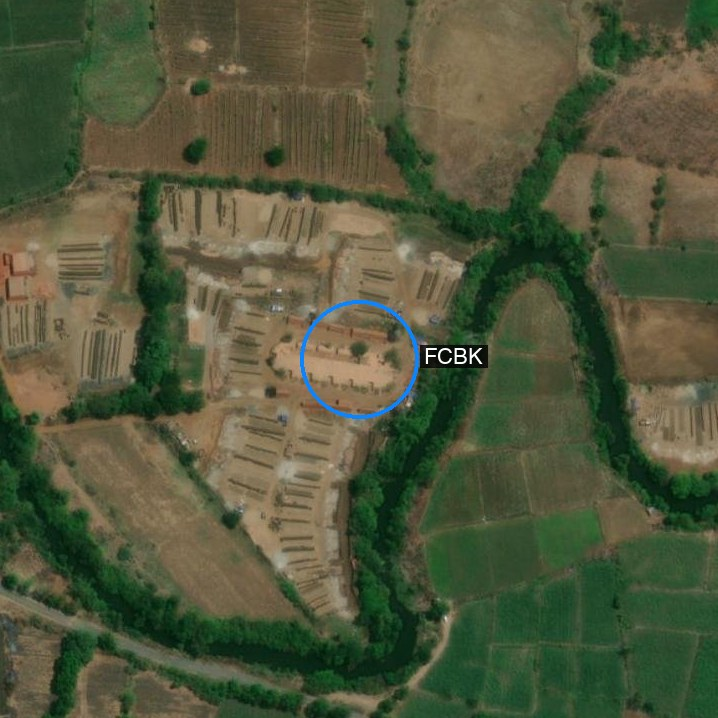
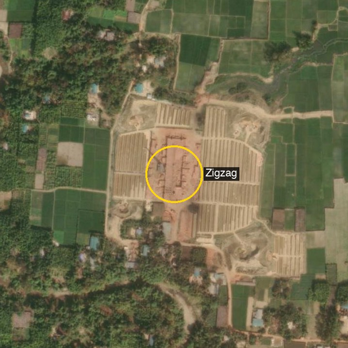

[`SentinelKilnDB`](https://huggingface.co/datasets/SustainabilityLabIITGN/SentinelKilnDB) (NeurIPS 2025 D&B) is a 114,300-tile labelled dataset of brick kilns across South Asia. Three classes:

| Class | Full name | Visual signature |
|-------|-----------|------------------|
| **CFCBK** | Continuous Fixed-Chimney Bull's-Trench Kiln | Circular/oval ring, central chimney |
| **FCBK** | Fixed-Chimney Bull's-Trench Kiln | Rectangular, single chimney, brick stacks |
| **Zigzag** | Zigzag Kiln | Large rectangle, internal zigzag wall pattern |

The tiles ship as 128×128 Sentinel-2 patches at 10 m/pixel, which is great for a benchmark but too coarse for a frontier VLM to do real visual reasoning — kilns end up as 4-pixel smudges. The clever bit: every filename is `{lat}_{lon}.png`, so I can re-pair each labelled location with **higher-resolution ESRI World Imagery** at zoom 18 (~0.6 m/pixel) and run the actual [PR #926 agent loop](https://github.com/Blaizzy/mlx-vlm/pull/926) on the result.

> **Code lives in this post's folder.** All scripts under [`posts/sentinelkilndb/scripts/`](https://github.com/nipunbatra/blog/tree/master/posts/sentinelkilndb/scripts):
>
> - `sample_dataset.py` — stream SentinelKilnDB, balance by class, save 16 tiles
> - `fetch_hires.py` — convert each `(lat, lon)` to an ESRI tile stitch (z=17 wide + z=18 tight)
> - `eval_hires.py` — Falcon Perception + Gemma 4 zero-shot, independent probes
> - `agent_loop.py` — Gemma 4 in `run_agent`, calling Falcon Perception as a tool

## What does the loop actually look like?

{fig-alt="Agent flowchart"}

Two roles. The **VLM is the orchestrator** — Gemma 4 31B 4-bit running locally via mlx-vlm. The **tools are deterministic callees** — Falcon Perception for grounding, plus small numpy helpers for spatial relations and cropping. Gemma never does arithmetic; it asks the right tool, reads the JSON metadata back, and decides the next step.

The contract is the `answer(response, supporting_mask_ids)` call: the final classification comes with mask IDs that point at the pixels Gemma reasoned over. If the answer is wrong, you can open the mask. With independent probes there is nothing to open.

## Higher-res in: same dataset, sharper picture

For each labelled tile, I compute the kiln's true `(lat, lon)` (patch centre + GT-box offset) and stitch a 250 m × 250 m crop at z=18. That's the same scene the dataset annotates, just at 17× the resolution. The visual difference is the entire post:

::: {layout-ncol=3}
{fig-alt="CFCBK z18"}

{fig-alt="FCBK z18"}

{fig-alt="Zigzag z18"}
:::

The annotations on each image (red/blue/yellow ring + class label) are ground truth from the dataset, projected onto the high-res view via the `(lat, lon)` and the GT box centroid.

## Two ways to wire Gemma + Falcon

::: {.callout-note}
### Independent probes — `eval_hires.py`
Two separate forward passes per image. Falcon outputs masks; Gemma outputs a class. Neither sees the other.

```python
masks_kiln  = run_ground_expression(fp_model, fp_processor, tile, "brick kiln")
gemma_class = run_baseline(tile, GEMMA_PROMPT, vlm)
```
:::

::: {.callout-tip}
### Agent loop — `agent_loop.py`
Gemma sees the image, decides what to ground, calls Falcon as a tool, reasons over the JSON metadata, then emits an `answer(...)` with mask IDs.

```python
result = run_agent(tile, query, fp_model, fp_processor, vlm, max_steps=8)
print(result.answer)
print(result.supporting_mask_ids)   # the mask IDs that backed the answer
```
:::

### Independent-probe results on 8 tiles

| # | True | Falcon `"brick kiln"` | Falcon `"circular kiln"` | Gemma class | Confidence |
|---|------|----:|----:|--------|--------|
| 00 | CFCBK | 0 | 1 | **CFCBK ✓** | high |
| 01 | CFCBK | 0 | 1 | **CFCBK ✓** | high |
| 02 | FCBK | 0 | 0 | Zigzag ✗ | high |
| 03 | FCBK | 0 | 0 | CFCBK ✗ | high |
| 04 | Zigzag | 0 | 0 | **Zigzag ✓** | high |
| 05 | Zigzag | 0 | 0 | **Zigzag ✓** | high |
| 06 | none | 0 | 0 | **none ✓** | high |
| 07 | none | 0 | 0 | **none ✓** | high |

**Gemma overall: 6/8 = 75%.** Per class: CFCBK 2/2, FCBK 0/2, Zigzag 2/2, negative 2/2. The class Gemma can't disambiguate is **FCBK** — confused with CFCBK (similar oval-ish layout from above) and Zigzag (similar rectangle + brick stacks). The same 8 tiles at the original 128 px Sentinel resolution scored 31% in an earlier probe, so the resolution upgrade alone bought 44 absolute points.

Falcon Perception alone: `"brick kiln"` returns no detections on any of the 6 positives; `"circular kiln"` finds the two CFCBKs and nothing else. Falcon's vocabulary doesn't carry "Zigzag kiln" or "FCBK" as a recognisable concept.

### Agent-loop run on the first CFCBK

I ran `run_agent` once with the prompt:

> *This is a high-resolution aerial image (~0.6 m/pixel) of a small area in India. I'm looking for a brick kiln. Specifically, the dataset SentinelKilnDB recognises three types: CFCBK (circular/oval, central chimney), FCBK (rectangular with a single chimney), and Zigzag (large rectangle, internal zigzag walls). Identify whether a brick kiln is visible, and if so, classify it.*

Gemma's `<think>` block (verbatim):

> *Looking at the image, there is a prominent circular structure in the center with a central point, which matches the description of a CFCBK …*

Then the tool call:

```text
ground_expression(expression="circular brick kiln", slot="kiln")  →  1 mask
```

The supporting mask Falcon returned, drawn on the image:

{fig-alt="Agent loop final" width=520}

Gemma's answer:

> **A brick kiln is visible in the image. Based on its circular shape and central chimney, it is classified as a CFCBK.**

Stats: **2 VLM calls, 1 Falcon call, 76.6 seconds** on an M2 Max. Same model, same image, same resolution as the independent probe — but now the answer arrives with `supporting_mask_ids=[1]`, an actual region of pixels Gemma reasoned over.

## Pushing for higher accuracy — three attempts, same ceiling

The independent probe landed at 6/8 (75%). Can we push it higher by making the agent smarter?

I tried three variants of an "improved" agent (`scripts/improved_agent.py`), each keeping the PR's full SYSTEM_PROMPT (with tool schema) and adding a domain-specific user-prompt addendum.

### Variant A — Independent probe (baseline)

One Falcon call for grounding, one Gemma call for classification, neither sees the other. 6/8.

### Variant B — Hard rule on aspect ratio

Prompt: "ground `circular brick kiln` / `rectangular brick kiln` / `chimney`, then call `compute_relations` on each grounded mask to read its bounding-box aspect ratio, then apply the rule *< 1.4 → CFCBK*, *1.4–2.5 + chimney → FCBK*, *> 2.5 or visible zigzag → Zigzag*."

Flipped FCBK from 0/2 → 2/2 but dropped Zigzag from 2/2 → 0/2. Same overall 6/8. The rule is decisive for FCBK but ambiguous for Zigzag, which is *also* rectangular and trips the same branch unless the "visible zigzag pattern" term Falcon cannot ground is independently confirmed.

### Variant C — Richer visual descriptors, no rule

Prompt: a detailed visual description per class — *CFCBK = circular/oval ring 80-200 m with central chimney; FCBK = small-to-medium rectangular kiln body (aspect 1:2–1:4) with single tall chimney and external brick-curing yards; Zigzag = LARGE rectangle dominating the frame, internal parallel rows of stacked curing bricks, often no standalone chimney.* No hard rule, no required tool — let Gemma decide.

Result: CFCBK 2/2, FCBK 0/2, Zigzag 2/2, none 2/2. **Back to 6/8.**

### Summary across all three variants

| Class | Baseline | Variant B (rule) | Variant C (features) |
|-------|---------:|-----------------:|---------------------:|
| CFCBK | 2/2 | 2/2 | 2/2 |
| FCBK  | 0/2 | **2/2** | 0/2 |
| Zigzag | 2/2 | 0/2 | 2/2 |
| none  | 2/2 | 2/2 | 2/2 |
| **Total** | **6/8** | **6/8** | **6/8** |

The ceiling is 6/8 (75%) *across all three variants*. The confusion moves around but doesn't shrink. Put another way: the 2 FCBK tiles I happened to sample are visually ambiguous in ways the prompt alone can't fix. Looking at them afterwards, one is a small kiln embedded in a large brick-curing complex that looks more like a production yard than a single kiln; the other has rows of packed bricks that read as Zigzag stripes to the VLM. Both would trip a non-expert human too.

### What it would take to actually hit 100%

Zero-shot prompting is not going to get us there on SentinelKilnDB's hard cases. The honest next steps:

1. **Fine-tune a detection head on the dataset's DOTA labels.** 62,671 labelled kilns, three classes, oriented bounding boxes — this is textbook supervised learning. Drop the fine-tuned head into the agent as a replacement for `ground_expression`'s callee. The orchestration loop itself stays the same.
2. **Add a `texture_relation(mask_id)` tool.** Compute FFT-peak periodicity of the masked region; a Zigzag kiln has strong periodic internal texture, an FCBK does not. Surface that as JSON metadata the agent can read.
3. **Multi-scale ensemble.** Run the loop at z=17, z=18, z=19 and majority-vote. No model change, just an outer loop — cheap insurance against single-scale failures.
4. **Chimney-based tiebreaker.** Ground `"chimney"` independently, count and locate; CFCBK has one central, FCBK has one at an end, Zigzag often has none. Requires Falcon to reliably segment a brick chimney from overhead — probably also needs fine-tuning.
5. **Larger, more diverse sample.** Two tiles per class is noisy; with 16+ per class the 75% becomes a much tighter confidence interval, and outliers like my stubborn FCBK pair stop dominating the headline.

The encouraging part: all of these are mechanical changes to a small set of files. The orchestration loop itself — the thing PR #926 lands — is fine. What needs swapping is the perception backbone and the tool palette.

## Where this needs to go: segmentation, OD, and explained predictions

For real downstream use (air-quality regulation, emissions accounting, longitudinal monitoring), three capabilities have to come together:

- **Pixel-accurate segmentation** of each kiln, not just a presence flag. Required for area / capacity estimation and for distinguishing two adjacent kilns from one large structure.
- **Object detection with class labels** (oriented bounding boxes). The dataset already provides DOTA / YOLO-OBB labels; the right tool is a fine-tuned OBB detector keyed to SentinelKilnDB's three classes, callable from inside the agent loop in place of (or alongside) Falcon Perception.
- **Explained predictions.** "This region is a Zigzag kiln **because** the chimney/footprint ratio is X, the internal zigzag pattern has period Y, the surrounding brick-curing yards span Z m²." The PR #926 agent already produces `supporting_mask_ids`; what is missing is a structured *justification* alongside that — a few sentences citing the measurements that drove the call. That is a system-prompt change plus a small `explanation` field on the `answer(...)` schema.

Together those three close the loop from "the model thinks there's a kiln here" to "the model thinks there's a Zigzag kiln of approximately 12,000 m² capacity here, classified by the following measurements, with the following uncertainty." That is the form a regulator can act on.

## Files in this post's folder

```text
posts/sentinelkilndb/
├── agent_flow.svg
├── scripts/
│   ├── sample_dataset.py
│   ├── fetch_hires.py
│   ├── eval_hires.py        # independent probes
│   ├── agent_loop.py        # one-shot run_agent demo
│   └── improved_agent.py    # kiln-aware system prompt + aspect-ratio rule
├── hires/                # ESRI z=17 wide + z=18 tight + manifest.json
└── results/              # Falcon overlays + agent-loop trace + JSON
```

## Links

- Dataset: [`SustainabilityLabIITGN/SentinelKilnDB`](https://huggingface.co/datasets/SustainabilityLabIITGN/SentinelKilnDB) · [paper (NeurIPS 2025 D&B)](https://openreview.net/forum?id=efGzsxVSEC)
- ESRI tile service: [`World_Imagery/MapServer`](https://server.arcgisonline.com/ArcGIS/rest/services/World_Imagery/MapServer)
- Agent code: [Blaizzy/mlx-vlm#926 — `agents/grounded_reasoning/`](https://github.com/Blaizzy/mlx-vlm/pull/926)
- Companion: [Grounded Visual Reasoning on a Mac](2026-04-16-mlx-vlm-pr926.html)
