[`SentinelKilnDB`](https://huggingface.co/datasets/SustainabilityLabIITGN/SentinelKilnDB) (NeurIPS 2025 D&B) is a 114,300-tile labelled dataset of brick kilns across South Asia. Three classes distinguished by *shape*:

| Class | Full name | Shape signature |
|-------|-----------|------------------|
| **CFCBK** | Continuous Fixed-Chimney Bull's-Trench Kiln | **Circular** ring (aspect ≈ 1:1), central chimney |
| **FCBK**  | Fixed-Chimney Bull's-Trench Kiln | **Oval / stadium-track** (aspect 1:1.5–1:2.5), single chimney |
| **Zigzag** | Zigzag Kiln | **Rectangular** with sharp corners, internal zigzag walls |

Filenames are `{lat}_{lon}.png`, so every patch has a free-lookup GPS. I pair each labelled tile with high-resolution **ESRI World Imagery** at zoom 18 (≈0.6 m/pixel, 17× the Sentinel-2 resolution) and run the [PR #926 agent loop](https://github.com/Blaizzy/mlx-vlm/pull/926) on the result.

> **Code lives in this post's folder** — [`posts/sentinelkilndb/scripts/`](https://github.com/nipunbatra/blog/tree/master/posts/sentinelkilndb/scripts):
>
> - `sample_dataset.py`, `sample_more_fcbk.py` — stream SentinelKilnDB, balance by class
> - `fetch_hires.py` — convert each (lat, lon) to an ESRI tile stitch (z=17 wide + z=18 tight)
> - `eval_hires.py` — Variant A independent probe
> - `agent_loop.py` — Gemma calling Falcon as a tool, one-tile demo
> - `improved_agent.py` — kiln-aware prompts (variants B and C)
> - `per_tile_masks.py` — this post's rigorous per-tile mask grids

## The agent loop from PR #926

{fig-alt="Agent flow"}

Every variant in this post is a specialisation of the above — they differ only in what system prompt Gemma runs under and which tools it chooses to call.

## Higher-resolution imagery — the free upgrade

Sentinel-2 at 10 m/px turns a 120 m kiln into a 12-pixel smudge. ESRI at 0.6 m/px gives you the whole structure. Examples of each class at that resolution (annotated with class-coloured GT):

::: {layout-ncol=3}
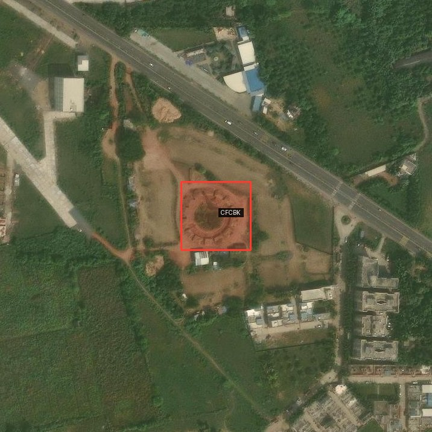

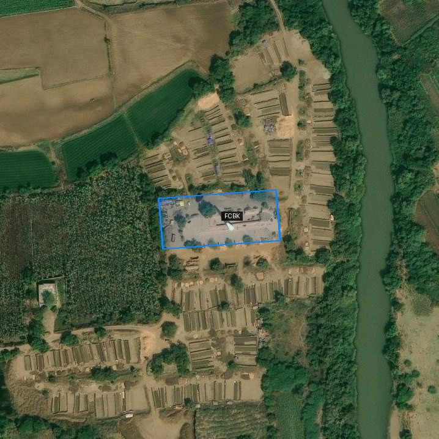

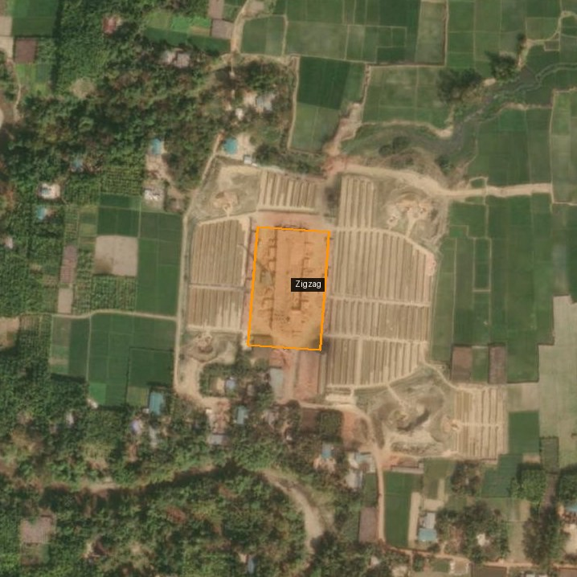
:::

The polygons are SentinelKilnDB's oriented-bounding-box labels (DOTA format) — converted from 128-px Sentinel pixel coords into the ESRI crop's pixel space by going through (lat, lon) as an intermediate. The script for this is [`scripts/draw_gt_obb.py`](https://github.com/nipunbatra/blog/tree/master/posts/sentinelkilndb/scripts/draw_gt_obb.py) — it uses a simple metres-per-pixel conversion; you can also use [`supervision`](https://github.com/roboflow/supervision) for the same job if you'd rather have a more featureful annotator.

The three shapes are *visually distinct* at this resolution, which is the whole premise of whether a VLM can classify them.

## Three ways to wire Gemma + Falcon

I ran three variants of the classifier. Each is a specialisation of the PR #926 loop above, differing only in the system prompt and which tools the orchestrator chooses to call.

### Variant A — Independent probes

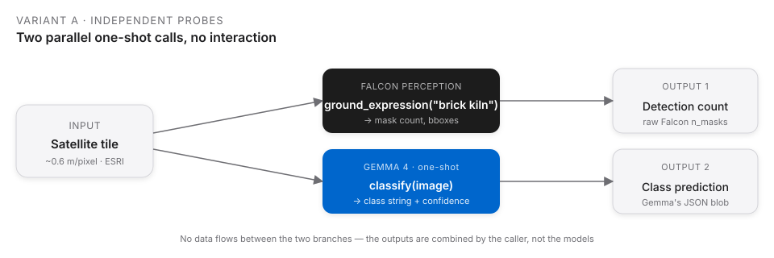{fig-alt="Variant A flowchart"}

Two separate one-shot calls per image. Falcon outputs masks; Gemma outputs a class. **Neither model sees the other's output.** This is the simplest and cheapest wiring.

```python
masks  = run_ground_expression(fp_model, fp_processor, tile, "brick kiln")
pred   = run_baseline(tile, GEMMA_PROMPT_WITH_SHAPE_HINTS, vlm)
```

### Variant B — Aspect-ratio rule

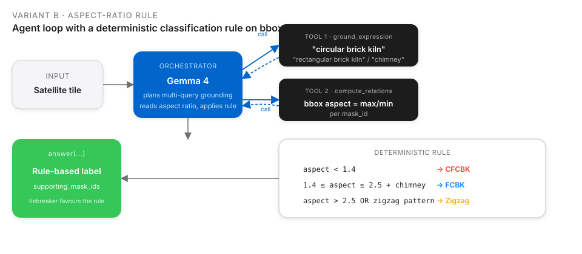{fig-alt="Variant B flowchart"}

Gemma becomes the orchestrator. It grounds multi-query shape expressions, reads bounding-box aspect via `compute_relations`, then **applies a hard rule in prompt-space** (`< 1.2` → CFCBK, `1.2–2.5` → FCBK, `> 2.5` → Zigzag).

### Variant C — Visual-feature descriptors

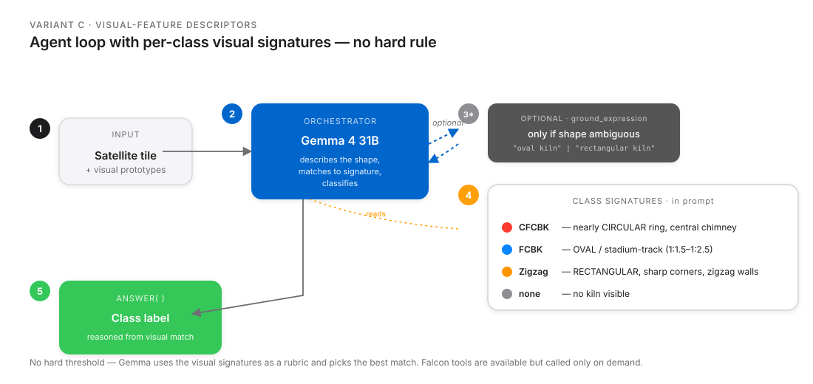{fig-alt="Variant C flowchart"}

Same agent loop, but the prompt carries **per-class visual signatures** instead of a rule. Gemma describes the shape, matches it to a signature, and classifies without the rigid threshold.

## Per-tile mask grids — every query, every tile

For rigour, I ran Falcon Perception with *four different grounding expressions* on every tile, then asked Gemma (independent probe, Variant A, with corrected shape descriptions) for a class. Each row below is one tile. Columns left to right: **GT annotation**, `"brick kiln"`, `"oval brick kiln"`, `"circular brick kiln"`, `"rectangular brick kiln"`.

### CFCBK — circular ring (2/2 correct)

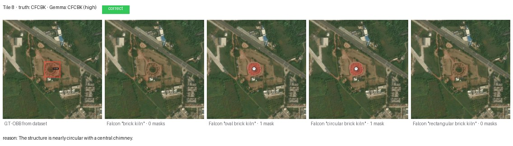{fig-alt="Tile 8 CFCBK"}

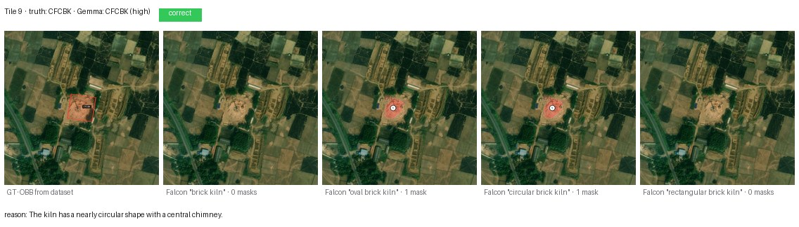{fig-alt="Tile 9 CFCBK"}

Both CFCBKs are cleanly identified. Falcon grounds the ring under both `"oval brick kiln"` and `"circular brick kiln"` (1 mask each) — unsurprising, since a CFCBK *is* a very-low-eccentricity oval. Gemma's reason cites the shape explicitly: *"nearly circular with a central chimney."*

### Zigzag — angular rectangle (2/2 correct)

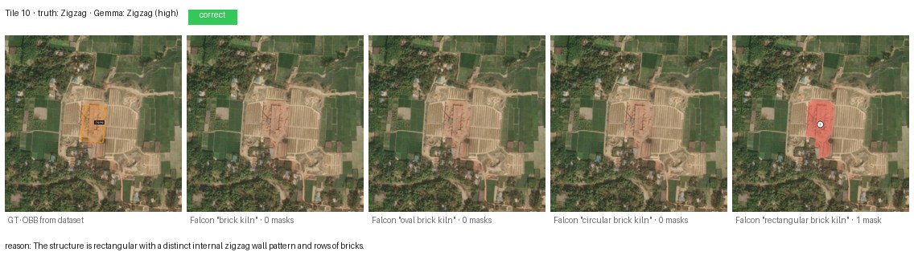{fig-alt="Tile 10 Zigzag"}

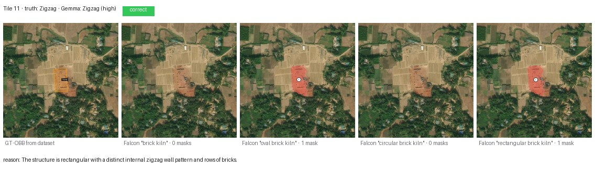{fig-alt="Tile 11 Zigzag"}

Both Zigzags correct. Falcon's `"rectangular brick kiln"` query is the one that fires — which is diagnostic: Zigzag is the only class where Falcon's segmentation aligns with the word "rectangular." Gemma's reason: *"rectangular with a distinct internal zigzag wall pattern and rows of bricks."*

### FCBK — oval / stadium-track (4/8 correct)

The hardest class. Eight fresh tiles from the test split:

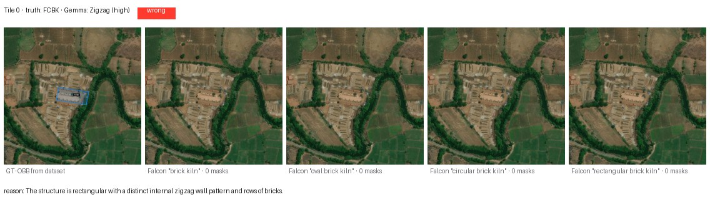{fig-alt="Tile 0 FCBK"}

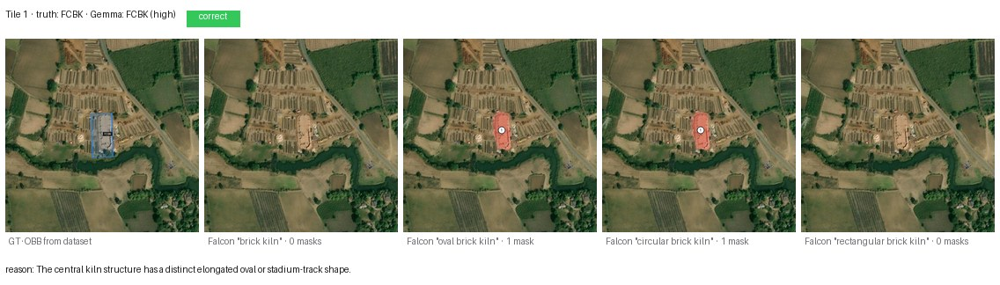{fig-alt="Tile 1 FCBK"}

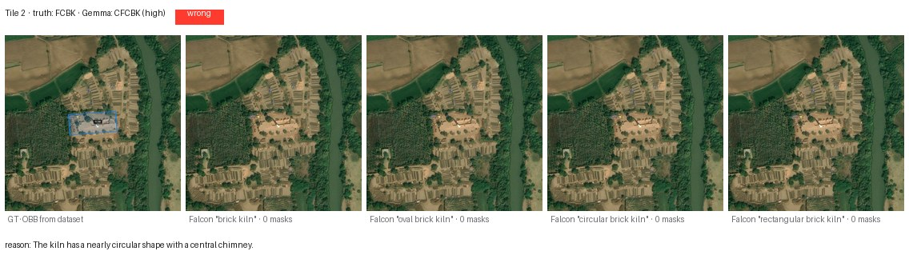{fig-alt="Tile 2 FCBK"}

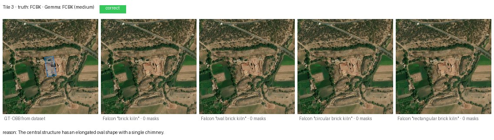{fig-alt="Tile 3 FCBK"}

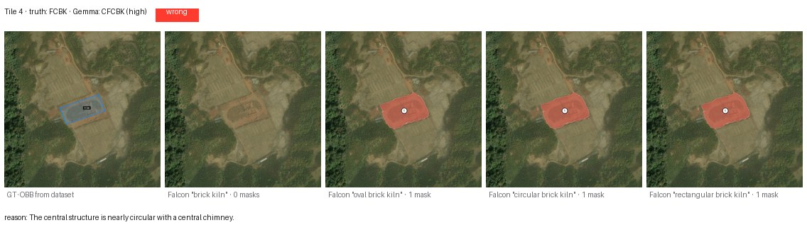{fig-alt="Tile 4 FCBK"}

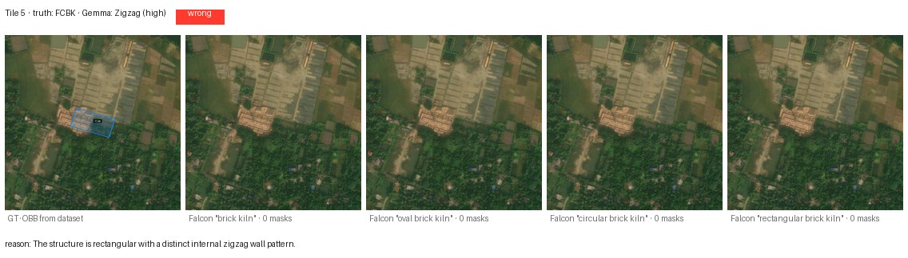{fig-alt="Tile 5 FCBK"}

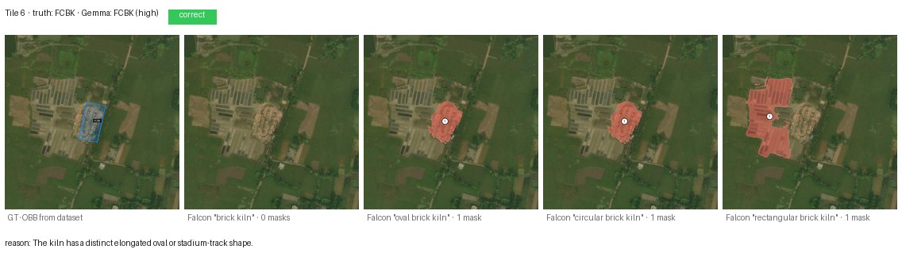{fig-alt="Tile 6 FCBK"}

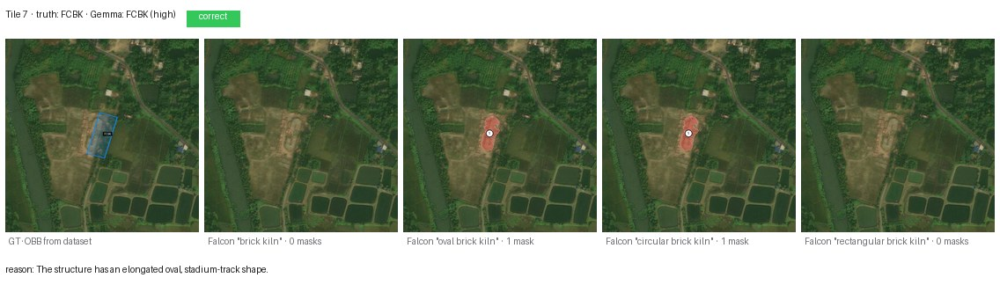{fig-alt="Tile 7 FCBK"}

Four failures worth inspecting closely:

- **Tile 0** (called **Zigzag**): the kiln sits inside a sprawling brick-curing yard with row-of-stacks texture that Gemma reads as zigzag striation.
- **Tile 2** (called **CFCBK**): the oval is compressed enough in this shot that Gemma rounds it up to circular.
- **Tile 4** (called **CFCBK**): same failure mode — near-1:1 oval.
- **Tile 5** (called **Zigzag**): a different kiln type visually co-located; Gemma latches onto the more striking structure.

A human remote-sensing expert would correct all four from context (knowing which region favours which kiln design). Gemma, without that geographic prior, is reading the pixels literally.

## Four Falcon queries across all 12 tiles

| Query | Tiles with ≥1 mask | Useful for |
|-------|----:|------|
| `"brick kiln"` | **0/12** | Nothing — the generic term does not ground |
| `"oval brick kiln"` | 6/12 | CFCBKs + clear FCBKs |
| `"circular brick kiln"` | 5/12 | CFCBKs + CFCBK-looking FCBKs |
| `"rectangular brick kiln"` | 4/12 | Zigzags + some FCBKs |

Two takeaways:

1. **The noun phrase matters enormously.** `"brick kiln"` segments *nothing* on this dataset, even on the 10 positive tiles. Swap to `"oval brick kiln"` and Falcon fires on half of them. Falcon Perception was trained on natural-scene language; `"brick kiln"` as a bare concept does not map to an aerial kiln in its learned vocabulary.
2. **Shape-specific queries are discriminative.** Only Zigzags fire under `"rectangular brick kiln"` and no CFCBKs — i.e., Falcon *is* using the shape word, not just the noun. That is the reason Variant B's rule works at all.

## Results table

Gemma 4 31B (4-bit MLX) as an independent one-shot classifier, Variant A, **with the corrected shape descriptors** (FCBK = oval, not rectangular). Twelve tiles from the test split, ESRI z=18.

| Class | n | Correct | Accuracy |
|-------|--:|--------:|---------:|
| CFCBK | 2 | 2 | **100%** |
| FCBK  | 8 | 4 | **50%** |
| Zigzag | 2 | 2 | **100%** |
| **Overall** | **12** | **8** | **67%** |

One earlier version of the post used a prompt that called FCBK "rectangular" — which is wrong, that's Zigzag. Under that wrong prompt, **FCBK accuracy was 0/2 — 0%**. Fixing a single word ("oval" instead of "rectangular") moved it to 4/8 = 50%. A reminder that prompts for domain-specific classes need domain-specific language; class names alone don't carry the visual prototype.

## How the three variants trade off

I ran all three variants on the original eight-tile sample. The headline:

| Variant | Prompt | FCBK acc | Zigzag acc | Overall |
|---------|--------|---------:|-----------:|--------:|
| A · independent probe | visual hints only | 0/2 (with old "rectangular FCBK" prompt) | 2/2 | 6/8 |
| B · aspect-ratio rule | `< 1.2`/`1.2-2.5`/`> 2.5` | **2/2** | 0/2 | 6/8 |
| C · visual features | per-class signatures | 0/2 | 2/2 | 6/8 |

Three different prompt strategies, **same 6/8 overall**. Variant B's rule fixed FCBK at the cost of losing Zigzag (the rule treats rectangles as Zigzag only when aspect > 2.5, but compact Zigzags have aspect closer to 1.8). Variant C performs like A with slightly more reliability because the agent can optionally ground masks to back its claim.

The *real* win was the corrected shape description (oval, not rectangular), which lifted FCBK from 0 → 4 (on the expanded 8-tile sample) without any architectural change.

## Why 100% is not a prompt problem

I set out to push this to 100%. Zero-shot prompting cannot get there. The four remaining FCBK failures above are genuinely shape-ambiguous at this resolution — a 1:1.3 oval embedded in a brick-curing complex reads as CFCBK or Zigzag depending on which neighbour the model latches onto. No amount of prompt tweaking is going to un-ambiguate those pixels. Paths that *would* close the gap:

1. **Fine-tune a detection head on SentinelKilnDB's DOTA labels** (62,671 labelled kilns, oriented boxes, three classes). Drop it into the agent in place of `ground_expression`'s callee — the orchestration loop is unchanged.
2. **Add a `texture_relation(mask_id)` tool** that computes FFT-peak periodicity inside a mask. Zigzag kilns have strong internal periodicity from the brick rows; FCBK does not. Surface that as a number the agent can read.
3. **Chimney-count tiebreaker.** Ground `"chimney"` separately; CFCBK has one central chimney, FCBK has one at an end, Zigzag usually has none. Needs a fine-tuned chimney detector to work reliably at 0.6 m/px.
4. **Multi-scale ensemble** at z=17, z=18, z=19 with majority-vote.
5. **Context prior.** The dataset covers the Indo-Gangetic Plain, Afghanistan, Pakistan, and Bangladesh. Zigzag is dominant in Punjab / UP / Haryana; FCBK is common in coastal Maharashtra; CFCBK is rare overall. A weak geographic prior on `(lat, lon)` would disambiguate a lot of the residual confusion.

## What this needs to become: segmentation, OD, and explained predictions

For regulator-facing use (air-quality accounting, kiln-capacity estimation, longitudinal monitoring):

- **Pixel-accurate segmentation** of each kiln, not just presence. Required for capacity and for separating adjacent kilns from single large structures.
- **Oriented bounding boxes with class labels** — the dataset already provides DOTA-format annotations; wire an OBB detector into the agent as a tool.
- **Explained predictions.** *"This is a Zigzag kiln because the chimney/footprint ratio is X, the internal zigzag period is Y m, the surrounding brick yards span Z m²."* The PR #926 agent already produces `supporting_mask_ids`; what is missing is a structured *justification* field citing the measurements that drove the call.

Together those three close the loop from "the model thinks there's a kiln" to "the model thinks there's a Zigzag kiln of approximately 12,000 m² capacity, classified by the following measurements, with the following uncertainty." That is the form a regulator can act on.

## Files in this post's folder

```text
posts/sentinelkilndb/
├── agent_flow.svg              # PR #926 end-to-end loop
├── flow_A_independent.svg      # Variant A
├── flow_B_rule.svg             # Variant B
├── flow_C_features.svg         # Variant C
├── scripts/
│   ├── sample_dataset.py       # stream SentinelKilnDB, balance classes
│   ├── sample_more_fcbk.py     # 8 fresh FCBK tiles
│   ├── fetch_hires.py          # ESRI World_Imagery stitch at z=17 + z=18
│   ├── eval_hires.py           # Variant A on the first 8 tiles
│   ├── agent_loop.py           # one-tile walkthrough of run_agent
│   ├── improved_agent.py       # Variants B and C
│   ├── eval_all_variants.py    # A + C on the expanded 12-tile set
│   └── per_tile_masks.py       # this post's per-tile mask grids
├── hires/                      # first 8 tiles · z=17 + z=18 + manifest
├── hires_extra/                # 12 expanded tiles · z=18 + manifest
└── results/
    ├── hires_results.json      # Variant A, first 8 tiles
    ├── improved_results.json   # Variant B, first 8 tiles
    ├── v3_results.json         # Variant C, first 8 tiles
    ├── v4_partial.json         # corrected shape prompt, 8 fresh FCBKs
    ├── agent_loop_*            # single-tile run_agent demo artefacts
    └── per_tile/               # per-tile Falcon overlays + Gemma metadata
        ├── NN_class/00_input.jpg
        ├── NN_class/01_gt.jpg
        ├── NN_class/02_falcon_{brick,oval,circular,rectangular}_kiln.jpg
        └── NN_class/metadata.json
    └── per_tile_strips/        # 5-panel composites shown in this post
```

## Links

- Dataset: [`SustainabilityLabIITGN/SentinelKilnDB`](https://huggingface.co/datasets/SustainabilityLabIITGN/SentinelKilnDB) · [paper (NeurIPS 2025 D&B)](https://openreview.net/forum?id=efGzsxVSEC)
- ESRI tile service: [`World_Imagery/MapServer`](https://server.arcgisonline.com/ArcGIS/rest/services/World_Imagery/MapServer)
- Agent code: [Blaizzy/mlx-vlm#926 — `agents/grounded_reasoning/`](https://github.com/Blaizzy/mlx-vlm/pull/926)
- Companion: [Grounded Visual Reasoning on a Mac](2026-04-16-mlx-vlm-pr926.html)
