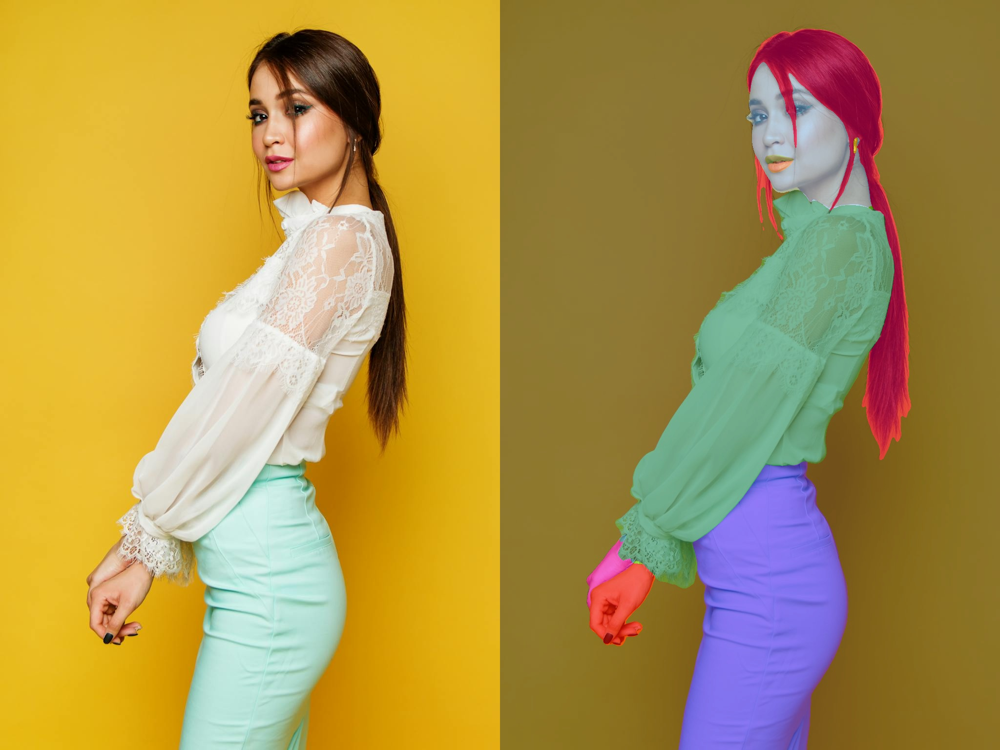
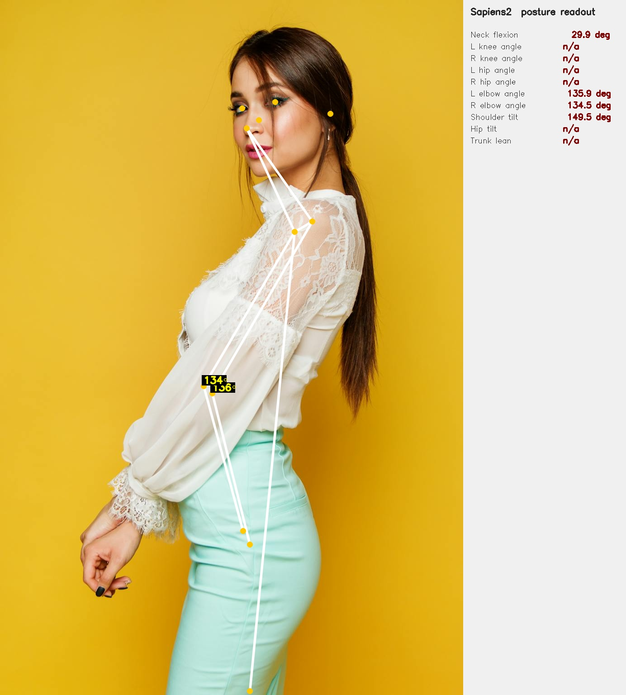
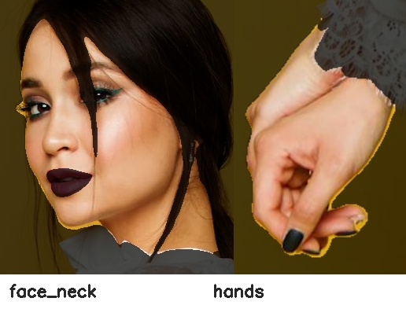
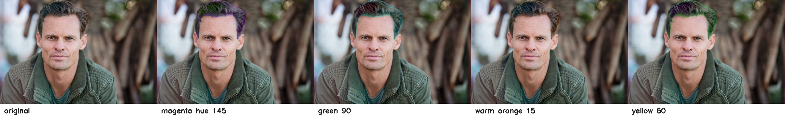

[Sapiens2](https://huggingface.co/facebook/sapiens2) is Meta's follow-up to the original [Sapiens](https://huggingface.co/facebook/sapiens), released two days ago (2026-04-23) and accepted at ICLR 26. It's a family of vision transformers pretrained on **1 billion human images** at up to 4K, with task heads for four human-centric problems:

| Task | Output | Sizes available |
|------|--------|-----------------|
| **Pose** | 308 2D keypoints (body + face + hands + feet) | 0.4B, 0.8B, 1B, 5B |
| **Body-part segmentation** | 29-class per-pixel labels (face, hair, hands, …) | 0.4B, 0.8B, 1B, 5B |
| **Surface normals** | per-pixel unit vectors in camera frame | 0.4B, 0.8B, 1B, 5B |
| **Pointmap** | dense 3D point per pixel | 0.4B, 0.8B, 1B, 5B |

The official inference path is CUDA-only (mmpose-style multi-GPU job sharding, plus an `mmdet` person detector for pose). I cloned the repo, swapped `device='cuda:0'` for `device='mps'`, and (for pose) bypassed the detector with a full-image bounding box. It just works. **0.4B forward pass: ~0.6–1.6 s per 1024×768 image on an M2 Max, no code changes beyond the device string.**

The interesting question isn't "does it run on a Mac" — it's **"what can you measure with it once it does?"** This post leans toward health-relevant primitives:

1. **Joint-angle readout** — knees, hips, elbows, neck flexion, trunk lean from pose keypoints.
2. **Body symmetry** — left/right shoulder and hip alignment.
3. **Gait analysis on video** — trunk-lean and stride-asymmetry time-series across a 12-frame walking clip.
4. **Tele-dermatology ROI** — clean Face/Neck and hand crops from the seg head, ready to feed a downstream lesion classifier.
5. **Foreground-only relighting** — Lambertian shading using normals + seg mask.
6. **Selective hair recolour** — HSV rotation confined to the seg "Hair" class.

None of these are clinical claims. They are **measurement primitives** — the numbers a screening protocol or a physiotherapist would use to decide what to do next.

> Code: [`posts/sapiens2/scripts/`](https://github.com/nipunbatra/blog/tree/master/posts/sapiens2/scripts) — `run_normal.py`, `run_seg.py`, `run_pose.py`, `relight.py`, `apps.py`, `health.py`, `gait_video.py`.

## Setup

```bash
# Pure-PyTorch package, no mmcv, no custom CUDA extensions.
git clone --depth=1 https://github.com/facebookresearch/sapiens2 /tmp/sapiens2
pip install -e /tmp/sapiens2

# Three task checkpoints (smallest size: 1.6 GB each)
hf download facebook/sapiens2-normal-0.4b sapiens2_0.4b_normal.safetensors --local-dir ~/sapiens2_host/normal
hf download facebook/sapiens2-seg-0.4b    sapiens2_0.4b_seg.safetensors    --local-dir ~/sapiens2_host/seg
hf download facebook/sapiens2-pose-0.4b   sapiens2_0.4b_pose.safetensors   --local-dir ~/sapiens2_host/pose
```

The bundled `vis_*.py` scripts assume `cuda:0` and 8 GPUs. The model itself doesn't care — `init_model()` accepts any device string. For pose, the bundled driver also calls `init_detector` from `mmdet`; my [`run_pose.py`](https://github.com/nipunbatra/blog/tree/master/posts/sapiens2/scripts/run_pose.py) skips that and passes the whole image as a single bounding box, which is fine when there's one centred subject.

Cold load + one inference takes ~5–7 s the first time per head; subsequent calls are sub-second:

| Head | Image | Forward (warm) |
|------|-------|----------------|
| `normal-0.4b` | 1024×683 | 0.85 s |
| `normal-0.4b` | 1024×1536 | 0.87 s |
| `seg-0.4b`    | 1024×683 | 0.69 s |
| `seg-0.4b`    | 1024×1536 | 0.55 s |
| `pose-0.4b`   | 1024×683 | 1.14 s |
| `pose-0.4b`   | 1024×1536 | 1.13 s |

That is fast enough for interactive use in a Streamlit / Gradio app. Not video-realtime, but I run pose on 12 sampled video frames below and the whole pipeline finishes in ~17 s.

## What the three heads produce

::: {layout-ncol=2}


:::

::: {layout-ncol=2}



:::

## Application 1 — Joint-angle readout

For every body keypoint `b` with neighbours `a` and `c` (e.g. knee = hip → knee → ankle), we compute

$$\theta_b = \arccos\!\left(\frac{(a-b)\cdot(c-b)}{\|a-b\|\,\|c-b\|}\right).$$

Plus a few derived quantities: neck flexion (the angle between the mid-shoulder→nose vector and the vertical), shoulder tilt, hip tilt, and trunk lean. All in [`health.py`](https://github.com/nipunbatra/blog/tree/master/posts/sapiens2/scripts/health.py), all dropouts on missing keypoints become NaN.

Run on `person4` (mountain-climber on a yoga mat — picked specifically because every joint angle is informative):


The numbers — 46° right knee, 107° left knee, 174° right hip — are the kind a physiotherapist would read off a printout. They are **measurements**, not assessments, but they are the numerical inputs that a screening protocol turns into "needs follow-up" / "fine".

The same readout on `person2` (side-view portrait — most lower-body keypoints are occluded, so they correctly drop out as `n/a`):



What this is good for in practice:

- **Tele-physiotherapy** — patient performs an exercise on camera; the readout produces joint-angle measurements that a remote clinician interprets.
- **Workplace ergonomics** — an office worker hits a "snapshot" button; the readout flags neck-flexion > 30° as a long-term repetitive-strain risk.
- **Sports / strength training** — squat depth from knee/hip angles, deadlift hinge from trunk lean. Same primitive, different rubric.

What it is **not** good for: anything that needs sub-degree precision, anything that needs the depth (z) coordinate, or anything that needs the camera intrinsics. For those you want the pointmap head + a calibrated camera.

## Application 2 — Body symmetry

Three quantities, all read directly off shoulder + hip keypoints:

- **Shoulder tilt** — the angle of the line connecting left and right shoulders (relative to horizontal). For person4 we get 14°, which is huge but matches the photo (he is leaning forward into a plank).
- **Hip tilt** — same idea for the hips.
- **Trunk lean** — angle between the shoulder–hip axis and the vertical.

Side-by-side or symmetry checks are useful for **scoliosis screening**, **post-stroke posture monitoring**, and **musculoskeletal assessment after injury**. The key word is *screening*: these are signals that suggest someone should be seen by a clinician, not diagnoses.

## Application 3 — Tele-dermatology ROI extraction

The seg head's `Face_Neck` and `Right_Hand`/`Left_Hand` classes are essentially free skin-region masks. Cropping just those classes (with a small margin and the background dimmed) gives you the inputs a downstream lesion classifier expects. No new model needed:

```python
m = np.isin(seg, [3])              # Face_Neck class id
ys, xs = np.where(m)
crop = img[ys.min():ys.max(), xs.min():xs.max()]
```

The skin-region crops for `person2` look like this:



In a real tele-derm pipeline this becomes the first stage of a two-stage system: Sapiens2 to find skin → a domain-trained lesion classifier (ISIC or similar) on the crop. The Sapiens2 step is doing the work that a dermatologist would otherwise do manually — *crop me the patch with the lesion*.

## Application 4 — Gait analysis on video

The clip is an 8-second 4K vertical of an elderly man walking with a cane (free Pexels stock, [#14801276](https://www.pexels.com/video/14801276/)) — a classic clinical-screening scenario. I sample every 18th frame (12 frames over ~7 s), crop a vertical strip around the subject so he fills enough of the input that the pose lands, and run `pose-0.4b` on each crop.

### Four sampled frames, with the live readout


### Time-series

For each frame I compute three quantities:

- **Signed trunk lean** — $\arctan2$ of the horizontal vs vertical components of the mid-shoulder→mid-hip vector. Positive ≈ leaning right (subject's right, camera's left).
- **Head x deviation** — horizontal offset of the nose from the mid-hip, normalised by frame width. Catches lateral sway.
- **Stride asymmetry** — difference in normalised vertical position of the two ankles. A periodic signal would be ideal walking gait; a flat signal with a bias suggests an asymmetric step.


### Annotated overlay video

```{=html}
<video controls loop muted playsinline width="720" src="sapiens2/outputs/gait_overlay.mp4"></video>
```

The whole pipeline — model load + 12-frame inference + plotting — runs in **~22 s on M2 Max** with no GPU. That is fast enough that you could rebuild the time-series in real time during a tele-rehab session, just by sampling at 1–2 fps.

What this *almost* does:

- A real clinical gait analysis system would track the foot strike events directly from the ankle-y signal (zero-crossings of the velocity), compute stride length from the change in horizontal position between strikes, and report cadence (strides/min). All three derive trivially from the per-frame Sapiens2 outputs above.
- Adding the seg head's `Lower_Clothing` and shoe classes lets you isolate the leg silhouette — useful when the keypoints are noisy and you want a backup signal.

What it doesn't do:

- **No 3D.** All measurements are in the 2D image plane. A stride that's foreshortened by walking away from the camera will look shorter than it is.
- **No cane detection.** Cane usage is visible in the strip but not measured. You'd add a hand-held-object detector or use a per-frame VLM call for that.

## Application 5 — Foreground-only Lambertian relighting

Surface normals + foreground mask + a chosen light direction = textbook Lambertian shading, applied only to body pixels:

$$\mathrm{relit}(p) = I(p)\cdot\bigl(0.25 + 0.75\cdot\max(0,\,\mathbf{n}(p)\cdot\mathbf{l})\bigr)\cdot\mathrm{tint}.$$


In a clinical context this is the mechanism behind a **standardised photography pipeline** — patient takes a picture under whatever ambient light, and the downstream system relights to a canonical orientation before passing the image to a classifier (or to a human reviewer who needs a fair before-and-after comparison).

## Application 6 — Selective hair recolour

A 5-line HSV rotation confined to the seg "Hair" class — included here only because it is the kind of thing UX teams ask for from the same primitives a clinical pipeline uses. Same plumbing, different rubric:



## What I'd reach for next

Concrete extensions that turn the primitives above into real screening pipelines:

| Pipeline | Primitive used | Add |
|----------|----------------|-----|
| Tele-physiotherapy joint-angle log | joint angles | a per-exercise angle target + tolerance |
| Workplace ergonomic snapshot | neck-flexion + trunk lean | a webcam-loop daemon and threshold alerts |
| Scoliosis screening (kids) | shoulder tilt + hip tilt + trunk lean | a panel-of-N-frames stability check |
| Tele-dermatology triage | seg-derived skin ROIs | an ISIC-trained lesion classifier on the crop |
| Fall-risk gait screen | trunk-lean + stride-asymmetry time-series | longer videos + foot-strike detection |
| Standardised before/after photography | normals-based Lambertian relight + foreground mask | a fixed light direction and tint |

## Caveats

- **Out-of-distribution background.** The normal head emits "something" everywhere; never trust it on background pixels. Use the seg head's `class > 0` mask first.
- **Pose without a person detector.** The full-image bbox shortcut works when there's one centred subject. For multiple people or off-centre subjects you need a real detector — the bundled mmdet RTMDet works on CUDA but is painful to install on Apple Silicon. A standalone YOLO from `ultralytics` is a simpler swap.
- **No 2D→3D lift.** All angles are 2D image-plane angles. A subject angled toward or away from the camera will produce systematically biased readings. Use the pointmap head (or an explicit camera calibration) when you need actual anatomy-frame angles.
- **License.** Sapiens2 is released under a custom Meta licence — read [`LICENSE.md`](https://github.com/facebookresearch/sapiens2/blob/main/LICENSE.md) before using clinically or commercially. The Pexels photos and the elder-walking video are under the [Pexels free licence](https://www.pexels.com/license/).
- **Larger models.** Everything above uses 0.4B. The 0.8B / 1B / 5B variants exist and should give crisper edges and more robust low-confidence keypoints. The 5B will be slow on MPS — for that one you want CUDA.

## Links

- Sapiens2 model collection: [huggingface.co/facebook/sapiens2](https://huggingface.co/facebook/sapiens2)
- Sapiens2 code: [github.com/facebookresearch/sapiens2](https://github.com/facebookresearch/sapiens2)
- Project page: [rawalkhirodkar.github.io/sapiens2](https://rawalkhirodkar.github.io/sapiens2)
- Original Sapiens (v1): [arXiv:2408.12569](https://arxiv.org/abs/2408.12569)
- Photos used: [Pexels #1300402](https://www.pexels.com/photo/1300402/) · [Pexels #2065200](https://www.pexels.com/photo/2065200/) · [Pexels #2294361](https://www.pexels.com/photo/2294361/)
- Video used: [Pexels #14801276](https://www.pexels.com/video/14801276/)
