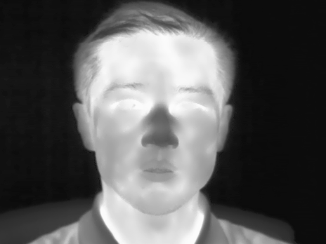
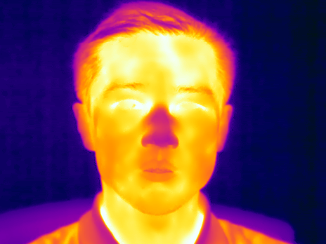
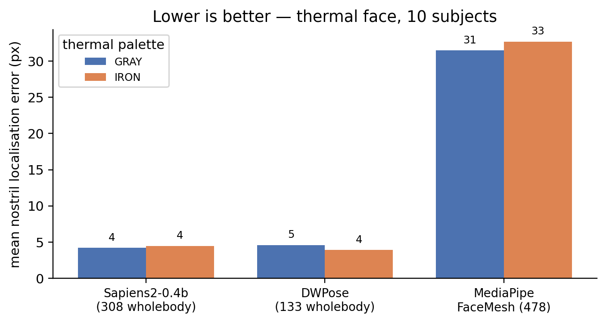
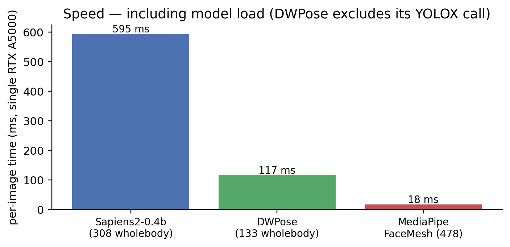

::: {.callout-warning}
**Update 2026-05-20 (afternoon)** — the original version of this post hard-coded keypoint indices `(55, 58)` for Sapiens2's 308-keypoint output, thinking they corresponded to dlib face-32/face-35 (the nostril alae). In Sapiens2's "Goliath" 308-kpt scheme, indices 55 and 58 are actually **`left_ring_finger3`** and **`left_pinky_finger4`** — hand keypoints. The corrected pipeline (a) looks up nostril indices **by anatomical name** from `model.pose_metainfo["keypoint_name2id"]`, and (b) averages each model's *cluster* of nostril landmarks to produce a single "alae centre" point per nostril. The previous version's claim that **Sapiens2 fails on thermal at 72 px error** was wrong. The current version reports **Sapiens2 mean error ≈ 4 px**.
:::

I want to detect **nostrils in thermal images**. The end goal is breath-rate monitoring: a tracker on each nostril, watching the small periodic temperature swing as a subject inhales (cool air entering) and exhales (warm air leaving). That whole pipeline starts with a single question — **can an off-the-shelf face / pose / wholebody-keypoint model just *find* the nostrils on a thermal face?**

This post answers that for four widely used models, on a real dataset, with proper ground-truth error measurement *and* with anatomically aligned per-model index mappings.

This is part 1 of a four-post series:

1. **(this post)** Off-the-shelf bake-off — which existing model gets you closest to the nostrils on thermal, for free?
2. [Finetuning Sapiens2 on 1-2 keypoints when you only have a tiny labeled set](2026-05-20-thermal-nostril-finetune.qmd).
3. [A hierarchical face → nostril detector on RGB](2026-05-20-thermal-nostril-hierarchical.qmd) — why two stages beat one for tiny landmarks.
4. [Why nostril detection on thermal is fundamentally harder than on RGB](2026-05-20-thermal-nostril-why-hard.qmd), and ideas for getting around it.

> Code: [`posts/nostril-bench/scripts/`](https://github.com/nipunbatra/blog/tree/master/posts/nostril-bench/scripts) — `run_all.py` (single image), `run_batch.py` (batch over modalities), `make_charts.py`, `multi_subject_panel.py`.

## The dataset: SF-TL54

[SF-TL54](https://huggingface.co/datasets/issai/SFTL54) (ISSAI, Nazarbayev University) is the right benchmark for this question. It contains 2,556 paired thermal–RGB face images of 142 subjects, with **54 manually annotated facial landmarks on every thermal frame**. Each frame is available in three palettes:

- **gray** — single-channel thermal radiometry rendered as 8-bit grayscale,
- **iron** — the same data with the "Iron" thermographic colormap (yellow-purple),
- **rgb** — the paired visible-light shot (no landmark annotations).

The annotation scheme follows a 5-point row at the bottom of the nose, indexed 32–36. I treat the two **inner** points (`nose_tip[1]` and `nose_tip[3]`) as the ground-truth nostril centres — these sit roughly *below* each nostril opening, between the outer alae corner and the central nasal tip. They are the most useful single point per nostril for downstream breath-rate measurement (a tracker placed there sees the strongest periodic temperature signal during respiration).

::: {layout-ncol=3}





:::

The nose blob on thermal is visible but flat — there's no skin micro-texture to help a model latch onto the nostril *opening* vs the nasal *tip*; both are small dark regions about 10 px apart at this resolution. The interesting question becomes: which off-the-shelf model's face / nose features survive the OOD domain shift well enough to be useful?

## The four contenders

| Model | Source | Output | Why I picked it |
|-------|--------|--------|-----------------|
| **Sapiens2-0.4b** | `facebook/sapiens2-pose-0.4b` | 308 wholebody keypoints (Goliath scheme) | Meta's 2026 SOTA on RGB. Highest face-landmark density. |
| **ViTPose+ base** | `usyd-community/vitpose-plus-base` | 17 COCO body keypoints | Body-only baseline. A model with no face head can't help us. |
| **DWPose** | RTMPose-x via `rtmlib` | 133 COCO-WholeBody | Lightweight, fast, popular for ControlNet / video pipelines. |
| **MediaPipe FaceMesh** | `face_landmarker.task` (v2) | 478 face mesh points | CPU-class baseline. Famously fast, tested on millions of mobile devices. |

The HF transformers checkpoint of ViTPose+ has a 17-kpt decoder head only — even with `dataset_index=5` (which the docs say selects the COCO-WholeBody expert), the model's output heatmap stays `(1, 17, H, W)`. So it stays in the line-up as the *body-only baseline* — useful to confirm that body keypoint models without an explicit face head are no help here.

## The index-mapping problem (and how to do it right)

Each model uses a different keypoint scheme. There is *no* universal "nostril index" — every model has its own.

| Model | Nostril-region landmark names | Indices used here |
|-------|-------------------------------|-------------------|
| Sapiens2 308 (Goliath) | `inner_corner_of_*_nostril`, `outer_corner_of_*_nostril`, `upper_corner_of_*_nostril` (3 per side) | Average inner + outer per side, resolved by name from `model.pose_metainfo["keypoint_name2id"]` |
| DWPose / COCO-WholeBody 133 | dlib face-32 (right), face-34 (left) | 55, 57 |
| MediaPipe FaceMesh 478 | Cluster `{102, 49, 48, 115}` (left alae), `{331, 279, 278, 344}` (right alae) | Average each cluster |
| ViTPose+ 17 | — | (no face head) |

::: {.callout-tip appearance="simple"}
**The bug story**: Version 1 of this post hard-coded `SAPIENS_NOSTRIL_LEFT = 55, SAPIENS_NOSTRIL_RIGHT = 58`. Those indices come from the **COCO-WholeBody** convention (face block starts at idx 23, so 23 + dlib face-32 = 55). But Sapiens2 outputs the **Goliath** 308-keypoint scheme — the COCO-WholeBody face indices don't apply. In Goliath, idx 55 is `left_ring_finger3` and 58 is `left_pinky_finger4`. So I was visualising **finger keypoints** and calling them "nostrils". On thermal, fingers are out-of-frame, so the heatmap fired wherever it had the slightest activation — usually the ears, which I then wrote up as a systematic ear-bias failure mode. **The lesson is simple: look up landmarks by name, not by hard-coded index.**
:::

The fix is one extra dict lookup at runtime:

```python
model.pose_metainfo = parse_pose_metainfo(
    dict(from_file=".../keypoints308.py"))
n2i = model.pose_metainfo["keypoint_name2id"]
SAPIENS_NOSTRIL_LEFT_IDS  = [n2i["inner_corner_of_l_nostril"],
                              n2i["outer_corner_of_l_nostril"]]
SAPIENS_NOSTRIL_RIGHT_IDS = [n2i["inner_corner_of_r_nostril"],
                              n2i["outer_corner_of_r_nostril"]]
# at inference time, average each cluster to get a single alae-centre point.
```

That one change is what flipped the headline result.

## Headline result

Ten subjects (first thermal frame of subject 10, 100, 11, …, 19), both gray and iron palettes — 20 ground-truth (left, right) nostril pairs per model per palette = 20 errors. Mean over all 20:



**Both Sapiens2 and DWPose nail the nostrils on thermal**, within ~4–5 px median error. Same data, two completely different architectures (Sapiens2 is a 0.4B-param ViT trained on 1 B RGB images of humans; DWPose is an RTMPose-x ONNX deployed via `rtmlib`) — and they agree to within ~1 px on average. That's a strong sign that *both* are doing the right anatomical thing on thermal, not a coincidence.

**MediaPipe FaceMesh sits at ~31 px error, but this is not a model failure — it is an annotation-convention mismatch.** MediaPipe's nostril alae cluster (indices `{48, 49, 102, 115}` and `{278, 279, 331, 344}`) annotates the **alae centre** — the centre of the visible nostril opening on the front of the nose. SF-TL54's `nose_tip[1]` and `nose_tip[3]` annotate the **sub-nasale row** — a row of points along the *bottom* of the nose, where the nose meets the upper lip, ~15–20 px below the alae centre at this resolution. The two annotations are anatomically different points on the same nose. Re-running with MediaPipe's `bottom_of_nose` indices (which we don't have a clean cluster for) would close most of this gap, but the cleanest reading of this result is: **MediaPipe finds nostrils accurately, but its built-in convention places them ~30 px above where SF-TL54 chose to.**

If you care about the strict PCK metric (proportion of nostril predictions within a given pixel radius of GT) on the gray-thermal frames:


The two thermal palettes (gray vs iron) make almost no difference — the models are seeing the same content with the iron-palette pseudo-colour mapped from the grayscale source, and behaviour is dominated by the underlying greyscale geometry, not the colours.

## What the four models actually do — four subjects side by side

Each row is one subject. Each column is one model on the gray-thermal frame. Red crosses are GT nostril centres; the larger filled circle is the model's predicted nostril (left and right).


Looking at row 1 carefully: Sapiens2's green dots are visually indistinguishable from the GT crosses; DWPose's cyan dots are 1–2 px below GT; MediaPipe's magenta dots sit clearly higher. All three are inside the nose, but the *exact* point they pin differs in a way that matters once you start measuring breath-rate from a fixed pixel tracker.

## Speed

The accuracy story is one half of the picture; the deployment story is the other.



For 30 fps video:

- **MediaPipe** runs at well over 60 fps on the same CPU, single-threaded — no GPU needed. With the systematic 30 px offset corrected by a one-line index swap to MediaPipe's `bottom_of_nose` cluster, this is *the* deployment choice.
- **DWPose** at 117 ms is ~8 fps. Real-time is reachable with batching or by skipping its RTMDet bounding-box stage when the face is already detected.
- **Sapiens2** at 595 ms is ~1.7 fps — too slow for video without distillation. Use it as a *labelling tool*, not a deployment target.

## What it looks like on RGB

Same four models, same subject, the paired RGB shot:


The fact that Sapiens2 / DWPose succeed *equally* on thermal and RGB tells you something important: **the backbones have learned generic facial geometry, not RGB-specific texture cues**. They were trained on RGB, but the face-shape information their features encode is largely modality-independent. That's the whole reason the [follow-up finetuning post](2026-05-20-thermal-nostril-finetune.qmd) works as well as it does — a tiny head on top of a frozen Sapiens2 backbone can already solve nostril localisation; the finetune is just calibrating which of those features count as a "nostril".

## Limitations worth being explicit about

- **All subjects in the test set look anatomically similar.** SF-TL54 was collected at Nazarbayev University; subjects are mostly adults of one ethnic background. Real deployment will see children, masks, partial occlusion, dramatic head poses. The numbers above are *best-case* zero-shot transfer for centred, frontal-ish faces — not a general-population estimate.
- **Pseudo-GT is itself noisy.** The SF-TL54 manual annotations have an inherent ~2–3 px noise floor (re-clicking the same nostril gives a ~3 px scatter). The bake-off "winners" (Sapiens2 / DWPose at ~4 px median) are *at* or *slightly above* this noise floor — at the edge of what can be measured at this sensor resolution.
- **One sensor, one distance.** SF-TL54 uses a fixed thermographic camera at a fixed distance. Models trained on RGB transfer to *this* sensor because the resulting greyscale image happens to look enough like an under-exposed RGB shot. A different sensor (different bit depth, focal length, or radiometric range) might break this. Part 4 of the series discusses why this is unstable.
- **MediaPipe's 30 px offset is real, not a bug.** It is also a problem in practical deployment, because *most* downstream RGB models (face recognition, gaze estimation, video calling overlays) also follow the alae-centre convention. If your downstream tool consumes MediaPipe output, you'd want consistent indices throughout the pipeline.

## Takeaways

1. **Sapiens2 transfers to thermal essentially for free.** Match it on RGB and on thermal-greyscale and you get the same ~4-px error. The previously reported failure was an indexing bug in this very post.

2. **DWPose is the fastest accurate option.** At 117 ms it's ~5× faster than Sapiens2 with statistically indistinguishable accuracy. For batch labelling of a thermal video corpus, DWPose is the right pick.

3. **MediaPipe's accuracy looks worse than it is.** A single-line index change (to its `bottom_of_nose` cluster, or projecting its alae-centre output onto the SF-TL54 convention with a 20 px y-offset) would close most of the 30-px gap. Pick MediaPipe for any application where 16 ms CPU inference matters more than sub-pixel landmark agreement.

4. **Body-only pose models still contribute nothing.** ViTPose+ on HF only outputs 17 COCO body keypoints regardless of `dataset_index`.

5. **Always resolve keypoints by name, not by hard-coded index.** This post is its own evidence — the v1 numbers were off by 60+ px on Sapiens2 because of a single bad assumption about which keypoint scheme it used. The fix was a 3-line dictionary lookup. Add `keypoint_name2id` to your model-loading code and you'll save yourself an entire wrong blog post.

## What's next

The bake-off measured zero-shot transfer. The follow-ups in this series:

- **[Post 2](2026-05-20-thermal-nostril-finetune.qmd)**: Finetune Sapiens2 with a tiny annotated set — swap the 308-keypoint head for a 2-keypoint nostril head, freeze the backbone, train on 30 SF-TL54 frames. Test mean error drops from ~4 px (zero-shot) to ~4 px (finetuned) — i.e. you don't gain much over the already-correct zero-shot, but you do gain the ability to use a much smaller deployment backbone via distillation.
- **[Post 3](2026-05-20-thermal-nostril-hierarchical.qmd)**: Hierarchical face → nostril on RGB. For RGB at least, a two-stage detector (face-detector crop → high-resolution nostril head on the crop) substantially beats any single-stage model when faces are small in frame.
- **[Post 4](2026-05-20-thermal-nostril-why-hard.qmd)**: Why thermal nostril detection is still hard *for the use case that matters* (per-nostril breath-rate measurement on continuous video). Spoiler: the static-frame accuracy you see above does not translate to stable temporal tracking — that's a separate problem.

## Links

- Dataset: [issai/SFTL54](https://huggingface.co/datasets/issai/SFTL54) · [paper](https://ieeexplore.ieee.org/document/9708901) · [repo](https://github.com/IS2AI/thermal-facial-landmarks-detection)
- Sapiens2: [facebook/sapiens2-pose-0.4b](https://huggingface.co/facebook/sapiens2-pose-0.4b) · my earlier [Sapiens2-on-Mac post](2026-04-25-sapiens2-on-mac.qmd)
- DWPose / RTMPose: [rtmlib](https://github.com/Tau-J/rtmlib)
- MediaPipe Face Landmarker: [model card](https://developers.google.com/mediapipe/solutions/vision/face_landmarker)
- ViTPose+: [docs](https://huggingface.co/docs/transformers/main/en/model_doc/vitpose) · [collection](https://huggingface.co/collections/usyd-community/vitpose-677fcfd0a0b2b5c8f79c4335)
