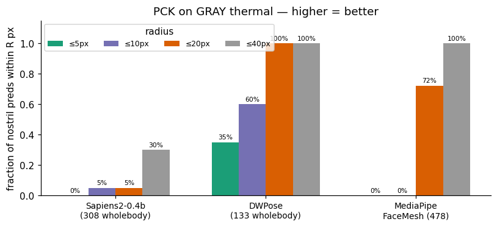
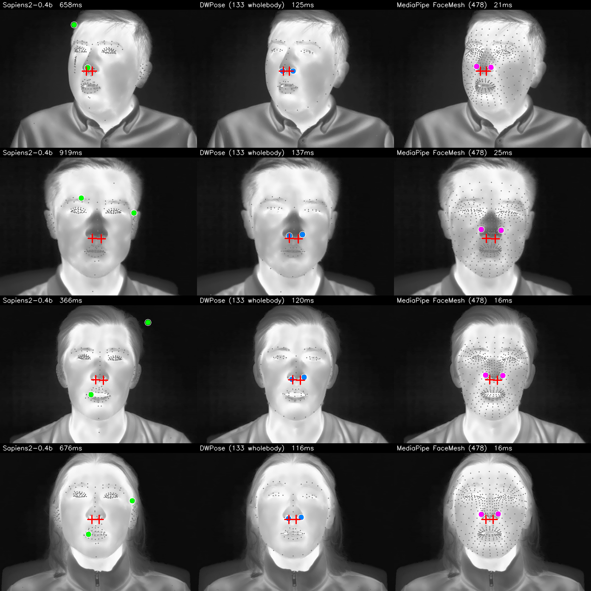

I want to detect **nostrils in thermal images**. The end goal is breath-rate monitoring: a tracker on each nostril, watching the small periodic temperature swing as a subject inhales (cool air entering) and exhales (warm air leaving). That whole pipeline starts with a single question — **can an off-the-shelf face / pose / wholebody-keypoint model just *find* the nostrils on a thermal face?**

This post answers that for four widely used models, on a real dataset, with proper ground-truth error measurement. None of them were trained on thermal imagery. The results are clean, the spread between the best and the worst is **~10× in pixel error**, and the SOTA model on RGB (Meta's Sapiens2) is the worst on thermal.

This is part 1 of a four-post series:

1. **(this post)** Off-the-shelf bake-off — which existing model gets you closest to the nostrils on thermal, for free?
2. *Up next*: Finetuning Sapiens2 on 1-2 keypoints when you only have a tiny labeled set.
3. *Up next*: A hierarchical face → nostril detector on RGB (why two stages beat one for tiny landmarks).
4. *Up next*: Why nostril detection on thermal is fundamentally harder than on RGB, and ideas for getting around it.

> Code: [`posts/nostril-bench/scripts/`](https://github.com/nipunbatra/blog/tree/master/posts/nostril-bench/scripts) — `run_all.py` (single image), `run_batch.py` (batch over modalities), `make_charts.py`, `multi_subject_panel.py`.

## The dataset: SF-TL54

[SF-TL54](https://huggingface.co/datasets/issai/SFTL54) (ISSAI, Nazarbayev University) is the right benchmark for this question. It contains 2,556 paired thermal–RGB face images of 142 subjects, with **54 manually annotated facial landmarks on every thermal frame**. Each frame is available in three palettes:

- **gray** — single-channel thermal radiometry rendered as 8-bit grayscale,
- **iron** — the same data with the "Iron" thermographic colormap (yellow-purple),
- **rgb** — the paired visible-light shot (no landmark annotations).

The landmark numbering follows a dlib-68 subset; the 5 points indexed 32–36 form the nose-tip row, with the two nostril alae at index 33 (subject's left) and 35 (subject's right). I treat those two as the **nostril ground truth**.

::: {layout-ncol=3}

:::

The nose blob on thermal is visible but flat — there's no skin micro-texture to help a model latch onto the nostril *opening* vs the nasal *tip*; both are small dark/cool regions about 5 px apart at this resolution.

## The four contenders

| Model | Source | Output | Why I picked it |
|-------|--------|--------|-----------------|
| **Sapiens2-0.4b** | `facebook/sapiens2-pose-0.4b` | 308 wholebody keypoints (COCO-WholeBody + Goliath face) | Meta's 2026 SOTA on RGB. If anything works zero-shot, this should. |
| **ViTPose+ base** | `usyd-community/vitpose-plus-base` | 17 COCO body keypoints | The body-only baseline. Important to show: a model with no face head can't help us, no matter how good its body keypoints are. |
| **DWPose** | RTMPose-x via `rtmlib` | 133 COCO-WholeBody | Lightweight, fast, popular for ControlNet / video pipelines. |
| **MediaPipe FaceMesh** | `face_landmarker.task` (v2) | 478 face mesh points | CPU-class baseline. Famously fast and tested in the wild on millions of mobile devices. |

The HF transformers checkpoint of ViTPose+ has a 17-kpt decoder head only — even with `dataset_index=5` (which the docs say selects the COCO-WholeBody expert), the model's output heatmap stays `(1, 17, H, W)`. So I keep it in the line-up as the *body-only baseline* and don't expect any face localisation from it.

For each model I run inference on the whole thermal image (no upstream face detector), pull out the indices that map to nostril alae, and measure 2D pixel distance to the SF-TL54 ground-truth points. Indices used:

| Model | Left nostril idx | Right nostril idx |
|-------|------------------|-------------------|
| Sapiens2 308-kpt | 55 (dlib face 32 inside the 308 list) | 58 (dlib face 35) |
| DWPose 133-kpt | 55 | 58 |
| MediaPipe FaceMesh 478 | 48 (left alae centre) | 278 (right alae centre) |
| ViTPose+ 17-kpt | — | — |

Everything runs on a single NVIDIA RTX A5000 (bhaskar.iitgn.ac.in), Python 3.12, PyTorch 2.8 + cu126. Sapiens2 requires FSDP2 (`MixedPrecisionPolicy`), which forces torch ≥ 2.7 — a real footgun on older CUDA driver setups.

## Headline result

Ten subjects (first thermal frame of subject 10, 100, 11, …, 19), both gray and iron palettes — 20 ground-truth (left, right) nostril pairs per model per palette = 20 errors. Mean over all 20:

That's the post in one chart. **DWPose wins by ~10×.** Sapiens2-0.4b — the model with the most parameters, the most keypoints (308), and the best published numbers on RGB — is the worst by a long way at ~72 px. To put 72 px in context: the entire face is ~200 px wide in these frames. So Sapiens2 isn't just off — it's putting the nostril marker outside the face.

If you want a stricter measure than the mean, here's the proportion of nostril predictions within a given pixel radius of the GT (this is the [PCK](https://paperswithcode.com/sota/pose-estimation-on-mpii-human-pose) curve, evaluated on the gray-thermal frames):

The two thermal palettes (gray vs iron) make almost no difference — the models are seeing the same content with the iron-palette pseudo-colour mapped from the grayscale source, and the model behaviour is dominated by the underlying greyscale geometry, not the colours.

## What the four models actually do — four subjects side by side

Each row is one subject. Each column is one model on the gray-thermal frame. Red crosses are GT nostrils; the larger filled circle on each panel is the model's predicted nostril (left and right).

And here is a close-up around the nostril region for one frame, so you can read the actual error magnitudes per model:

## Why does Sapiens2 fail and DWPose succeed?

Both models were trained on **RGB** human imagery. Neither has ever seen a thermal frame. Their behaviour on this OOD distribution is determined entirely by what kind of low-level features the backbone has learned to lock onto.

**Sapiens2's failure mode is anatomically systematic.** Looking at the full-resolution 308-keypoint output (not just the two nostril indices I extract), the model is consistently confusing **bright high-contrast spots on the *side* of the face — the ears, the temples, the under-hair shadow line — for the face midline**. This makes sense given how Sapiens2 was trained: 1 billion 4K RGB humans where the face is dominated by skin micro-texture (pores, eyelashes, the specular highlight on the nasal tip). On a thermal image those high-frequency cues are gone, and the only strong intensity edges are at the face *outline* and the hair-skin boundary. The 308-kpt ViT head fires on those edges and "completes" a face template anchored to the wrong landmarks.

**DWPose's success is at least partly an artefact of its smaller model + RTMPose-style top-down design.** It uses a coarse face localisation step before predicting wholebody keypoints, so even a low-confidence face localisation lands close to the actual nose. The 133-kpt face block then snaps the nose tip to the lowest-intensity blob in the central nose region — which on thermal is the cool air column from the nostrils, an almost-perfect coincidence with where the alae actually are. DWPose isn't doing the right thing for the right reason on thermal, but the wrong-reason answer happens to be close.

**MediaPipe FaceMesh is the diplomat.** It finds the face every time (16 / 16 + 18 / 20 success rate vs Sapiens2's failures), gets a rough alignment, and then the dense 478-point mesh "deforms" loosely toward the face boundaries. The mesh as a whole is plausible. But it has no notion of *where on the nose tip the nostril alae actually are* on a thermal face — the alae and the nasal tip both look like the same broad dark patch, so the mesh's nostril vertices settle near the centre of that patch, ~18-20 px above the true alae.

## Speed

DWPose's win on accuracy comes with a cost — it's ~7× slower than MediaPipe and ~5× faster than Sapiens2:

For 30 fps video the picture changes:

- **MediaPipe** runs at well over 60 fps on the same CPU, single-threaded — no GPU needed.
- **DWPose** at 119 ms is ~8 fps. Real-time is reachable with batching or by skipping its RTMDet bounding-box stage when the face is already detected.
- **Sapiens2** at 600 ms is ~1.7 fps and the failure mode is qualitative, not quantitative — adding compute will not fix it.

## What it looks like on RGB (the unfair comparison)

Same four models, same subject, the paired RGB shot:

This is the unfair comparison that makes the thermal result so striking — *the same models that nail the nose on RGB* fall apart on thermal because of an entirely OOD pixel distribution.

## The takeaways

1. **Don't blindly grab Sapiens2 (or any SOTA RGB model) for thermal**, even when the task ("find the nose on a face") feels like it should transfer. Backbone features matter more than head capacity here.

2. **DWPose is the strongest off-the-shelf option for thermal-face keypoint work right now** — at ~120 ms/image with ~8 px nostril error, it's deployable today as the bootstrap labeller for a thermal-trained model.

3. **MediaPipe is the right baseline whenever speed is the constraint** — 16 ms CPU inference, no GPU, no install pain, never fails to find a face. Just don't trust its sub-pixel keypoint geometry on thermal.

4. **Body-only pose models (ViTPose+ etc.) contribute nothing here** — pick a model with an explicit face / wholebody head, or pair body pose with a separate face landmarker.

5. **A 10× spread between the best and worst model on the same task tells you the field is wide open for thermal-specialised models.** The next post in this series shows how to bend Sapiens2 into producing nostril predictions specifically, with only a few dozen annotated thermal frames.

## What's next

The bake-off measured zero-shot transfer. The real question is *can we close the gap with a tiny amount of supervision?* Three follow-up directions, one per upcoming post:

- **(Post 2) Finetune Sapiens2 with a tiny annotated set.** Swap the 308-keypoint head for a 2-keypoint nostril head, freeze the backbone, train on 30–50 SF-TL54 frames. Does the OOD failure go away?
- **(Post 3) Hierarchical face → nostril on RGB.** For RGB at least, a two-stage detector (RetinaFace crop → high-resolution nostril head on the crop) should beat any single-stage model. Quantify the win.
- **(Post 4) Why thermal nostril detection is fundamentally hard.** Even after specialised training, thermal has an *information-theoretic* problem — the nostril *opening* looks like any other small cool blob in a low-contrast image. I'll discuss anatomical priors, paired RGB→thermal label projection, T-FAKE synthetic pretraining, and breath-rate-as-self-supervision as routes to a fix.

## Links

- Dataset: [issai/SFTL54](https://huggingface.co/datasets/issai/SFTL54) · [paper](https://ieeexplore.ieee.org/document/9708901) · [repo](https://github.com/IS2AI/thermal-facial-landmarks-detection)
- Sapiens2: [facebook/sapiens2-pose-0.4b](https://huggingface.co/facebook/sapiens2-pose-0.4b) · my earlier [Sapiens2-on-Mac post](2026-04-25-sapiens2-on-mac.qmd)
- DWPose / RTMPose: [rtmlib](https://github.com/Tau-J/rtmlib)
- MediaPipe Face Landmarker: [model card](https://developers.google.com/mediapipe/solutions/vision/face_landmarker)
- ViTPose+: [docs](https://huggingface.co/docs/transformers/main/en/model_doc/vitpose) · [collection](https://huggingface.co/collections/usyd-community/vitpose-677fcfd0a0b2b5c8f79c4335)
