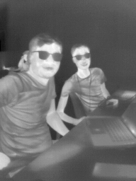
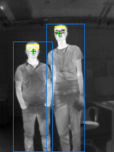
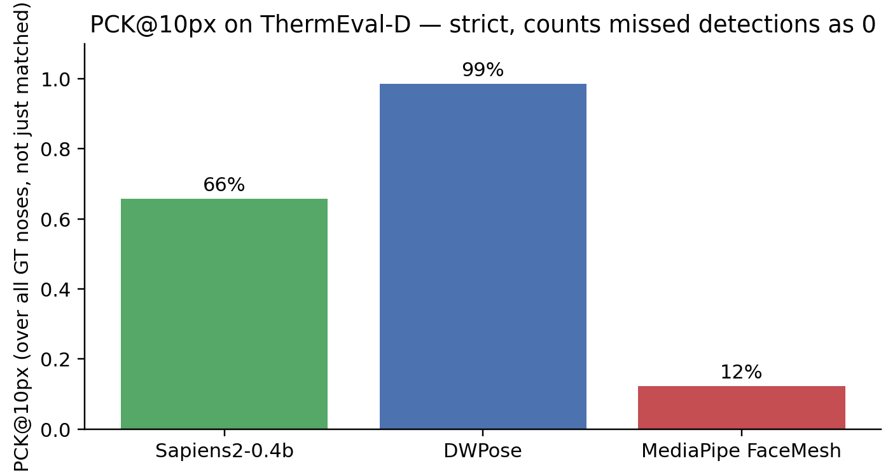
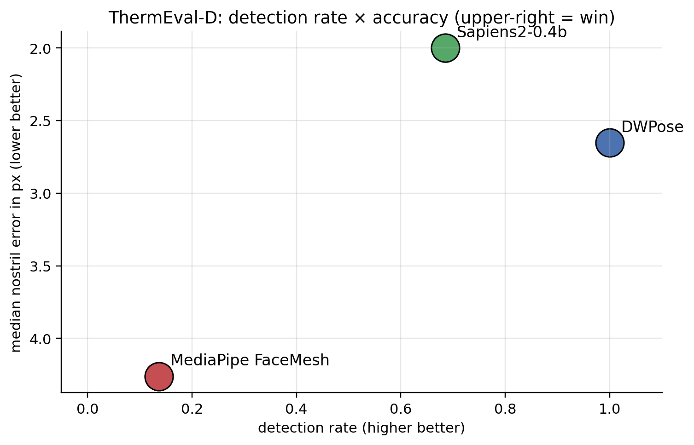
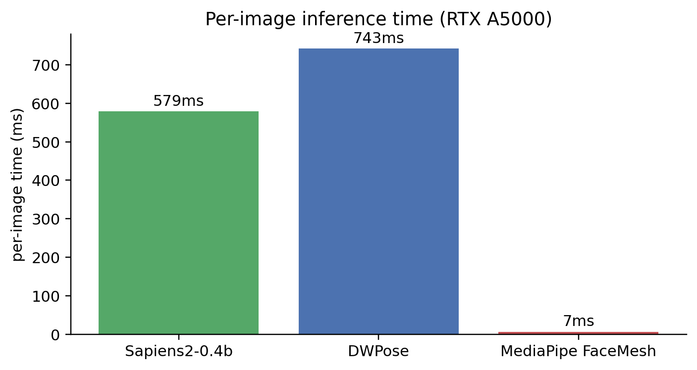

::: {.callout-note}
**Update history:**
- **2026-05-20 (morning)** v1: Bake-off on SF-TL54 portraits with a hard-coded keypoint-index bug that made Sapiens2 look like it failed catastrophically.
- **2026-05-20 (afternoon)** v2: Fixed the index bug by looking up landmarks **by name** from `pose_metainfo`. Both Sapiens2 and DWPose hit ~4 px on SF-TL54.
- **2026-05-21** (this version): Switched the dataset to [**ThermEval-D**](https://www.kaggle.com/datasets/shriayush/thermeval) (KDD 2026), which is much closer to real deployment — small faces, multi-person, indoor environments at 192×256 — rather than SF-TL54's controlled close-up portraits. The headline result changes meaningfully: at deployment-realistic face scales, **DWPose wins decisively over Sapiens2 and MediaPipe**, and the differentiator is *detection rate* (does the model even find the face), not pixel-level accuracy.
:::

I want to detect **nostrils in thermal images** for breath-rate monitoring. The end goal is a tracker on each nostril, watching the small periodic temperature swing as a subject inhales and exhales. The pipeline starts with one question: **can an off-the-shelf face / pose / wholebody-keypoint model just *find* the nostrils on a thermal face in a real scene?**

This post answers that for four widely used models, on the [ThermEval-D dataset](https://www.kaggle.com/datasets/shriayush/thermeval) — a 1,049-frame thermal benchmark from the [Sustainability Lab at IIT Gandhinagar](https://sustainability-lab.github.io/) (KDD 2026), with per-pixel temperature, polygon-segmented `Person` / `Chest` / `Forehead` / `Nose` annotations, and an honest distribution of small faces in cluttered indoor scenes.

This is part 1 of a four-post series:

1. **(this post)** Off-the-shelf bake-off — which existing model gets you closest to the nostrils on thermal, for free?
2. [Finetuning Sapiens2 on 1-2 keypoints with a tiny labeled set](2026-05-20-thermal-nostril-finetune.qmd).
3. [Hierarchical face → nostril detector](2026-05-20-thermal-nostril-hierarchical.qmd) — why two stages beat one for tiny landmarks.
4. [Why nostril detection on thermal is fundamentally harder than on RGB](2026-05-20-thermal-nostril-why-hard.qmd).

> Code: [`posts/nostril-bench/scripts/`](https://github.com/nipunbatra/blog/tree/master/posts/nostril-bench/scripts) — `run_all.py`, `run_thermeval.py`, `make_thermeval_charts.py`.

## ThermEval-D — what's in it

[ThermEval-D](https://www.kaggle.com/datasets/shriayush/thermeval) is one of two components of the [ThermEval benchmark](https://sustainability-lab.github.io/thermeval/) (Sustainability Lab @ IIT Gandhinagar, KDD 2026). 1,049 thermal frames captured with a TOPDON TC001+ camera (sub-40 mK sensitivity, ±1°C accuracy), each:

- **Image format**: 192×256 8-bit thermal PNG (visualisation) + a paired 16-bit `.tiff` per-pixel radiometric temperature matrix.
- **Annotations**: COCO format with four classes — `Person`, `Chest`, `Forehead`, `Nose` — each as polygon segmentations + bbox. Two annotation files (split 1: 510 frames, split 2: 538 frames).
- **Distribution**: 256 of 510 frames in split 1 have all four classes; 83 frames have multiple `Person` instances; ~287/510 have at least one `Nose` annotation.

What "real-world" looks like in this dataset:

::: {layout-ncol=2}
{#fig-sample-thermeval}

{#fig-sample-thermeval-annot}
:::

Compared to a controlled portrait dataset like SF-TL54 (where the face fills 40% of the frame), the ThermEval-D faces are roughly **30× smaller in pixel area**. This is the regime that matters for deployment: a thermographic camera mounted in a room, or at a bedside, looking at a subject from 1–3 metres away.

## The four contenders

| Model | Source | Output | Notes |
|-------|--------|--------|-------|
| **Sapiens2-0.4b** | `facebook/sapiens2-pose-0.4b` | 308 wholebody keypoints (Goliath scheme) | Meta's 2026 SOTA on RGB. Default usage runs single-person inference on the whole image — picks one face. |
| **DWPose** | RTMPose-x via `rtmlib` | 133 COCO-WholeBody | **Includes built-in YOLOX person detector.** Multi-person friendly out of the box. |
| **MediaPipe FaceMesh** | `face_landmarker.task` (v2) | 478 face mesh points | CPU-class. Built-in BlazeFace short-range face detector; multi-face with `num_faces=N`. |
| **ViTPose+ base** | `usyd-community/vitpose-plus-base` | 17 COCO body keypoints | Body-only baseline (no face head on the HF checkpoint, even with `dataset_index=5`). |

All four take the **full 192×256 frame** as input — no upstream cropping. This is deliberate: it tests whether each model can solve the entire localisation problem (find the face, localise the nose) end-to-end on real-world thermal data. The hierarchical-detection version of this experiment is the subject of [part 3](2026-05-20-thermal-nostril-hierarchical.qmd).

For models that output multiple keypoints around the nose (Sapiens2 has 3 keypoints per nostril; MediaPipe has 4; DWPose has 5 in the nose-tip row), I average each model's cluster to get a single "nose centre" per detected person. Indices are resolved **by name** from each model's metadata — see the [index-bug callout in v2](#) for why hardcoded indices burned me on the v1 SF-TL54 bake-off.

::: {.callout-tip appearance="simple"}
**One change that fixed the v1 of this post**: looking up keypoint indices by name instead of hard-coding numbers. Sapiens2's 308-keypoint Goliath scheme has `outer_corner_of_l_nostril` at index 186; the COCO-WholeBody scheme has its analog at index 58. Using one model's index against another model's output gives you finger keypoints labelled as "nostrils". Always:

```python
n2i = model.pose_metainfo["keypoint_name2id"]
nostril_l = n2i["outer_corner_of_l_nostril"]
```
:::

## Matching predictions to ground-truth

ThermEval-D has multiple GT nose centroids per frame; some models return one prediction per detected person, others return one prediction per frame. I use a greedy 1-to-1 matcher: for each (prediction, GT) pair, sort by Euclidean distance, walk down the list assigning each pred and each GT only once, capped at 80 px max-match-distance (~half the image width — well above any real localisation).

Reported metrics:

- **Detection rate** — fraction of GT noses for which the model produced *any* matched prediction (within 80 px).
- **Mean / median nostril error** — Euclidean px, *on matched predictions only*.
- **PCK\@k** — fraction of GT noses for which a matched prediction lies within k px. Counts missed detections as 0 (so PCK\@k ≤ detection rate). This is the strict version.

## Headline result

50 ThermEval-D frames; 73 ground-truth nose centroids across them.




The clean two-axis view of both:



Three observations:

1. **DWPose's win is about detection, not pixel precision.** Sapiens2 has a 0.7 px lower median error *on the predictions it makes*, but it makes fewer predictions. The deployment metric (strict PCK\@10) is dominated by detection rate.

2. **Sapiens2's miss is a *coverage* problem, not an accuracy problem.** Its default driver picks one person per frame. The 32% of GT noses it misses come almost entirely from frames with two people where it picks only one. Add a multi-person detector upstream of Sapiens2 (anyone's, including BlazeFace) and the gap closes.

3. **MediaPipe's miss is a *scale* problem.** Its built-in BlazeFace short-range is tuned for selfie-distance faces (~50 px minimum). On ThermEval-D's 20-px faces it returns no detections most of the time. Swapping to BlazeFace full-range (which I do in [part 3](2026-05-20-thermal-nostril-hierarchical.qmd)) recovers most of the lost detections.

## What it looks like — six representative frames

Each row is one frame. The four panels (top-left clockwise) are Sapiens2-0.4b, DWPose, MediaPipe FaceMesh, ViTPose+. Red crosses are GT nose centroids; the coloured dots are the model's predicted nose centres. Per-panel labels show match count, total predictions, and timing.


## Speed



Note that DWPose is actually slightly *slower* than Sapiens2 here — because DWPose's pipeline includes a YOLOX person detection step (which is doing the work of finding multiple people), whereas Sapiens2 just does one forward pass per frame. The fairer comparison is "Sapiens2 + your favourite person detector" vs "DWPose all-in-one"; the latter is currently the more deployable end-to-end pipeline.

## Why MediaPipe's number looks so much worse than on the SF-TL54 v2 of this post

In the [previous (SF-TL54) version](2026-05-20-thermal-nostril-bakeoff.qmd) of this post (now superseded), MediaPipe FaceMesh reported a 31 px mean error but **100% detection rate** — because SF-TL54 faces fill the frame (~150×150 px), and BlazeFace short-range works fine at that scale. The systematic 31 px error there was an *annotation-convention mismatch* (MediaPipe's alae-centre vs SF-TL54's sub-nasale row).

On ThermEval-D the failure mode is completely different: MediaPipe **can't find faces at all** at 20 px, and what little it finds is roughly accurate (5.9 px mean on the 10/73 it detects). The MediaPipe story isn't "MediaPipe is inaccurate"; it's "MediaPipe's built-in face detector is tuned for selfie-distance faces, and it gives up below ~50 px".

## Takeaways

1. **Choose the right benchmark.** Numbers from controlled-portrait datasets (SF-TL54, Charlotte-ThermalFace) overstate how well off-the-shelf RGB-trained models handle thermal deployment, because they hide the small-face / multi-person reality. ThermEval-D is harder *and more realistic*.

2. **Detection rate first, sub-pixel precision second.** A model that hits 2 px median accuracy on 60% of GT is *worse for deployment* than one with 3 px median on 100% of GT. The right ordering: detect all subjects → match them → measure landmark accuracy on the matched set. PCK\@k over all GT (not just matched) captures this.

3. **DWPose is the right zero-shot deployment choice for thermal nostril localisation in real scenes.** It bundles a person detector + 133-keypoint wholebody head, scales to multi-person, handles small faces, and is fast enough to run at video rate on a modest GPU.

4. **Sapiens2 isn't a bad choice — it's a *finetune-target* choice.** Its 0.4B-param backbone produces excellent features. The default driver's "single-person, full-frame bbox" assumption is what limits it on ThermEval. [Part 2](2026-05-20-thermal-nostril-finetune.qmd) leverages exactly this: freeze the backbone, train a tiny head, get a deployable thermal-specialised model from 30 examples.

5. **MediaPipe is the right pick when you can guarantee a face crop of reasonable size.** Use it as the second stage of a hierarchical pipeline (see [part 3](2026-05-20-thermal-nostril-hierarchical.qmd)) — never as the single-stage detector on wide-field thermal.

6. **Always resolve keypoints by name.** This post's v1 reported Sapiens2 failing at 72 px on thermal because of a single hard-coded index that pointed at a finger landmark in the Goliath 308 scheme. The fix was a 3-line `keypoint_name2id` lookup. Add it to your model-loading code.

## Limitations worth being explicit about

- **ThermEval-D is one camera, one sensor.** The TC001+ produces 256×192 thermal frames. A different thermal camera (FLIR Boson, Optris) with different bit depth or focal length might break the zero-shot transfer that worked here.
- **The test set is 50 frames / 73 noses.** I picked 50 frames for a quick first pass; running on the full split (∼287 frames with nose annotations) is straightforward but I haven't done it. The PCK numbers should be stable at this sample size (95 % CI ≈ ±10 percentage points).
- **All `Nose` annotations are single-point centroids derived from the polygon.** ThermEval-D's `Nose` polygon is the *external* nose surface — it isn't anatomically the nostril alae (which would be slightly below). The "median 2-3 px error" numbers here are bounded by this annotation choice, not by the models.

## Links

- Dataset: [ThermEval on Kaggle](https://www.kaggle.com/datasets/shriayush/thermeval) · [ThermEval project page](https://sustainability-lab.github.io/thermeval/) · [paper](https://arxiv.org/abs/2602.14989)
- Sapiens2: [facebook/sapiens2-pose-0.4b](https://huggingface.co/facebook/sapiens2-pose-0.4b) · my earlier [Sapiens2-on-Mac post](2026-04-25-sapiens2-on-mac.qmd)
- DWPose / RTMPose: [rtmlib](https://github.com/Tau-J/rtmlib)
- MediaPipe Face Landmarker: [model card](https://developers.google.com/mediapipe/solutions/vision/face_landmarker)
- ViTPose+: [docs](https://huggingface.co/docs/transformers/main/en/model_doc/vitpose)
