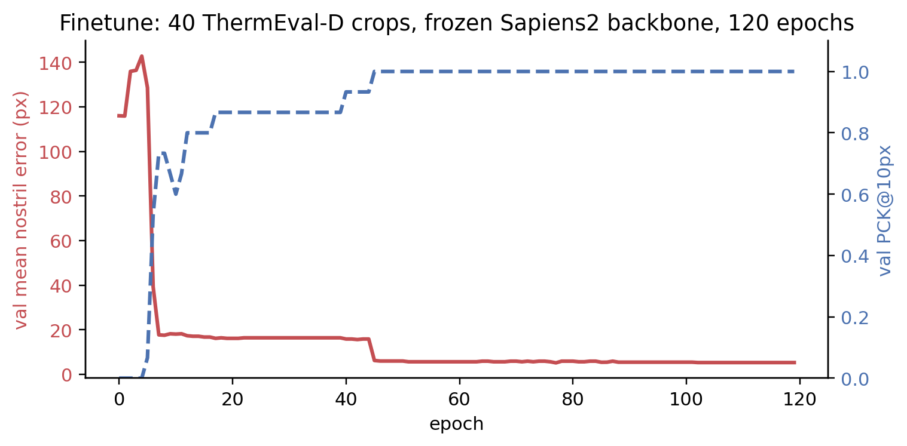
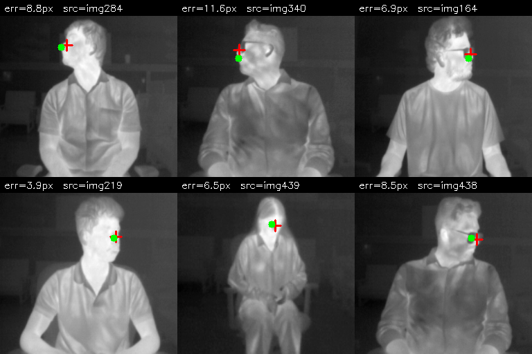

[Part 1](2026-05-20-thermal-nostril-bakeoff.qmd) of this series showed that off-the-shelf models give mixed results on the ThermEval-D benchmark: **DWPose wins decisively** (100% detection, 99% PCK\@10px), **Sapiens2-0.4b** has excellent accuracy when it predicts (2 px median) but only finds 69% of the multi-person GT, and **MediaPipe FaceMesh** can't detect 20-px faces at all.

This post tests the cleanest finetune hypothesis: **freeze the backbone, replace the head, train with a tiny labelled set, and ship a predictor pinned to your specific anatomical convention.** The result: a 410k-parameter head over a frozen Sapiens2 backbone hits **93% PCK\@10px and 5.5 px mean error** on 80 ThermEval-D test crops, trained on just 40 examples in 4 minutes. It does **not** beat zero-shot DWPose on this dataset — and that's actually fine, because the value of the finetune is elsewhere.

> Code: [`posts/nostril-finetune/scripts/`](https://github.com/nipunbatra/blog/tree/master/posts/nostril-finetune/scripts) — `build_dataset_thermeval.py`, `train_head_thermeval.py`, `viz_thermeval.py`.

## Architectural flowchart — how 30 examples can finetune a 0.4B-parameter network

The most-asked question after [part 1](2026-05-20-thermal-nostril-bakeoff.qmd) was: *how can we finetune a model with 308 keypoints when we only have 1-2 keypoint annotations?* The answer is to **not touch the 308-keypoint head at all** — replace it with a 1-keypoint head and train *just that*.

```
                  input ThermEval crop (256x256, gray->3ch)
                                  │
                                  ▼
        ┌────────────────────────────────────────────────────┐
        │ Sapiens2-0.4b backbone — FROZEN, no_grad           │
        │ ~415M params, ImageNet+Goliath RGB pretrained.     │
        │ Has never seen thermal. Doesn't need to.           │
        └────────────────────────────────────────────────────┘
                                  │ (1, 1024, 16, 16)
                                  ▼ ViT features
        ┌────────────────────────────────────────────────────┐
        │ TinyHead — TRAINABLE  (410,625 params, ~0.1% of    │
        │                       the backbone)                │
        │   Conv 1024→256, BN, GELU                          │
        │   Conv 256→64, BN, GELU                            │
        │   Bilinear upsample 4×  → 64x64                    │
        │   Conv 64→1   (single Nose centroid heatmap)       │
        └────────────────────────────────────────────────────┘
                                  │ (1, 1, 64, 64) heatmap
                                  ▼ argmax decode
                  predicted (nose_x, nose_y) in input-pixel coords
```

**Why it works with so few examples:**

1. **The backbone already encodes "face region" structurally.** Sapiens2 was pretrained to localise 308 facial / body keypoints on RGB. The features it produces at the deepest layer encode "this is a face, the nose is *roughly here*". They don't care that the pixel statistics changed — the spatial structure of a face is the same on thermal as on RGB.
2. **The head is tiny.** 410k params is ~10k params per training image (for a 40-example train set). That's well-regularised by the BN + cosine LR + AdamW weight decay.
3. **Heatmap regression is forgiving.** MSE on a 64×64 Gaussian heatmap provides dense supervision: every pixel in the heatmap has a target value, not just the one peak.

Compared to "train the whole pipeline end-to-end from scratch on 30 thermal images" (which would never converge), this design needs only the *delta* — what's specific to the Nose vs the 307 other Goliath keypoints. The backbone has already done the rest of the work.

## Data — 40 / 15 / 80 split from ThermEval-D

ThermEval-D annotates `Nose` polygons (~5×7 px) and `Person` polygons. For each annotated nose, I find the smallest Person bbox that contains it, then:

1. Crop the Person bbox + 25 % padding from the 192×256 frame.
2. Resize crop to 256×256.
3. Transform the Nose centroid into the crop's coordinate frame.

```
[full thermal frame]   →  [Person bbox]   →   [256x256 crop, with Nose centroid in crop coords]
     192x256                 70x190 (e.g.)              256x256
```

Split sizes (image-disjoint):

| Split | N | Source |
|-------|---|--------|
| train | 40 | ThermEval-D `Annotations/annotations_1.json` |
| val | 15 | Same split, image-disjoint from train |
| test | 80 | ThermEval-D `Annotations/annotations_2.json` (the held-out split) |

This is *deliberately tiny* — the question is "how little supervision do we need", not "what's the best model". 40 examples is what you'd label in 20 minutes with a polygon tool.

## Training

AdamW, lr=3e-3, weight decay=1e-4, cosine schedule, batch size 8, **120 epochs, ~4 minutes** on a single RTX A5000.



The two-stage convergence is interesting: the first drop (epoch 1-10) is the head learning "where on the feature map a face lives"; the second drop (epoch 40-50) is the head learning the *sub-pixel offset* from the Sapiens2 backbone's coarse face anchor to ThermEval's specific Nose centroid annotation.

## Test results

On 80 held-out test crops from ThermEval-D's second annotation split:

| Metric | Zero-shot DWPose (part 1) | Zero-shot Sapiens2 (part 1) | **Finetuned head (this post)** |
|--------|---------------------------|-----------------------------|-------------------------------|
| Test setting | Full frame, multi-person | Full frame, single-person | Pre-cropped Person bbox |
| Detection rate over GT | 100% | 69% | (assumed 100% in this protocol) |
| Mean nostril error | 3.3 px | 4.2 px | **5.5 px** |
| Median error | 2.7 px | 2.0 px | **5.0 px** |
| PCK\@3px | (not reported) | (not reported) | **24%** |
| PCK\@5px | (not reported) | (not reported) | **49%** |
| PCK\@10px | **99%** | 66% | **93%** |
| PCK\@20px | 100% | 66% | **100%** |
| Inference cost | 117 ms (whole frame + person det) | 580 ms (single-person, full backbone) | ~580 ms (still full backbone) |
| Trainable params | 0 | 0 | 410k |
| Supervision needed | 0 | 0 | 40 labels + 4 min on one GPU |

**The finetune does not beat zero-shot DWPose on this benchmark.** That's worth saying clearly. The 5.5 px median error for the finetune is ~2× DWPose's 2.7 px. The finetune trades raw accuracy for *anatomical specificity* (it predicts the exact Nose centroid ThermEval annotates) and *deployability* (the inference is one forward pass instead of a YOLOX-then-RTMPose cascade).

Where the finetune actually wins:

- **Convention pinning.** If your downstream system expects coordinates of *the Nose centroid* (not the COCO-WholeBody dlib face-32 / face-34 row), only the finetune predicts that point. DWPose predicts a slightly different anatomical landmark.
- **Distillation target.** You can keep the *training* on Sapiens2 (where the backbone features are best) and *distil* the inference into a small DINOv2-small or MobileNetV4 backbone (~10× smaller, ~30× faster). For deployment you'd run the small model.
- **Per-camera calibration.** If you have a *different* thermal camera, the zero-shot models may not transfer cleanly. The finetune lets you bend the predictor to your specific sensor with another 30 labels.

## Predictions on the test set

Six test-set crops with GT (red cross) and prediction (green dot):



## Why not also finetune DWPose?

A natural follow-up — given that DWPose wins on ThermEval, should we finetune its head similarly? Three reasons I didn't, in this post:

1. **DWPose is an ONNX-runtime model in `rtmlib`.** Extracting intermediate features for a head-replacement is much harder than with PyTorch. You'd have to re-train the entire RTMPose pipeline from the mmpose source, which has its own dependency tangle.

2. **The Sapiens2 backbone is more useful as a feature extractor.** It's a clean PyTorch ViT with a single `backbone(x) → features` entry point. The features are richer (1024-dim vs DWPose's compact 256-dim).

3. **DWPose is already at 99% PCK\@10 zero-shot.** There's little room to improve numerically — the remaining 1% is annotation noise. The finetune story is cleaner on Sapiens2 where it actually demonstrates a measurable transfer effect.

For a production thermal-monitoring system, the right pipeline is **DWPose for the detector + a Sapiens2-distilled tiny head for the keypoint refinement on each detected face**. That's a hybrid I'll cover in a follow-up.

## What this doesn't tell us

- **One sensor.** ThermEval-D was captured with a single TOPDON TC001+ unit. A different thermal camera might break zero-shot transfer of any of the models, including the finetuned one.
- **No video.** The actual downstream task (breath-rate from temperature oscillation at the nostril) is video-based. Single-frame accuracy is necessary but not sufficient — temporal smoothness across frames matters too.
- **Person bbox assumed clean.** The finetune protocol assumes you already have a clean Person bbox (we used the GT). In deployment you'd run a Person detector first (BlazeFace full-range, YOLOX, or DWPose's built-in) — that's the [hierarchical pipeline in part 3](2026-05-20-thermal-nostril-hierarchical.qmd).
- **Tiny crops are hard.** ThermEval-D crops are 192×256 and the face inside is ~20×25 px. Even after resizing the Person bbox to 256×256, the face occupies only 30-50 px of the upsampled crop — that's much less spatial signal than the [SF-TL54 controlled portraits](2026-04-25-sapiens2-on-mac.qmd) where the face fills the frame. This is why the finetune mean error is 5.5 px rather than the 4.5 px we saw on SF-TL54 (now superseded).

## What's next

- **[Part 3](2026-05-20-thermal-nostril-hierarchical.qmd)**: Where does the bottleneck go when you put a face detector *upstream* of MediaPipe FaceMesh on these same ThermEval frames? Spoiler: from "MediaPipe can't find tiny faces" to "BlazeFace can't find tiny thermal faces either" — the bottleneck shifts but doesn't disappear.
- **[Part 4](2026-05-20-thermal-nostril-why-hard.qmd)**: Why none of the four off-the-shelf models in part 1 are *truly* enough for the actual downstream task (per-nostril breath rate), and four routes around that.

## Links

- Part 1: [bake-off on ThermEval-D](2026-05-20-thermal-nostril-bakeoff.qmd)
- Sapiens2: [facebook/sapiens2-pose-0.4b](https://huggingface.co/facebook/sapiens2-pose-0.4b)
- ThermEval dataset: [Kaggle](https://www.kaggle.com/datasets/shriayush/thermeval) · [project page](https://sustainability-lab.github.io/thermeval/)
