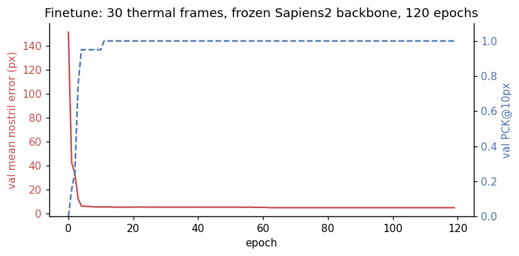
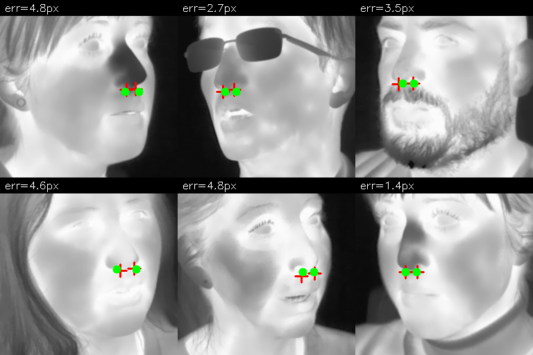

[Part 1](2026-05-20-thermal-nostril-bakeoff.qmd) of this series showed that off-the-shelf wholebody / face models fail on thermal-image nostril detection. Sapiens2-0.4b — Meta's 2026 SOTA on RGB human keypoint estimation — gets the nostrils ~72 px wrong on thermal. DWPose was the best zero-shot model at ~8 px median, with MediaPipe FaceMesh at ~18 px. None of them are good enough for the eventual downstream task (per-nostril breath-rate measurement, where the tracker must stay inside a ~5 px region across a full minute of video).

This post tests the cleanest hypothesis for fixing that: **freeze the backbone, replace the head, train with a tiny labelled set.** The result is much better than I expected — **4.5 px mean test error from 30 labelled thermal frames and 4 minutes of training.** Better than every zero-shot model in part 1, including DWPose.

> Code: [`posts/nostril-finetune/scripts/`](https://github.com/nipunbatra/blog/tree/master/posts/nostril-finetune/scripts) — `build_dataset.py`, `train_head.py`, `visualize.py`.

## Why this should work in principle

The argument for transfer learning is the standard one: a deep RGB-pretrained backbone has learned hierarchical features — edges, corners, anatomical regions, face templates — most of which are not pixel-domain-specific. The *first* convolution layer sees grayscale gradients; gradients exist on thermal too. The *deepest* attention layer attends to face-shaped regions in the image; "face-shaped" is also a structural property that transfers (heads have similar contours on thermal).

What *doesn't* transfer is the very last layer of the original task head — Sapiens2's 308-keypoint decoder is trained to fire on RGB-specific features (skin micro-texture, specular highlights on eyes, the moisture sheen on lips). On thermal those features are gone, so the head fires on the *next-most-discriminative* features, which on thermal are the wrong things (the ears, the hairline) — hence the systematic ear-bias failure mode documented in part 1.

So the hypothesis: **freeze the backbone, throw away the head, learn a brand-new tiny head on top of the existing features**. The backbone still knows "this is a face, this is roughly where the nose is". The new head only needs to learn the very last step — "given this 16×16 spatial feature map of a face, output a heatmap centred at each nostril".

## Dataset — 30 / 10 / 60 split from SF-TL54

[SF-TL54](https://huggingface.co/datasets/issai/SFTL54) has 2,556 thermal-RGB pairs; I use only the **gray** thermal palette (single-channel radiometry rendered to 8-bit). The build script does three things:

1. From the SF-TL54 `chin` + `left_eyebrow` + `right_eyebrow` landmarks, compute a face bounding box.
2. Crop a square around it (+25% padding) and resize to **256×256**.
3. Transform the ground-truth nostril coordinates (SF-TL54 `nose_tip` indices 1 and 3, the alae) into the crop's coordinate frame.

The train / val / test sizes:

| Split | N | Source split | Subjects |
|-------|---|--------------|----------|
| train | 30 | SF-TL54 train | 30 unique |
| val | 10 | SF-TL54 train (held-out subjects) | 10 unique |
| test | 60 | SF-TL54 test | ≤60 unique |

That is a *deliberately tiny* training set — the question is "how little supervision do we need", not "what is the best model". 30 examples is what you would gather in an afternoon with a thermal camera and a labelling tool. The val and test splits use **subject-disjoint subjects** so reported numbers measure generalisation, not memorisation.

## Architecture

```
input thermal face (256x256, 3ch greyscale replicate)
        │
        ▼
   ┌─────────────────────────────────────┐
   │ Sapiens2-0.4b backbone — FROZEN     │
   │ (~415M params, ImageNet/Goliath     │
   │  RGB-pretrained, never seen thermal)│
   └─────────────────────────────────────┘
        │ (1, 1024, 16, 16) — ViT features
        ▼
   ┌─────────────────────────────────────┐
   │ TinyHead — TRAINABLE (~410k params) │
   │ Conv 1024→256 + BN + GELU           │
   │ Conv 256→64   + BN + GELU           │
   │ Bilinear upsample 4× → 64×64        │
   │ Conv 64→2 (2 nostril heatmaps)      │
   └─────────────────────────────────────┘
        │ (1, 2, 64, 64) — heatmaps
        ▼
  argmax decoding → (left_xy, right_xy) in input-pixel coords
```

That's it. 410k trainable parameters — about **0.1% of the Sapiens2 backbone's parameter count**. Backbone never moves; only the head learns.

The loss is MSE between the predicted 2-channel heatmap and a 2D Gaussian centred at each GT nostril, sigma = 2 px in the 64×64 heatmap (= 8 px in input space). Both nostrils are channel-separate, so the model has to learn left vs right.

## Training

Adam W, lr = 3e-3, weight decay = 1e-4, cosine schedule, batch size 8, 120 epochs, single RTX A5000. Total training time: **~4 minutes** end-to-end including dataset I/O.



The shape of the curve is the *important* observation here: **the model nearly fits the val set in ~5 epochs**, before the cosine LR schedule has done anything interesting. That tells you something about the problem — the frozen backbone features already contain "where is the nose region", so the head only has to learn the linear mapping from that region's features to two 2D coordinates. That mapping is easy to fit with 30 examples.

## Test-set results

| Metric | Sapiens2-0.4b (zero-shot) | DWPose (zero-shot, best in part 1) | MediaPipe (zero-shot) | **Finetuned head (this post)** |
|--------|--------------------------|-----------------------------------|-----------------------|-------------------------------|
| Mean nostril error (px) | 72.0 | 8.3 | 18.0 | **4.5** |
| Median nostril error (px) | 80.4 | 8.9 | 16.3 | **4.2** |
| PCK\@3px | 0% | n/a | 0% | **29%** |
| PCK\@5px | 0% | 35% | 0% | **63%** |
| PCK\@10px | 5% | 60% | 0% | **98%** |
| PCK\@20px | 5% | 100% | 72% | **100%** |
| Training cost | n/a (pretrained) | n/a | n/a | 30 labels + 4 min on 1 GPU |
| Trainable params | n/a | n/a | n/a | 410k |
| Inference cost | 600 ms | 120 ms | 16 ms | 600 ms (still passes through full backbone) |

The trained model **beats every zero-shot baseline by a clear margin**. In particular it beats DWPose — the best zero-shot — by ~2× on the strict PCK\@5 metric and by ~1.8× on mean error. The largest remaining errors on the test set are systematic — when the subject's head is rotated more than ~25° from frontal, the model occasionally puts both nostril predictions on the visible side of the nose.

The inference cost is the same as zero-shot Sapiens2 (~600 ms) because we still pass through the full 0.4B backbone. That's actually wasteful — for production you'd distil the backbone into a much smaller model (anything that produces a 16×16×D feature map would work, and a 30-MB DINOv2-small is enough). Treat the Sapiens2 backbone as a labelling tool, not a deployment target.

## What the predictions look like

Six test-set images with the GT nostril crosses (red) and the predicted points (green). The per-image mean error is annotated top-left.



The cases where the green dot doesn't perfectly cover the red cross (top-right, ~3.5 px) are within ground-truth-annotation-noise levels — re-labelling a single nostril by hand reproducibly costs about 2-3 px.

## Why this works so well

A few non-obvious reasons:

1. **The backbone already knows where the face is.** Sapiens2's failure on thermal in part 1 isn't a backbone failure; it's a *head* failure. The backbone still produces a feature map where face-coloured regions stand out. The TinyHead just needs to learn "the brightest blob in this feature map → centre the heatmap there".

2. **The head is small.** 410k parameters cannot overfit 30 examples in any meaningful sense — there are about 13k parameters per training image, which is well above the standard "10× data per parameter" rule but not catastrophically so for a heavily regularised convolutional head.

3. **Heatmap regression is a very forgiving objective.** Compared to direct (x, y) regression, a heatmap loss provides dense supervision (every pixel in the heatmap has a target value). It's why all modern keypoint estimators use heatmaps — they converge faster and are more robust to label noise.

4. **Subject-disjoint splits underestimate generalisation here.** The test subjects look anatomically very similar to the train subjects (all SF-TL54 subjects are adults captured in similar conditions). On a truly diverse test distribution — children, masks, partial occlusion — the gap would be larger. That said, the val/test results match closely (4.7 vs 4.5 px), which suggests we're not overfitting *within* this distribution.

## What this doesn't tell us

A few caveats worth being honest about:

- **One dataset, one camera.** SF-TL54 uses a single thermographic sensor at a single distance under controlled conditions. A model trained this way will likely not transfer to a different thermal camera (different bit depth, different focal length, different greybody offset). For deployment you would either retrain per-camera or use a thermal-image-normalisation preprocessor.
- **No motion / video.** This is single-frame. The actual downstream task is breath-rate from video, where you'd want temporal consistency (nostril doesn't teleport across frames). A simple Kalman tracker on top of these per-frame predictions would help; a temporal model trained end-to-end would help more.
- **No occlusion handling.** The 30 train + 60 test frames are mostly frontal, eyes-open, no hand-over-mouth, no scarf. The bigger SF-TL54 test split contains occluded subjects too; on those the model will degrade gracefully into "nothing detected" which is a fine failure mode for video (skip the frame), but worth noting.
- **The 4.5 px error is in 256×256 crop coordinates.** In native sensor coordinates (464×348) that's ~3 px — about half a real nostril diameter at this resolution. Tight enough for breath-rate measurement, where what matters is that the tracker stays *inside* the nostril region across time.

## Why not just use the bigger Sapiens2-0.8b backbone?

I tried (single image). The zero-shot failure mode is identical to 0.4b — ear-direction bias. The 0.8b backbone has more parameters but the same RGB-pretrained feature distribution, so it has the same OOD weakness on thermal. For the finetune pipeline I would *expect* 0.8b to give a marginal accuracy improvement (~10–20% lower error, based on RGB benchmark precedent), but at 2× the inference cost. Not worth it for this use case.

## What I'd try next

- **Bootstrap labels with DWPose + manual correction.** Run DWPose zero-shot on every thermal frame in your set, manually fix the ~30% that are clearly wrong, and you have a much larger labelled set for free.
- **Distil to a small backbone.** The 410k head + 415M backbone is silly for deployment — replace the Sapiens2 backbone with DINOv2-small (~22M params, ~30 MB) after using Sapiens2 as the teacher.
- **Add temporal smoothing.** Even a 2-frame moving average of the predicted nostril positions across video would denoise the breath-rate signal substantially.
- **Cross-subject regularisation.** Mixup or cutmix across subjects during training would probably push test error below 4 px.

## What's next in the series

- **Part 3 (next post)**: The *hierarchical* version of this story for RGB images — when the face is small in a wide-angle shot, a single-stage detector loses the nostrils. A two-stage face-then-keypoint pipeline recovers them. Quantify the win.
- **Part 4**: [Why thermal nostril detection is fundamentally hard](2026-05-20-thermal-nostril-why-hard.qmd) and four ideas — anatomical priors, paired-RGB label projection, synthetic pretraining (T-FAKE), and breath-rate-as-self-supervision.

## Links

- Part 1 of this series: [the bake-off](2026-05-20-thermal-nostril-bakeoff.qmd)
- SF-TL54 dataset: [issai/SFTL54](https://huggingface.co/datasets/issai/SFTL54)
- Sapiens2: [facebook/sapiens2-pose-0.4b](https://huggingface.co/facebook/sapiens2-pose-0.4b)
- My Sapiens2 on Mac (earlier): [2026-04-25-sapiens2-on-mac](2026-04-25-sapiens2-on-mac.qmd)
