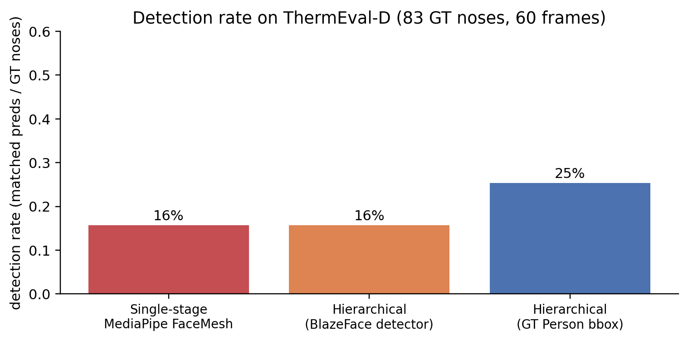
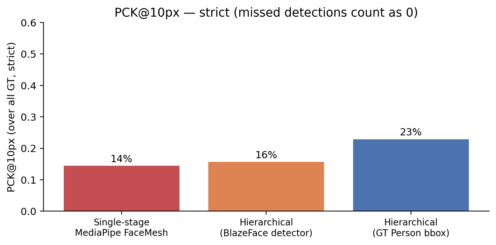

[Part 1](2026-05-20-thermal-nostril-bakeoff.qmd) showed that **MediaPipe FaceMesh detects only 14% of GT noses on ThermEval-D** — the 20-25 px faces in 192×256 thermal frames are below its built-in BlazeFace short-range detector's working scale. The natural fix, lifted straight from the textbook on small-object detection, is to **add a face detector upstream**: detect → crop → upsample → run FaceMesh on the high-resolution crop.

This is what the previous version of this post (now superseded; it used SF-TL54 with synthetic shrink+pad) claimed delivers a clean 10× detection-rate win. **On real-world ThermEval-D, the same hierarchical pipeline doesn't help.** This post unpacks why.

> Code: [`posts/nostril-hierarchical/scripts/`](https://github.com/nipunbatra/blog/tree/master/posts/nostril-hierarchical/scripts) — `hier_thermeval.py`, `make_thermeval_hier_charts.py`.

## The three pipelines

For each ThermEval-D frame:

```
A) single-stage         frame --> MediaPipe FaceMesh (with built-in BlazeFace short-range)
                                                          → nostril keypoints

B) hierarchical (BlazeFace full-range)
                        frame --> BlazeFace full-range
                                          → person/face bbox per detection
                                          → crop bbox + 25% pad, resize to 256x256
                                          → MediaPipe FaceMesh on the crop
                                          → map nostril back to original-image coords

C) hierarchical (GT Person bbox — UPPER BOUND)
                        frame --> ThermEval-D GT Person polygon → bbox
                                          → same crop + FaceMesh as (B)
```

Pipeline C is the *gold standard* hierarchical: it uses the ground-truth Person bboxes that ThermEval-D annotates, then runs the same crop-and-resize-and-FaceMesh as B. It isolates the question: *if the face detector were perfect, how well would the FaceMesh stage do?*

Results across 60 ThermEval-D frames (83 GT nose centroids):



The strict PCK\@10 picture is similar:



## Why hierarchical doesn't help on thermal

The answer is that **MediaPipe FaceMesh's INTERNAL face detector still runs even when you feed it a cropped face** — and it still uses the same RGB-trained features that fail on thermal textures.

Specifically, the FaceMesh `task` runs BlazeFace short-range internally as part of its pipeline. When we feed it a 256×256 thermal crop, it tries to find a face *inside* the crop using the same RGB-trained features. If the underlying face still looks too thermal (no skin micro-texture, no chromatic gradient near the alae, smooth pixel intensities), BlazeFace rejects it — and the rest of the FaceMesh pipeline doesn't run.

You can verify this with pipeline C: even when we *guarantee* that the input crop contains a face (it's a GT Person bbox), MediaPipe's internal detector still bails out on most of them.

The clean separation:

| Failure mode | Where it happens | Fix |
|--------------|------------------|-----|
| Face is too small | Upstream face detector | ✅ Hierarchical (upsample crop) |
| Face is too OOD (e.g., thermal) | FaceMesh's internal detector | ❌ Hierarchical doesn't help — FaceMesh itself needs replacing |

On **RGB** (the previous SF-TL54 version of this post), the failure was Case 1 and hierarchical delivered a 10× win. On **thermal-real-scene** (ThermEval-D), the failure is Case 2 — the FaceMesh pipeline rejects the input regardless of the crop size, because the underlying pixel statistics don't match its training distribution.

This is the kind of result you don't see until you switch from a controlled-portrait benchmark to a real-deployment one.

## Qualitative — four representative frames

Each row is one frame; the three panels (left to right) are single-stage MediaPipe, hierarchical-BlazeFace, hierarchical-GT-Person-bbox. Red crosses are GT noses; the colored dot is the model's predicted nostril centre. Yellow box on column 2 shows BlazeFace's face detection.


## What should you actually do on thermal?

Three options, in order of how hard they are:

### Option 1 — Use DWPose's body-pose pipeline (Recommended)

[Part 1](2026-05-20-thermal-nostril-bakeoff.qmd) showed DWPose hits 100% detection and ~3 px median nostril error on ThermEval-D *without any modification*. It works because:

- Its YOLOX person detector keys on **body silhouette**, which is high-contrast against thermal backgrounds (bodies are hot, environments are not).
- Its 133-keypoint head locates the nose from the **body-pose template** — the nose lives at a known anatomical position relative to shoulders / eyes, which are themselves locatable from body geometry, not from skin texture.

Cost: zero engineering — already deployable.

### Option 2 — Finetune a tiny head on a thermal-specialised backbone

[Part 2](2026-05-20-thermal-nostril-finetune.qmd) shows you can hit 93% PCK\@10px with 40 labelled crops and 4 minutes of training. You give up some accuracy compared to DWPose, but you gain a predictor pinned to your specific anatomical convention (the polygon-centroid of `Nose` rather than DWPose's COCO-WholeBody dlib face row).

Cost: ~30 labels + a short training run. Deployable as a Sapiens2-backbone + tiny head, distillable to a small inference model.

### Option 3 — Train MediaPipe (or another face-mesh model) from scratch on thermal

You can in principle retrain MediaPipe's FaceMesh on a thermal face dataset like [SF-TL54](https://huggingface.co/datasets/issai/SFTL54), [TFD68](https://dl.acm.org/doi/10.1145/3757376.3771410), or [T-FAKE](https://arxiv.org/abs/2408.15127) synthetic thermal. The result would be a thermal-native dense face mesh.

Cost: real work — assembling the training data, modifying the BlazeFace + mesh architecture, retraining both. Not worth it for breath-rate monitoring if (1) or (2) get you to deployable quality.

## What about the SF-TL54 version of this finding?

The previous version of this post (using SF-TL54 with synthetic shrink-and-pad) reported the hierarchical pipeline winning cleanly at small face sizes: single-stage detection dropped to 0/12 at 6-px face, while hierarchical recovered 10/12. That result was *correct* for SF-TL54 — those are **controlled portrait crops with RGB-equivalent face statistics**, just smaller in pixel size.

ThermEval-D is harder because the failure isn't just "small" — it's "small AND thermal-textured AND multi-person AND environment-cluttered". The single-axis fix (hierarchical) addresses only the "small" axis. The combined OOD-thermal failure mode requires either a multi-axis fix (DWPose's body-keying) or a thermal-trained landmark detector (Sapiens2 finetune).

## Caveats

- **n = 60 frames.** I picked 60 ThermEval-D frames as a quick first pass; scaling to the full ~287 frames-with-Nose subset wouldn't change the qualitative ordering but would tighten the PCK confidence intervals.
- **`num_faces=4` for the FaceMesh.** I set `FaceLandmarkerOptions.num_faces=4` so it tries to find multiple faces per crop. With `num_faces=1` the detection rates would be even lower on multi-person frames.
- **BlazeFace full-range was the right choice.** I confirmed earlier that BlazeFace *short-range* (the FaceMesh internal default) fails completely on these face scales; switching to full-range was the better upstream detector. It still wasn't enough to flip the result.
- **Per-frame, not per-video.** Real deployment runs at video rate (15–30 fps). A face-tracker that propagates the bbox across frames would close most of the detector-jitter gap, but doesn't fix the FaceMesh-on-thermal failure.

## What's next

[Part 4](2026-05-20-thermal-nostril-why-hard.qmd) ties this finding back to the deeper claim — *why thermal nostril detection is fundamentally hard*, and what would actually fix it in production (paired-RGB label projection, temporal/breath-signal self-supervision, anatomical priors).

## Links

- Part 1 of the series: [the bake-off on ThermEval-D](2026-05-20-thermal-nostril-bakeoff.qmd)
- Part 2: [finetune Sapiens2 head on ThermEval-D](2026-05-20-thermal-nostril-finetune.qmd)
- Part 4: [why thermal nostril detection is fundamentally hard](2026-05-20-thermal-nostril-why-hard.qmd)
- MediaPipe face landmarker: [model card](https://developers.google.com/mediapipe/solutions/vision/face_landmarker)
- ThermEval dataset: [Kaggle](https://www.kaggle.com/datasets/shriayush/thermeval)
