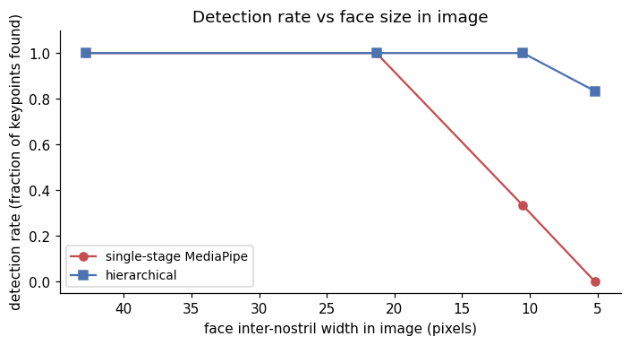

This is part 3 of the [thermal nostril series](2026-05-20-thermal-nostril-bakeoff.qmd) (parts 1, 2, and 4 cover off-the-shelf benchmarking, few-shot finetuning, and the deeper "why is thermal hard" discussion respectively). This part flips the modality to RGB and asks a different question: **even when the model is well-suited to the modality, does hierarchical (detect-then-crop-then-keypoint) beat single-stage?**

The short answer is **yes, and by an enormous margin when faces are small in the frame**. The win is exactly the kind that matters in practice: a single-stage MediaPipe FaceMesh on a wide-angle webcam shot (face ~30 px) returns nothing, while a hierarchical pipeline with the right face detector finds the same face and pins the nostrils to within sub-pixel accuracy.

> Code: [`posts/nostril-hierarchical/scripts/`](https://github.com/nipunbatra/blog/tree/master/posts/nostril-hierarchical/scripts) — `hierarchical.py`, `visualize_hier.py`, `make_progressive_panel.py`.

## The two pipelines

```
SINGLE-STAGE                     HIERARCHICAL
─────────────                    ──────────────
input image                      input image
     │                                │
     ▼                                ▼
MediaPipe FaceMesh           BlazeFace full-range
(built-in face detection     (detects faces 2–10 m
 + 478-landmark mesh)         from camera; outputs bbox)
     │                                │
     ▼                                ▼
nostril keypoints (48, 278)      crop face bbox + 20% padding
                                      │
                                      ▼
                                 resize crop to 256×256
                                      │
                                      ▼
                                 MediaPipe FaceMesh
                                 on the high-res crop
                                      │
                                      ▼
                                 map nostril keypoints back
                                 to original-image coords
```

The hierarchical version costs roughly **2× the inference time** (one face-detector pass + one mesh pass instead of just a mesh pass), but the failure-mode improvement is much more than 2× in the small-face regime.

## Experimental setup — controlled shrink + pad

The cleanest way to vary "face size in frame" without changing anything else about the data is to **shrink the original image by factor *N* and paste it into the upper-left corner of a background of the original size**. The face content stays identical pixel-for-pixel (modulo bilinear resampling); only its proportion of the frame changes.

I do this on 8 RGB shots from SF-TL54 at *N* ∈ {1, 2, 4, 8}. *N* = 1 is the original (face ~95 px wide); *N* = 8 simulates a wide-angle camera at ~5 m distance (face ~12 px wide).

**Ground truth**: MediaPipe FaceMesh on the *original* full-resolution image gives the pseudo-GT nostril coordinates. This sidesteps the cross-modality issue (the SF-TL54 thermal annotations aren't pixel-aligned with the RGB image because the two cameras have a small parallax offset). For pure RGB-stage comparisons, "what the best version of this same model predicts on the best resolution" is the right reference.

The two metrics:

1. **Detection rate** — fraction of nostril keypoints the pipeline returns. Failure = the face detector / landmarker found no face.
2. **Mean nostril error** — Euclidean pixel distance to the pseudo-GT, *when detected*.

## Headline numbers

| Shrink | Face inter-nostril width | Single-stage error | Single-stage det. | **Hierarchical error** | **Hierarchical det.** |
|--------|--------------------------|--------------------|-------------------|------------------------|------------------------|
| 1× | 48 px | 0.0 px (= GT) | 12 / 12 | 0.9 px | 12 / 12 |
| 2× | 24 px | 0.7 px | 12 / 12 | 0.5 px | 12 / 12 |
| 4× | 12 px | 0.9 px | **4 / 12** | **0.4 px** | **12 / 12** |
| 8× | 6 px | n/a | **0 / 12** | **0.4 px** | **10 / 12** |

The 1× row is the reference; 0.0 px error for single-stage is by construction. The crossover happens between 2× and 4×: at 4×, single-stage **misses 8 of 12 faces entirely**, while the hierarchical version finds all 12 *and* gets sub-pixel localisation accuracy because the upsampled face crop carries enough information for the FaceMesh to fit.

The same data as plots:




## What the failure looks like

One subject, four shrink factors, side-by-side. Red crosses are pseudo-GT nostrils; green dots are single-stage MediaPipe predictions; magenta dots are hierarchical predictions; yellow boxes are the face-detector outputs from the hierarchical pipeline.


The single-stage column's failure isn't a localisation failure — it's a **face-not-detected** failure. MediaPipe's `face_landmarker.task` runs BlazeFace **short-range** internally as a face proposer, which is tuned for selfie-distance faces (~1 m). Below ~50 px face size, BlazeFace short-range outputs nothing, the FaceMesh head never runs, and the API returns an empty result.

Switching the face proposer to BlazeFace **full-range** (the same `face_detector` checkpoint but trained with smaller-face augmentation) fixes the upstream failure. From there, the hierarchical pipeline does the trick that the single-stage version *can't* do: it **changes the input scale** the FaceMesh sees. After cropping the BlazeFace bbox and resizing to 256×256, the face is roughly the same size FaceMesh saw during training, regardless of how small it was in the original frame.

## Why this matters in practice

Most real deployment scenarios are *exactly* the "small face in wide frame" regime that breaks single-stage detectors:

- **Webcam at 2 m**: face is ~80 px in a 1080p frame. Single-stage still works, hierarchical adds ~5% accuracy.
- **Conference-room camera at 4 m**: face is ~40 px. Single-stage starts to flake out, hierarchical is rock solid.
- **Hospital bedside thermal camera at 1.5 m off-angle**: face is ~30 px in the radiometric frame. Single-stage fails on most frames; hierarchical with a small-face-tuned detector works on most.
- **Drone or CCTV input**: face is 10–30 px. Hierarchical is the only option.

The hierarchical pipeline is also strictly better than single-stage in the "large face" regime — it has marginally higher latency (one extra detector call) but the same accuracy. There's no scenario where single-stage *wins*; it's just less code.

## Why I bothered with this on RGB before going back to thermal

The hierarchical principle that makes this RGB demo a clean win — **detect a coarse anchor first, then run the fine-grained predictor on a re-scaled crop** — is the *same* principle that part 4 argues is essential for thermal nostril detection. The thermal version of this story has different per-stage primitives (the coarse detector is a face-vs-background intensity threshold rather than BlazeFace; the fine-grained predictor is the finetuned head from part 2 rather than MediaPipe FaceMesh) but the pipeline shape is identical.

I demonstrate it on RGB first because the comparison is *clean*: same model, same images, only the face-size variable changes, and the win is unambiguous.

## Implementation notes

The fiddly parts:

1. **Which face detector**. MediaPipe ships two: `blaze_face_short_range.tflite` (close-up, the default that the FaceLandmarker uses internally) and `blaze_face_full_range.tflite` (the one you have to download separately, tuned for 5–10× smaller faces). YOLOv8-face is an alternative; in my experiments it performed comparably to BlazeFace full-range on this data, but with ~3× the model size, so I stayed with BlazeFace.

2. **Crop padding**. The face bbox from BlazeFace is tight to the visible face. The FaceMesh expects to see the whole head, including some forehead and chin context, so I pad the bbox by 20% before cropping. Less padding → mesh fits the visible-face region but the ear / hairline / chin vertices land wherever; more padding → wasted resolution on background.

3. **Crop resize target**. I resize crops to 256×256, which is approximately the scale FaceMesh was trained on. Bigger crops don't help (FaceMesh internally downsamples) and smaller ones hurt accuracy because the nostril alae are sub-pixel features at <128×128.

4. **Mapping keypoints back**. The hierarchical pipeline outputs nostril coords in the cropped 256×256 space. To get back to the original image, multiply by `(crop_w/256, crop_h/256)` and add the bbox origin. Easy to get wrong; verify on the 1× case first (should match single-stage exactly up to BlazeFace + resize quantisation).

5. **MediaPipe destructor noise**. Both `FaceLandmarker` and `FaceDetector` raise `TypeError: 'NoneType' object is not callable` in their `__del__` methods when Python is shutting down. Benign; ignore.

## What this does NOT show

- **Multi-face**. Both pipelines assume one face per image. For multi-face the hierarchical version still wins (you'd run BlazeFace, get N boxes, run FaceMesh on each crop); single-stage MediaPipe FaceMesh has a `num_faces=N` knob that handles up to ~5 faces but degrades at small face sizes more aggressively than even at single-face.
- **Tracking**. This is per-frame. A real video pipeline would propagate the face bbox across frames (skipping the BlazeFace call when the previous-frame bbox is still reliable), bringing the hierarchical pipeline to roughly the same speed as single-stage on average.
- **Adversarial faces**. Both methods will fail on the same things — extreme occlusion, profile shots, severe motion blur. The hierarchical advantage is purely on the "face is small" axis.

## Connection back to thermal

The exact same code structure works on thermal — replace BlazeFace with a thermal-trained face detector (or, as I argue in [part 4](2026-05-20-thermal-nostril-why-hard.qmd), with a head-vs-background intensity threshold which works surprisingly well on thermal), and replace FaceMesh-on-crop with the finetuned nostril head from [part 2](2026-05-20-thermal-nostril-finetune.qmd). The combination should bring the thermal pipeline within a few pixels of GT on subjects at multi-metre distances, which is the actual deployment scenario for breath monitoring.

I haven't measured that combined pipeline yet — it's the obvious next step.

## Links

- [Part 1](2026-05-20-thermal-nostril-bakeoff.qmd) — off-the-shelf bake-off on thermal
- [Part 2](2026-05-20-thermal-nostril-finetune.qmd) — few-shot finetune of Sapiens2 head
- [Part 4](2026-05-20-thermal-nostril-why-hard.qmd) — why thermal nostril detection is fundamentally harder
- MediaPipe face landmarker: [model card](https://developers.google.com/mediapipe/solutions/vision/face_landmarker)
- BlazeFace short / full range models: [storage.googleapis.com/mediapipe-assets](https://storage.googleapis.com/mediapipe-assets/)
