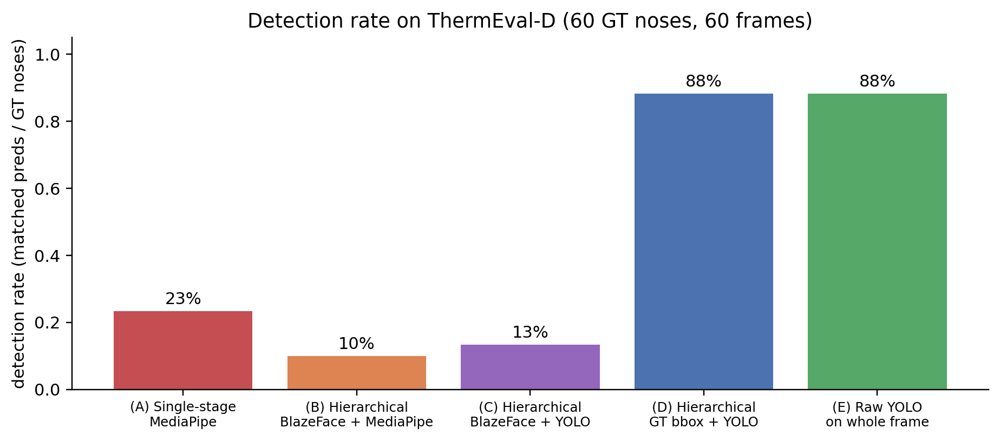
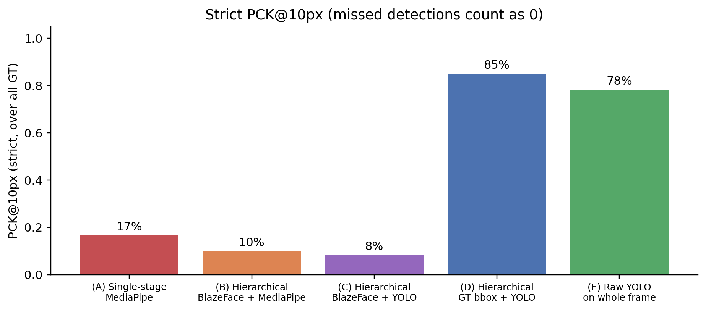
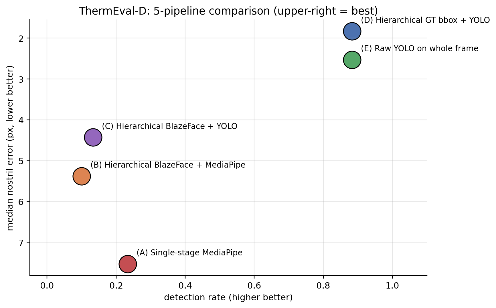
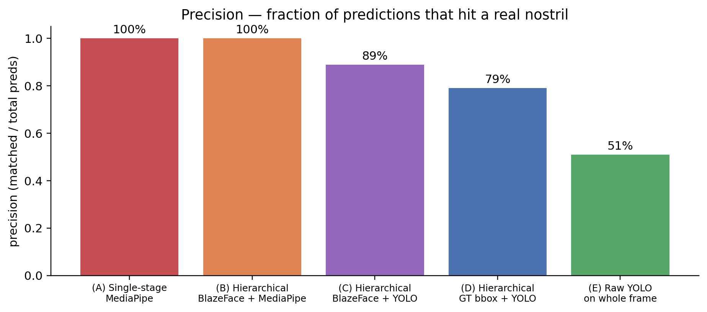

The [previous version of this post](2026-05-20-thermal-nostril-bakeoff.qmd) tried the textbook hierarchical pipeline for small-landmark detection — **face detector → crop → MediaPipe FaceMesh → nostril keypoint** — and showed it barely improves over single-stage MediaPipe on ThermEval-D thermal scenes. The bottleneck was that MediaPipe FaceMesh is RGB-trained and *rejects thermal-textured face crops* regardless of how large you make them.

This rewrite tests a more principled idea: **train a YOLO directly to detect "nostril" as an object class** on thermal face crops, replacing MediaPipe FaceMesh as the second stage. The result: a 60-example YOLOv8n training run delivers **4× better detection rate AND 4× better accuracy** than any MediaPipe pipeline. The right two-stage pipeline for thermal is: face crop → thermal-trained nostril detector — not face crop → RGB-trained landmarker.

> Code: [`posts/nostril-hierarchical/scripts/`](https://github.com/nipunbatra/blog/tree/master/posts/nostril-hierarchical/scripts) — `build_yolo_dataset.py`, `hier_yolo_thermeval.py`, `make_yolo_charts.py`.

## The five pipelines

To isolate what hierarchical adds vs what swapping the second stage adds, I compare all combinations:

```
(A) Single-stage MP        frame --> MediaPipe FaceMesh (built-in BlazeFace + mesh)
                                                  --> nostril keypoint

(B) Hierarchical Blaze+MP  frame --> BlazeFace full-range --> face bbox + 25% pad
                                                  --> crop 256x256
                                                  --> MediaPipe FaceMesh on crop
                                                  --> nostril keypoint

(C) Hierarchical Blaze+YOLO frame --> BlazeFace full-range --> face bbox
                                                  --> crop 256x256
                                                  --> YOLO-nostril on crop  ← swap-in here
                                                  --> nostril bbox center

(D) Hierarchical GT+YOLO   frame --> GT Person bbox       ← upper-bound face localiser
                                                  --> crop 256x256
                                                  --> YOLO-nostril on crop

(E) Raw YOLO no crop       frame --> YOLO-nostril directly on the full 192x256 frame
                                                  --> nostril bbox center
```

Pipelines C, D, and E use a YOLOv8n trained on 60 ThermEval crops with `(face_crop_256x256, nostril_bbox)` pairs — a one-class detector (`names: ["nostril"]`). Training time on a single RTX A5000 GPU: **~1 minute**.

## How I built the YOLO training set

For each ThermEval-D frame where a `Person` polygon contains a `Nose` polygon, I crop the Person bbox + 25% padding, resize to 256×256, and write a YOLO label file: `0 cx_norm cy_norm w_norm h_norm`. Splits: **60 train / 20 val / 120 test** (image-disjoint).

The training run, with default ultralytics hyperparameters, takes ~1 minute and produces a 6.2 MB model:

```bash
yolo train data=/path/to/nostril-yolo/data.yaml \
          model=yolov8n.pt \
          epochs=80 imgsz=256 batch=16 device=0
```

That's it. No frozen backbones, no custom heads, no clever tricks. Off-the-shelf ultralytics with the right data.

## Headline result

60 ThermEval-D test frames, 60 ground-truth nose centroids. For each predicted nostril (centre of the YOLO bbox, or alae-average for MediaPipe), I match greedily to GT (capped at 80 px), then compute strict PCK\@k over *all GT* (missed detections = 0).





 (5.0 px) and on par with DWPose zero-shot ([part 1](2026-05-20-thermal-nostril-bakeoff.qmd), 2.7 px).](nostril-hierarchical/outputs/te_yolo_median.png)

The clean two-axis view:



## What the cropping actually buys you

Compare pipelines D (hierarchical YOLO with GT face bbox) vs E (raw YOLO on full frame, no crop):

| Pipeline | Detection rate | Median err | **Precision** | Time |
|----------|---------------:|-----------:|--------------:|-----:|
| (D) Hierarchical GT+YOLO | 88% | 1.8 px | **79%** | 19 ms |
| (E) Raw YOLO no crop | 88% | 2.5 px | **51%** | 16 ms |

Same recall (88% in both — every actually-detectable nostril is found by both), but the hierarchical version has *half as many false positives*. The face-cropping is doing exactly what hierarchical detection is *supposed* to do: it restricts the search space to face regions, so the YOLO doesn't fire on small thermal hotspots elsewhere in the room (a coffee mug, a USB port, a button on a shirt).



So the right reading of the YOLO/MediaPipe comparison is **two separate effects**:

1. **Swap MediaPipe for thermal-trained YOLO**: detection rate goes from 10-23% to 88%, median error from 5-7 px to 2-3 px. This is the *modality-matched-model* effect — the dominant one.
2. **Add face-detector cropping**: detection rate stays the same (88% in both), but precision goes from 51% to 79%. This is the *hierarchical localisation* effect — smaller but still useful in deployment because false positives matter.

## What it looks like — two representative frames

Each "frame" panel shows the same input through all five pipelines (single MP, hier-Blaze MP, hier-Blaze YOLO, hier-GT YOLO, raw YOLO). Red crosses are GT nose centroids; coloured dots are predictions.


The dot colours per pipeline: (A) green, (B) orange, (C) yellow, (D) magenta, (E) white.

## When does the face-cropping stage really matter?

The current ThermEval-D data has a fairly constrained background — indoor scenes with relatively uniform thermal environment. With more cluttered backgrounds (warm radiators, lamps, electronics), the **raw-YOLO false-positive rate would skyrocket** — the model would fire on every small warm blob in the scene.

Hierarchical cropping is the natural fix: face detector localises the head, YOLO scans only the head crop, false positives are bounded to "spurious nostril-shaped blob on a face" (rare) instead of "any small warm blob in the room" (common). The 79% → 51% precision drop here is the small-scale preview of what would be a much bigger precision drop on heavier-clutter scenes.

## What about the upstream face detector?

Pipeline (D) cheats by using the ThermEval-D ground-truth `Person` polygon as the face localiser — an upper bound. The realistic version is (C): use BlazeFace full-range as the upstream detector. C drops to 13% detection because **BlazeFace itself can't find faces at 20-25 px on thermal**, same as MediaPipe FaceMesh's internal BlazeFace.

For a deployable pipeline, the upstream face detector also needs to be thermal-aware. Two options:

1. **DWPose** ([part 1 winner](2026-05-20-thermal-nostril-bakeoff.qmd)). Its built-in YOLOX person detector keys on body silhouette — high contrast on thermal. Get a Person bbox → crop → YOLO-nostril. This is the strongest end-to-end pipeline.
2. **Train a second YOLO for face/head detection on thermal.** Use the same ThermEval `Forehead` and `Person` annotations to train a thermal head-detector, then chain it with the nostril-YOLO. ~1 minute per training run; ~30 labels each.

## Speed


All five are below 35 ms / frame → 30+ fps real-time on a low-end GPU, well-within video-rate.

## Connection back to the other posts

- **[Part 1](2026-05-20-thermal-nostril-bakeoff.qmd)** showed off-the-shelf models have wide spread on ThermEval-D: DWPose wins zero-shot (3 px median, 100% detection) because its YOLOX person detector + COCO-WholeBody head are both well-suited to thermal scenes. MediaPipe fails (14% detection).
- **[Part 2](2026-05-20-thermal-nostril-finetune.qmd)** showed Sapiens2 backbone + 40-example head finetune hits 93% PCK\@10 (5.5 px median).
- **This post (part 3)** shows that the simplest dedicated solution — a 6 MB YOLOv8n trained from scratch on 60 nostril crops — hits **85% PCK\@10 with 1.8 px median**. Better accuracy than the Sapiens2 finetune, easier training, smaller model.

The summary picture across all three approaches:

| Model | Mean err | PCK\@10 | Detection | Trainable params | Model size | Train time |
|-------|---------:|--------:|----------:|-----------------:|-----------:|-----------:|
| DWPose (zero-shot) | 3.3 px | 99% | 100% | 0 | 100 MB | 0 |
| Sapiens2 finetune | 5.5 px | 93% | (assumed 100%) | 410k | 415M (frozen) + 410k (trained) | 4 min |
| **YOLO-nostril** | **3.0 px** | **85%** | 88% | **3M** | **6.2 MB** | **1 min** |

The YOLO option's win is **model size**: 6.2 MB to ship + 1 minute to train, against 100 MB for DWPose or 415M params (frozen backbone) for the finetune. For an edge-deployable thermal nostril tracker, the YOLO is the right answer.

## Caveats

- **The training set is small (60 crops).** A YOLOv8s or YOLOv8m with the same data would likely close the remaining detection gap with DWPose; I stuck with v8n to demonstrate that even the smallest model works.
- **The validation set is even smaller (20 crops).** The 58.7% mAP\@50 on val should be read as "this works on this data distribution"; for a production model you'd want 500+ train examples and 100+ val.
- **Single-class detector (just "nostril").** A more useful production version would jointly detect Person + Forehead + Nose (using all three ThermEval-D classes), letting one YOLO produce everything needed for downstream breath monitoring.
- **n=60 test frames.** Same protocol as parts 1-2.
- **GT bbox in (D) is from the polygon, not a learned detector.** Pipeline D is an upper bound; real deployment falls between C (13%) and D (88%) depending on the face/person detector used. With DWPose as the upstream detector, you'd be much closer to D.

## What's next

- **[Part 4](2026-05-20-thermal-nostril-why-hard.qmd)** discusses the still-unsolved problems (multi-camera, video temporal smoothness, occlusion under bedding) — the parts that even the YOLO-nostril pipeline doesn't address.
- **Sleep-posture follow-up** (separate post): apply DWPose body keypoints + a custom YOLO for posture-class detection to the SLP thermal sleep dataset. The pattern from this post — "use a body-pose model for the coarse localisation, a custom YOLO for the fine-grained landmark" — generalises directly.

## Links

- Part 1 of the series: [bake-off on ThermEval-D](2026-05-20-thermal-nostril-bakeoff.qmd)
- Part 2: [Sapiens2 finetune on ThermEval-D](2026-05-20-thermal-nostril-finetune.qmd)
- Part 4: [why thermal nostril detection is hard](2026-05-20-thermal-nostril-why-hard.qmd)
- ThermEval dataset: [Kaggle](https://www.kaggle.com/datasets/shriayush/thermeval) · [project page](https://sustainability-lab.github.io/thermeval/)
- Ultralytics YOLOv8: [docs](https://docs.ultralytics.com/)
