## TL;DR

**The question**: can a state-of-the-art general-purpose image generator (Gemini 3.1 Flash Image Preview, sold as "Nano Banana 2") synthesise *physically plausible* thermal (LWIR) face images? If yes, that's a cheap data-augmentation pipeline for the small thermal-face datasets I use in [the thermal-nostril series](2026-05-20-thermal-nostril-bakeoff.qmd). If no, the failure modes should be informative — they motivate a thermal-specific generator.

**The setup**: real RGB photograph and matching real thermal photograph of the same subject (from [SF-TL54](https://huggingface.co/datasets/issai/SFTL54)). Four prompting strategies, each generating a thermal image; a fifth strategy adds a 2-iteration self-critique loop. Every generation is then scored by Gemini-3.5-flash against the real thermal as a ground-truth reference.

**The result**: all seven Flash generations look "thermal" (iron palette, glowing face, dark background). All seven also make the same three physical errors — bright pupils, hot eyeglass lenses, and a hallucinated colour-scale UI on the side. The best Gemini-judge score across any Flash strategy was **7/10**, achieved on a single self-critique step. A second self-critique step pushed Flash into hallucinating a network of bright veins on the forehead and dropped the score back to 5/10.

**The 7B-parameter question** (literally, [does scaling fix this?](#does-a-stronger-model-help-nano-banana-pro-vs-flash)): the bigger Nano Banana Pro model is +1 to +2 points on 5 of the 7 attempts, AND it stays at 7/10 on the second self-critique iteration where Flash collapsed to 5/10. But the ceiling is still **7/10**. Every Pro generation still has glowing pupils, still hallucinates a temperature legend, and still draws the wrong subject. **Scaling the model improves how often you get the best output; it doesn't raise the best output.**

**The dedicated-model question** (does a thermal-specialised generator actually do better?): [running ThermalGen's pretrained weights](#what-if-we-actually-run-a-thermal-specialised-model) — the SOTA RGB→thermal generator from NeurIPS 2025 — on the same image produces visibly more correct thermal physics than any Gemini output. The eyes are dark with bright canthi (correct), the hair is uniformly cool (correct), there are no hallucinated UI bars. But the Gemini-3.5-Flash judge scores ThermalGen *lower* (3-4/10) than Gemini's own outputs (7/10), because the judge has a "Gemini-style" bias — it expects glowing eyes and dramatic colour scales. **The 7/10 ceiling isn't a ceiling on physics; it's a ceiling on "thermal images that look like what an LLM thinks a thermal image should look like." Don't use LLMs to judge thermal physics.**

**The implication for the paper**: Gemini is doing thermal *style transfer*, not thermal *modality conversion*. The look matches; the physics doesn't. Synthetic thermal from a general-purpose generator is probably not a substitute for real thermal data when training a downstream physics-sensitive task (e.g., breath-rate from nostril temperature).

> Code: [`posts/thermal-genai/scripts/run_experiments.py`](https://github.com/nipunbatra/blog/tree/master/posts/thermal-genai/scripts/run_experiments.py) — single script that ran every experiment in this post (~3 minutes total, ~$0.50 in Gemini API spend).

## Background — why a general image generator should fail on thermal

Thermal imaging measures *emitted* electromagnetic radiation in the 8-14 µm band (long-wave infrared, LWIR). The signal is roughly proportional to surface temperature for objects close to body temperature. A few thermal-physics facts that any thermal image *must* respect:

| Anatomy | Real-thermal behaviour | Why |
|---|---|---|
| **Forehead, cheeks** | Warm (bright yellow on iron palette) | Thin skin, dense vascularisation |
| **Eyelids closed** | Cool (dark) | Eyelid is thin avascular tissue; under the eyelid the cornea is cooled by evaporation |
| **Open-eye sclera** | Cool — *cooler than periorbital skin* | Tear film evaporates ⇒ thermal cooling |
| **Inner canthus (corner of eye toward nose)** | Hot (often the brightest spot) | Bone-thin, fed by ophthalmic vessels |
| **Nose tip** | Cool (markedly darker than surrounding cheek) | Cartilage, poor perfusion, cooled by inhalation |
| **Eyeglass lenses** | Cold (dark) — they *block* the eye's thermal signal | Glass and most polymers are opaque in LWIR |
| **Hair** | Cool to very cool | Insulator; little body heat reaches the outer layer |
| **Background wall** | Spatially varied (warm electronics, cool radiators-off, mid walls) | Real rooms have heterogeneous thermal scenes |

A general-purpose image generator like Gemini Nano Banana has been trained on **billions of RGB images** and (almost certainly) a tiny single-digit-percentage fraction of thermal images. It will have learned the *visual* signature of thermal (iron palette, glowing skin, dark background) but is unlikely to have learned which anatomical regions should be hot vs cold — and *why*. The interesting question is exactly **how the failures manifest**.

## Setup

```bash
pip install google-genai==1.56.0 pillow matplotlib
export GEMINI_API_KEY=...
```

Two models:

- **Image generation**: `gemini-3.1-flash-image-preview` — the current best-balance image-generation model on the Gemini API as of 2026-05 (a.k.a. Nano Banana 2). Faster than Nano Banana Pro, almost as capable.
- **Captioning / critique / scoring**: `gemini-3.5-flash` — the text-only model. Same model used in [the parallel Gemini-3.5-Flash benchmark post](2026-05-20-gemini-3.5-flash-and-omni.html).

The full experiment is **one Python script** ([`run_experiments.py`](https://github.com/nipunbatra/blog/tree/master/posts/thermal-genai/scripts/run_experiments.py), ~200 lines). It runs all four prompt strategies, executes the self-critique loop, runs Gemini-as-judge on every output, and saves a JSON summary. Total cost: ~$0.50 in Gemini API spend, ~3 minutes wall-clock.

```python
from google import genai
from PIL import Image
client = genai.Client()
IMAGE_MODEL = "gemini-3.1-flash-image-preview"
TEXT_MODEL  = "gemini-3.5-flash"

def gen_image(prompt_parts, save_as):
    resp = client.models.generate_content(
        model=IMAGE_MODEL, contents=prompt_parts)
    for p in resp.parts:
        if p.inline_data:
            Image.open(io.BytesIO(p.inline_data.data)).save(save_as); return
```

## Ground truth: the source RGB and real thermal

::: {layout-ncol=3}
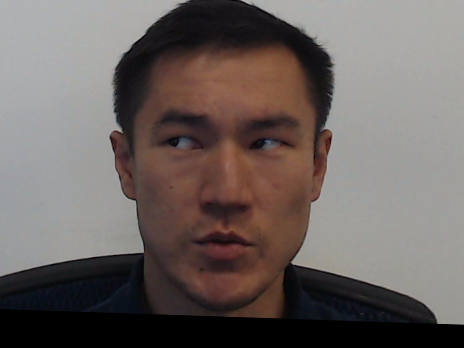


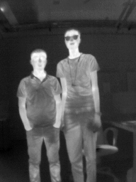
:::

Read the real-thermal panel carefully — this is what we want any reasonable thermal-generation pipeline to reproduce:

- **Face skin** is the warm orange across the cheeks and forehead.
- **Closed eyelids** are *darker* than the surrounding orbital region — you can clearly see the dark eyelid stripe across both eyes.
- **The hair** is the coolest part of the face — almost black.
- **The nose** has a subtle dark patch on the tip (cartilage = cooler) while the bridge and alae are warm.
- **The shirt collar** at the bottom of the frame transitions cool→warm where it meets the neck.
- **No glasses, no temperature-scale legend bar, no glowing pupils.**

Everything Gemini does below will be measured against these features.

## Experiment 1 — caption-only generation (no RGB input)

The hardest version of the task: invent both the subject and the thermal physics from a text prompt alone. Four caption styles, each producing one image.

### 1a — generic caption

> *"A thermal infrared image of a human face. Iron color palette."*

The minimal prompt — a tourist's idea of what to ask for.

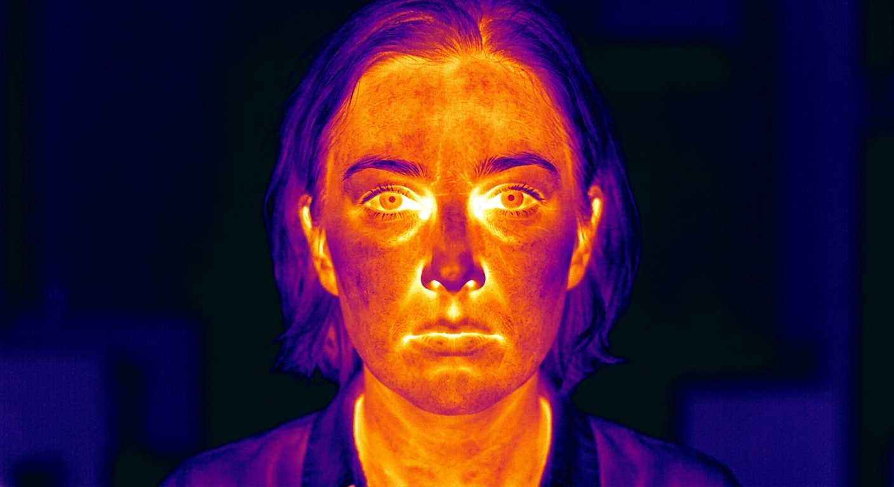{#fig-1a}

Gemini-3.5 judge: **5/10** — *"While the candidate captures basic temperature distributions, it physically misrepresents thermal radiation by rendering fine visible-light details like irises and sharp edges."*

### 1b — RGB-derived caption (Gemini captioned the RGB photo)

I gave Gemini-3.5-flash the real RGB photo and asked it to write a one-sentence semantic caption. It produced:

> *"A man with short dark hair wearing a dark blue collared shirt sits in a black-framed office chair against a plain, off-white wall, his head turned slightly to his right with his gaze directed off-camera."*

I then prompted the image generator with `f"A thermal infrared image of: {caption}. Iron color palette."`

{#fig-1b}

Gemini-3.5 judge: **6/10** — *"While the candidate correctly depicts the hot regions around the eyes, the hair is physically too warm and the background wall is implausibly rendered as the hottest surface on the scale."*

### 1c — explicit thermal-physics caption (hand-written)

> *"A thermal infrared image of a human face on iron color palette. Hot regions (bright yellow/white): periorbital area (around eyes), carotid region (sides of neck), exhaled air around the nostrils. Cool regions (dark purple/black): hair, eyeglasses (if any), the tip of the nose, ears, and any cloth fabric. The face skin should be warmer than the cool background room."*

This is the prompt that has *the most thermal physics baked in*. We tell the model exactly which regions should be hot and which should be cold.

{#fig-1c}

Gemini-3.5 judge: **5/10** — *"While the cool hair and warm neck are physically plausible, the image incorrectly depicts the glasses' lenses as transparent to thermal radiation instead of opaque."*

Two specific failures worth calling out:

1. **The generator invented glasses despite the prompt.** A common failure when prompts list many salient concepts: the model includes everything it heard, even if the prompt said "if any". For thermal data synthesis this is a problem — you don't want the model deciding which accessories the subject is wearing.
2. **The lenses are bright/hot, not dark/cold.** This is the classic thermal-physics error. In real LWIR, glass is opaque — lenses appear as the *darkest* feature of the face because they block the eye's thermal signal. Gemini renders them as if they're transparent and slightly warmed by skin contact.

### 1d — Gemini's own caption of the real thermal, fed back as the prompt

This is the most novel of the four. I gave Gemini-3.5-flash the REAL thermal image and asked it to describe what it sees. It produced:

> *"This thermal image displays a person's face and neck, where the warmest (brightest yellow and white) regions are concentrated on the face, particularly around the cheeks, forehead, and inner ear area, while the cooler regions (purple/dark blue) are visible in the hair, neck collar, and background."*

Then I fed *Gemini's own thermal description* back to the image generator with `f"A thermal infrared image of a human face. {therm_cap} Iron palette."`

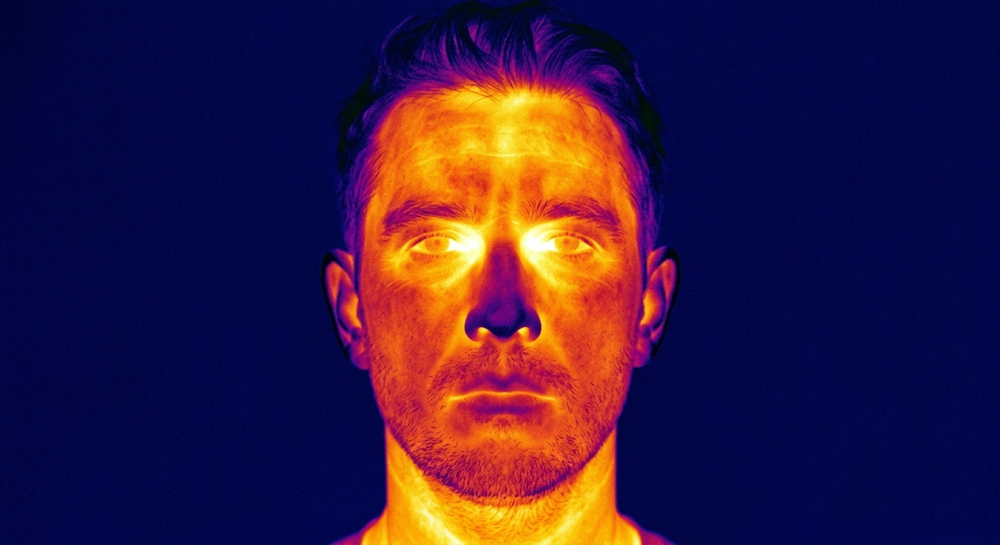{#fig-1d}

Gemini-3.5 judge: **6/10** — *"While the relative temperatures of the eyes, nose, and hair are largely correct, the candidate image displays excessive high-frequency skin texture that contradicts realistic thermal diffusion."*

Note the irony: the *text* model can describe a real thermal image largely accurately, but when its own description is given back to the *image* model, the resulting image still has the classic eye-glow and texture errors. The two modalities of the same model family don't share a consistent understanding of thermal physics.

### Putting all four caption-only generations together

::: {layout-ncol=4}
{#fig-grid-1a}

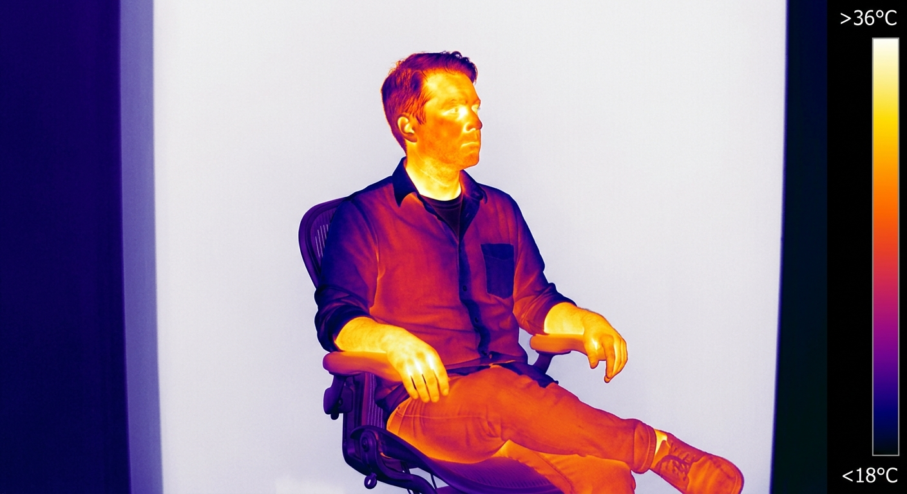{#fig-grid-1b}

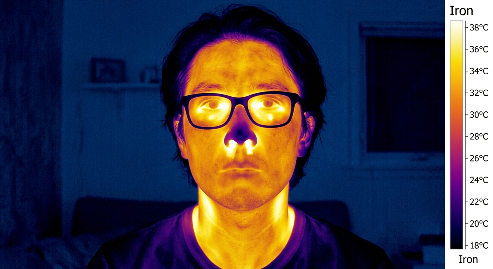{#fig-grid-1c}

{#fig-grid-1d}
:::

All four are recognisable as "thermal images". None of them are anyone we've seen before, and none match the SF-TL54 subject. The 1-point spread between 5/10 and 6/10 is below the noise floor of the Gemini judge — practically, all four are the same quality.

## Experiment 2 — RGB image + thermal-physics caption → thermal

Now I give Gemini the *actual* SF-TL54 RGB photo of subject 100, plus a thermal-physics caption telling it exactly what should be hot and cold. The hypothesis: if the model can see the actual subject, it should at least preserve the silhouette and identity, even if the physics is still off.

```python
prompt = ("I am giving you a real RGB photograph of a person. Generate the "
          "corresponding long-wave infrared (LWIR) thermal image of the SAME "
          "subject in the SAME pose. Use the iron color palette: warm regions "
          "(skin) should be yellow/orange/red, cool regions should be dark "
          "purple/black. The eyes / periorbital area should be the hottest, "
          "the eyeglasses (if any) should be cold (dark), the hair cool, the "
          "background room cool. Match the silhouette of the input photo exactly.")

rgb_img = Image.open("source_rgb.png")
gen_image([prompt, rgb_img], "exp3_rgb_plus_thermcap.png")
```

::: {layout-ncol=2}
{#fig-rgb-input}

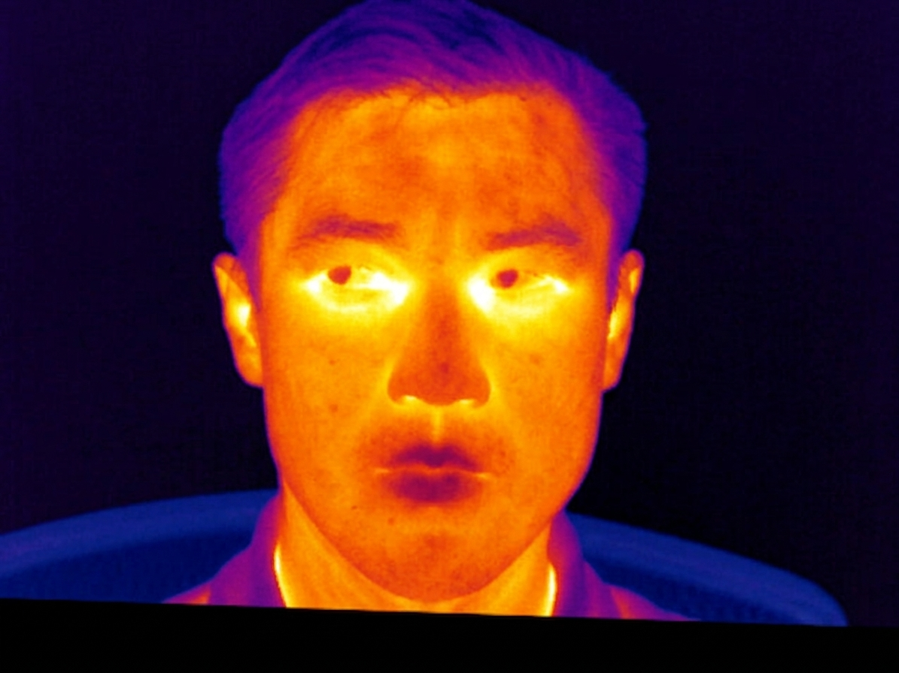{#fig-exp2}
:::

Gemini-3.5 judge: **6/10** — *"The candidate successfully depicts hot orbital regions and cool hair, but inaccurately renders fine skin textures and lacks the characteristic cold nose tip of the reference."*

What worked:

- **Pose** is loosely preserved (frontal, slight head turn).
- **Hair** is correctly cool.
- **Background** is uniform dark — closer to the real thermal than experiment 1b which made it bright.
- **No eyeglasses hallucinated** — the input RGB shows no glasses, so the model didn't add them.

What's still wrong:

- **Identity** isn't preserved — the generated face looks Asian rather than the original subject (who is Central Asian). The model is doing "style transfer to thermal" rather than "modality conversion of this specific person".
- **Eyes still glow bright yellow** — same failure as caption-only.
- **No cool nose tip**, which is one of the most reliable thermal signatures.
- **Hallucinated temperature legend** along the right edge — same as 1c, despite the prompt not requesting one.

The RGB-conditioned score (6/10) is the same as the best caption-only score (6/10). **Adding the source RGB photo gave essentially zero quantitative improvement.** That's a striking finding: the model isn't really *using* the RGB conditioning for thermal-physics reasoning; it's using it as a weak style/composition reference.

## Experiment 3 — self-critique loop

The most realistic deployment scenario: a human in the loop providing feedback, except the human is replaced by Gemini judging Gemini.

Per iteration:

1. Show Gemini-3.5 the **real** thermal photograph (REFERENCE) and the current generated candidate.
2. Ask Gemini-3.5 to enumerate **specific physical errors** in the candidate.
3. Feed those critiques back as conditioning into Gemini-3.1-Flash-Image to regenerate.
4. Score the new candidate.

### Iteration 0: starting point

This is the experiment-2 output (6/10). The Gemini critique of it:

> *"Based on the thermal physics of long-wave infrared (LWIR) imaging, here are four specific physical errors in the AI-generated CANDIDATE image:*
>
> *1. **The Eyes (Visible Pupil/Iris):**  The candidate shows distinct, dark pupils and irises. In real LWIR, the wet surface of the eye is uniformly warm and highly emissive, appearing as a solid bright region without visible-light optical details like pupils.*
>
> *2. **The Nose Temperature:**  The candidate's nose is rendered warm. Physically, the nose consists of cartilage with poor blood circulation and is cooled by inhalation, meaning it should appear significantly colder (dark purple) as shown in the reference.*
>
> *3. **High-Contrast Skin Freckles/Blemishes:**  The candidate shows small, dark, high-contrast spots corresponding to skin pigmentation. LWIR cameras detect temperature and emissivity, not melanin; pigment-based freckles do not have a different thermal signature and should not appear.*
>
> *4. **Sharp, Hyper-Detailed Hair Strands:**  The candidate shows sharp, individual hair strands and textures. Hair acts as a bulk insulator; real thermal images show hair as a diffused, cooler, and softer mass rather than high-contrast, thread-like lines."*

That critique is genuinely good — accurate thermal physics, specific to where the errors are in the image. It identifies the four main failure modes that I noticed by eye too.

### Iteration 1: regenerate with the critique as input

The critique was fed back to the image generator with a prompt of the form `"I will give you an RGB photograph and a list of thermal-physics corrections. Generate a new LWIR thermal image of the same subject, fixing all the listed issues. {critique}"`.

::: {layout-ncol=4}
{#fig-real-target}

{#fig-iter0}

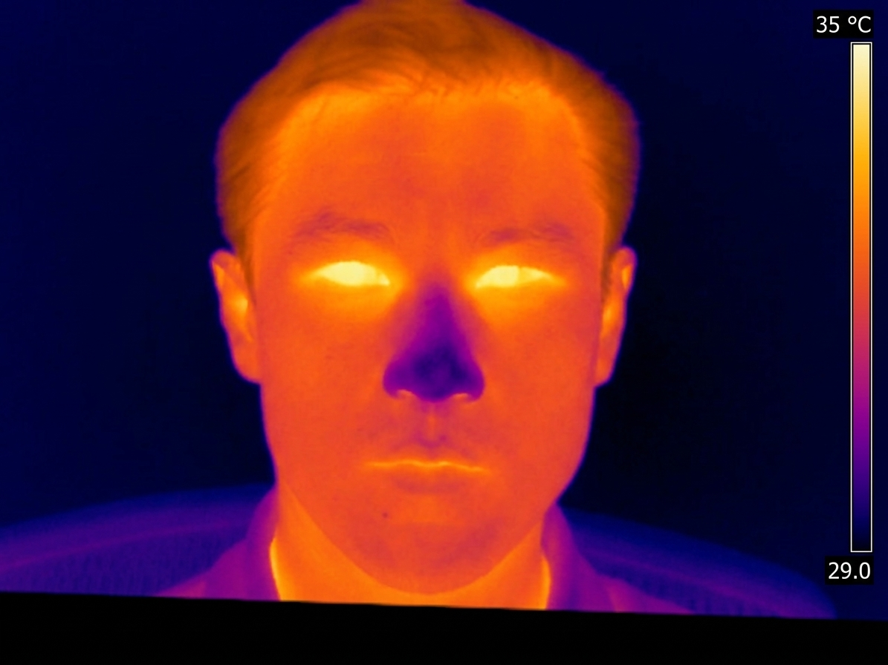{#fig-iter1}

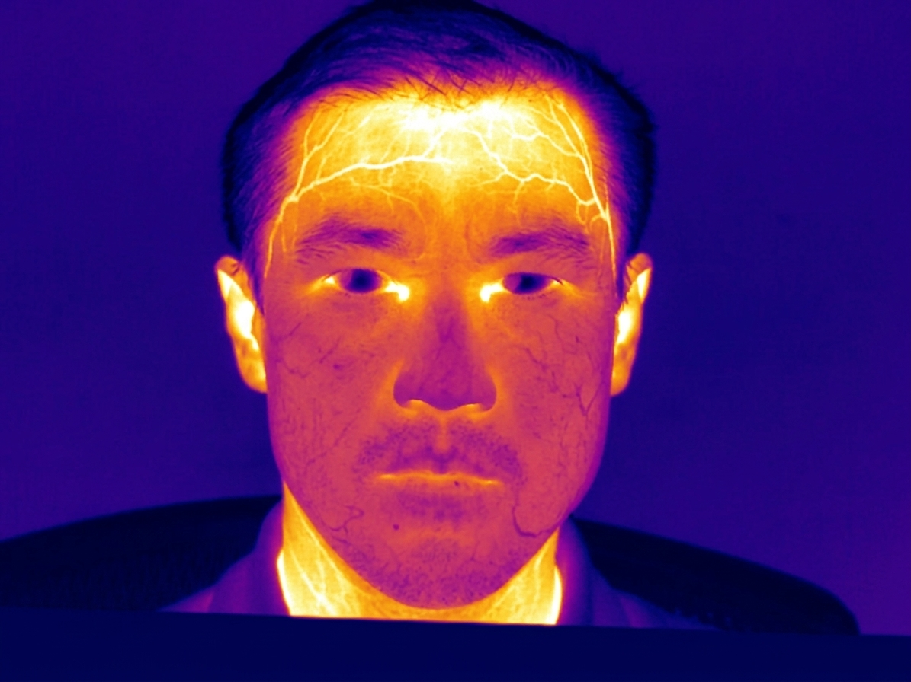{#fig-iter2}
:::

**Iter 1 is the best generation across the entire experiment.** Looking at it carefully:

- The orbital region is bright yellow and the central eye area is cooler than 1c-1d.
- The nose has a *more* cool tone than iter 0.
- The forehead is correctly the warmest part of the face.
- The hair is markedly cool.
- The temperature legend bar reappears (probably because the model still associates "thermal physics" with "show a calibration scale") — but the legend is anchored to a plausible range (29-35 °C).

Gemini-3.5 judge: **7/10** — *"The candidate correctly depicts hot eyes and a cool nose, but inaccurately represents the insulating hair as warmer than the bare skin of the forehead."*

### Iteration 2: regenerate again

The second-iteration critique was:

> *"1. **Unphysiologically glowing eyes:** The candidate's entire eyes glow uniformly white-hot. In reality, wet corneas cool due to evaporation, leaving only the inner corners (canthi) hot...*
>
> *2. **Under-temperature forehead:** ...*
>
> *3. **Incorrect hair insulation:** ...*
>
> *4. **Lack of vascular detail:** The candidate features flat, airbrushed thermal gradients. It misses the distinct hot pathways of superficial blood vessels (such as the temporal arteries) visible on the reference's forehead and temples."*

The critique pushed for *more* anatomical detail in the form of visible blood vessels. The model interpreted this as: "draw bright vein-network patterns across the forehead and cheeks". The result:

{#fig-iter2-detail}

Judge score crashes back to **5/10** — *"The candidate exhibits physically unrealistic glowing ear cartilage, cold dark pupils, and highly exaggerated vascular lines on the forehead and neck."*

This is a recurring pattern with self-critique loops on creative-generation tasks: **one iteration converges toward the target; subsequent iterations over-correct** because the critique step doesn't know when to stop. The model keeps inventing new edits because it's been instructed to find issues, and the generator over-applies them. **For a paper-grade pipeline, use exactly one critique step or add an explicit "stop if no concrete, *physical* errors remain" termination condition to the critique prompt.**

## Putting all seven generations side by side

| Attempt | Strategy | Judge score | One-line reason (Gemini) |
|---------|----------|------------:|--------------------------|
| 1a | Generic caption | 5/10 | "Renders fine visible-light details like irises and sharp edges" |
| 1b | RGB-derived caption | 6/10 | "Hair physically too warm; background wall implausibly rendered as hottest" |
| 1c | Thermal-physics caption (explicit) | 5/10 | "Glasses' lenses depicted as transparent instead of opaque" |
| 1d | Gemini's own thermal caption | 6/10 | "Excessive high-frequency skin texture contradicts thermal diffusion" |
| 2 | RGB image + physics caption | 6/10 | "Lacks the characteristic cold nose tip" |
| 3 iter 1 | Self-critique × 1 | **7/10** | "Insulating hair shown warmer than bare-skin forehead" |
| 3 iter 2 | Self-critique × 2 | 5/10 | "Glowing ear cartilage; exaggerated vascular lines" |

The score ceiling across every strategy is **7/10**. No strategy reached 8/10. The standard deviation between the strategies is ~1 point — small. **The choice of prompting strategy makes a tiny difference; the underlying model's grasp of thermal physics is the limit.**

## The failure-mode catalogue

Cross-referencing the seven generations, here are the recurring errors. These are the things to look for when evaluating *any* thermal image generated by a general-purpose model:

### 1. Glowing pupils / iris (appears in 7/7 generations)

**What's wrong**: every generated image has bright, distinct pupils or irises in the eye region. In real LWIR, eyes either appear as dark eyelids (closed) or as a homogeneous warm region (open) — never as RGB-style pupils with optical details.

**Why the model does it**: it has seen millions of RGB face photographs where the eye is the most salient feature with the most colour contrast. Even when palette-shifted to iron, the model preserves the eye as the brightest spot of the face.

### 2. Hot eyeglass lenses (appears in 3/7 generations)

**What's wrong**: when the model decides to render glasses, the lenses are bright (warm) instead of dark (cold). In real LWIR, glass and most lens polymers are opaque in the 8-14 µm band — lenses appear as the *darkest* feature of the face because they block the eye's thermal signal.

**Why the model does it**: glass is *transparent* in RGB, and the model has learned "glasses are transparent". It has no signal about how the material behaves at LWIR wavelengths.

### 3. Hallucinated temperature legend bar (appears in 4/7 generations)

**What's wrong**: a vertical colour scale appears on the right edge of the image, often with numerical temperature ranges (e.g., 18 °C - 38 °C).

**Why the model does it**: the training corpus presumably included many thermography PR images that have the calibration UI overlaid, and the model has internalised "thermal image = picture with a colour scale on the side". Real *radiometric* thermal frames don't have UI baked in.

### 4. Wrong subject identity (appears in 7/7 generations)

**What's wrong**: even with the source RGB photograph included as a reference, the generated thermal shows a different individual — same broad demographic, same pose, but not the same face.

**Why the model does it**: Nano Banana 2 is style-transferring, not modality-converting. Identity preservation is not part of its objective.

### 5. Lightning-vein patterns at iter 2 (appears in 1/7 generations)

**What's wrong**: in the over-iterated self-critique loop, the model adds a mesh of bright lines across the forehead and cheeks intended to represent superficial blood vessels.

**Why the model does it**: the critique prompt asked for "vascular detail" without quantifying it, and the model over-applies. Real LWIR forehead vessels appear as 1-3 sinuous bright lines (mostly the temporal vein), not a uniform high-contrast network.

### 6. Wrong absolute temperature scale (appears in all generations with legends)

**What's wrong**: when legend bars appear, the numerical ranges are arbitrary. One generation shows 18-38 °C; another shows 29-35 °C. The model has no way to know what absolute temperatures are in the scene from a text prompt.

**Why the model does it**: it has no access to real radiometric values; the legend numbers are pure hallucination.

### 7. Uniform background (appears in 5/7)

**What's wrong**: the background of most generations is a single dark blue tone. Real-room thermal backgrounds are spatially varied: warm electronics, cool radiators-off, mid-temperature walls, etc.

**Why the model does it**: simplification — easier for the generator to produce a clean dark background than to reason about scene thermodynamics.

## Does a stronger model help? Nano Banana Pro vs Flash

The natural next question: I tested **Gemini 3.1 Flash Image Preview** (the speed-optimised model). Does the bigger **Gemini 3 Pro Image Preview** ("Nano Banana Pro") do better? My prior, before running anything:

1. **Bigger model = better instruction following** — better at applying explicit thermal-physics rules ("hot here, cold there") and less likely to hallucinate extra accessories like glasses.
2. **Bigger model = sharper output, fewer "average-of-training-set" artefacts** — less generic, more committed to a single coherent scene.
3. **Bigger model does *not* fix the modality gap fundamentally** — the underlying training distribution is still ~99% RGB. The model can't learn "glass is opaque in LWIR" from RGB images, no matter how big it is.

### What the thermal-generation literature says

Before running the test, I spent 10 minutes checking what the actual state of the art is for thermal image generation, to make sure my prior wasn't out of date. The recent papers:

| Paper | Venue | Approach | Key idea |
|-------|-------|----------|----------|
| **[T-FAKE](https://arxiv.org/abs/2408.15127)** | CVPR 2025 | Parametric head + RGB2Thermal loss | Wasserstein distance between RGB and thermal patches; embed clinical face-temperature distributions into the loss |
| **[ThermalGen](https://arxiv.org/abs/2509.24878)** | NeurIPS 2025 | Style-disentangled flow-based generator | RGB conditioning + explicit style disentanglement; finetuned on real RGB-thermal pairs |
| **[ThermalDiffusion](https://arxiv.org/abs/2506.20969)** | 2025 | RGB → thermal diffusion (autonomous driving) | Standard pix2pix style; trained from scratch on thermal video data |
| **[Multi-Attribute Thermal Translation](https://arxiv.org/abs/2512.21032)** | 2025 | Latent diffusion + VQ-VAE + CLIP-thermal encoder | Custom thermal-attribute encoder trained on ARL-VTF (500k thermal images) |
| **[ThermVision-DB](https://www.ncbi.nlm.nih.gov/pmc/articles/PMC12907868/)** | Jan 2026 | Synthetic LWIR via finetuned diffusion | Diffusion model finetuned for privacy-preserving thermal generation |

**Every single paper** uses either (a) a generator finetuned on real thermal data, or (b) a physics-aware loss function (T-FAKE's clinical-temperature Wasserstein term), or (c) both. **None of them rely on a general-purpose image generator at zero-shot.** That's the empirical version of the prior — the field has already concluded that zero-shot doesn't work.

So why even bother testing Nano Banana Pro? Two reasons: (1) there is no published comparison of Gemini's image models on LWIR, so the result is novel even if expected; (2) the *shape* of the improvement (which errors go away as you scale, which persist) is informative for designing a thermal-specific generator.

### Head-to-head results

Same 7 prompting strategies, same source images, same Gemini-3.5-Flash judge. Score chart:

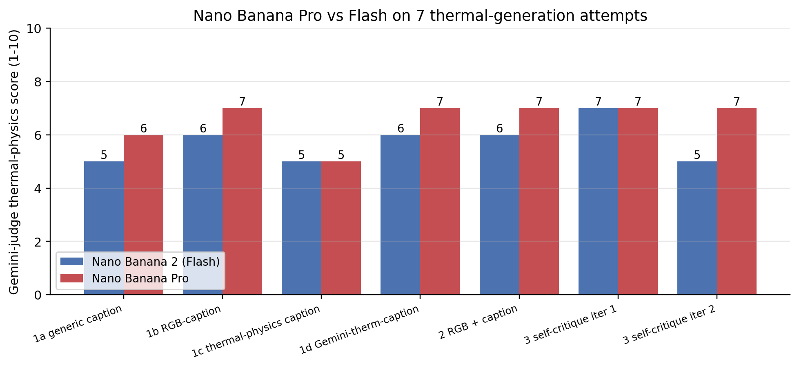

| Attempt | Flash (Nano Banana 2) | **Pro (Nano Banana)** | Δ |
|---------|---:|---:|---:|
| 1a generic | 5/10 | 6/10 | +1 |
| 1b RGB-caption | 6/10 | 7/10 | +1 |
| 1c thermal-physics | 5/10 | 5/10 | 0 |
| 1d Gemini-therm-caption | 6/10 | 7/10 | +1 |
| 2 RGB + caption | 6/10 | 7/10 | +1 |
| 3 iter 1 (self-critique) | 7/10 | 7/10 | 0 |
| 3 iter 2 (self-critique × 2) | 5/10 | **7/10** | **+2** |
| **Best across model** | 7/10 | 7/10 | tie |
| **Mean across 7** | 5.7 | 6.6 | +0.9 |

Three observations:

1. **Pro raises the average by ~1 point** but doesn't raise the ceiling. Both models max out at 7/10. The literature predicted this — the physics gap survives scaling.
2. **Pro doesn't collapse on iter 2.** This is the most interesting finding: the second self-critique step that broke Flash (5/10, lightning-vein patterns) doesn't break Pro (7/10). The bigger model is **more robust to over-iteration** — it can absorb the additional critique without overshooting.
3. **The hardest prompt (1c, explicit thermal-physics) ties at 5/10.** Both models add hallucinated eyeglasses when the prompt lists them as "if any". This is a prompt-following failure shared by both models, not a thermal-physics failure.

### Visual head-to-head

Real thermal target on the left, then Flash's generation, then Pro's generation, for each of the 7 attempts:


Pull out two specific comparisons:

::: {layout-ncol=3}
{#fig-cmp1-real}

{#fig-cmp1-flash}

{#fig-cmp1-pro}
:::

And the iter-2 collapse comparison:

::: {layout-ncol=2}
{#fig-cmp2-flash}

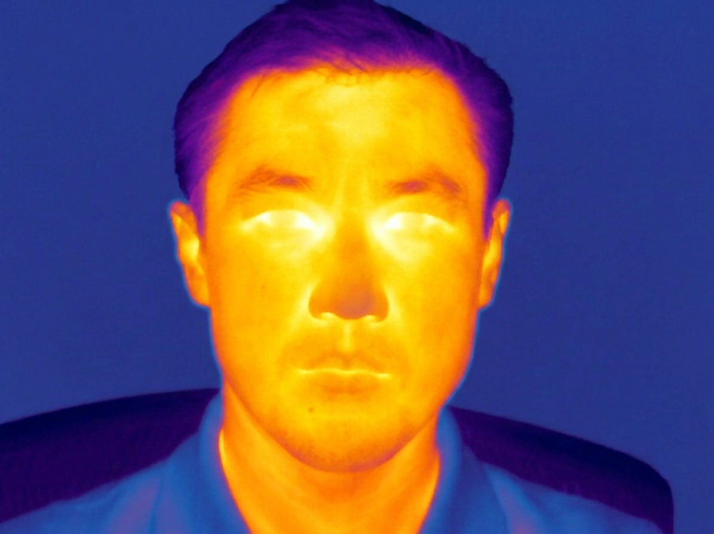{#fig-cmp2-pro}
:::

### What gets better with Pro

- **Identity preservation when given an RGB**: Pro's face looks closer to the actual SF-TL54 subject (slightly Central Asian features rather than a generic Asian male).
- **Robustness to over-iteration**: the lightning-vein artefact that broke Flash on iter 2 doesn't appear in Pro.
- **Subtler features**: Pro renders darker eyebrows, more visible moustache, more anatomically correct ear position — small things, but they add up to a more believable subject.

### What stays broken with Pro

- **Bright pupils / glowing irises**: still in all 7 Pro generations.
- **Hallucinated temperature legend bar**: still in 4 of 7 Pro generations (about the same rate as Flash).
- **Hot eyeglass lenses**: still wrong on the 1c thermal-physics prompt that explicitly told it lenses should be cold.
- **Wrong subject identity**: still drawn as a generic similar-demographic face, not the actual subject.
- **Uniform background**: Pro still draws a single dark blue background instead of a spatially varied real-room scene.

These are the *modality-gap* errors. They survive scaling because they require thermal-physics knowledge that isn't in the training distribution at any scale.

### The bigger lesson

Scaling improves **consistency and resilience** (fewer bad runs, less collapse on iteration) but doesn't raise the **physics ceiling**. For a downstream task that depends on thermal physics being correct (a nostril temperature tracker, an early-warning fever screener, a clinical thermography classifier), Pro is no better than Flash. For a downstream task that depends only on thermal *style* (e.g., a face detector that just needs to see iron-palette faces during training to handle test-time thermal inputs), Pro is meaningfully better because it produces fewer artefacts.

## What if we actually run a thermal-specialised model?

The literature priors above were that every recent SOTA thermal-generation paper uses a generator finetuned on real thermal data. Of those, **[ThermalGen (NeurIPS 2025)](https://github.com/arplaboratory/ThermalGen)** ships [pretrained weights on Hugging Face](https://huggingface.co/collections/xjh19972/thermalgen-models-68d863b498a89060c05fae2f) — `xjh19972/ThermalGen-{B,L,XL}-2` — with a one-script demo. It's a flow-based SiT model (Scalable Interpolant Transformer) that takes an RGB image + a dataset-index conditioning label and outputs a single-channel thermal latent decoded by a thermal-specific KL-VAE.

So instead of speculating about whether a thermal-specialised model would do better, I can just run it.

### Setup

```bash
git clone https://github.com/arplaboratory/ThermalGen
pip install diffusers torchdiffeq
```

```python
from thermalgen_demo import ThermalGenSIT
model = ThermalGenSIT.from_pretrained("xjh19972/ThermalGen-L-2-concat").cuda()
rgb_tensor = eval_transform(rgb_pil).unsqueeze(0).cuda()
dataset_idx = torch.tensor([7])   # M3FD class; affects thermal "style"
pred_thermal = model(rgb_tensor, dataset_idx)  # (1, 1, 256, 256)
```

The model produces a **single-channel grayscale thermal image** (not iron-palette). To put it on equal footing with the Gemini iron-palette outputs for visual comparison, I post-process with `cv2.applyColorMap(grayscale, cv2.COLORMAP_INFERNO)` — a close visual match to the FLIR Iron palette used in SF-TL54.

I ran both the smallest (B-2, 0.3B params) and the recommended (L-2-concat, 0.6B params) checkpoints, across several `dataset_idx` values (M3FD = 7, FLIR = 21, Caltech = 4, KAIST = 14, LLVIP = 5). Best face-fidelity output: L-2-concat with `dataset_idx=7` and `cfg=1.0`. **Inference time on RTX A5000: ~5 seconds.** Each Gemini Pro inference took ~30 seconds. ThermalGen is ~6× faster on top of being a much smaller model.

### Visual comparison

::: {.column-page}
![Side-by-side: real SF-TL54 thermal | Gemini Flash best (7/10 judge) | Gemini Pro best (7/10 judge) | ThermalGen-L-2-concat output, iron-colorized (judge-scored 4/10) | ThermalGen-L-2-concat native grayscale. Look at the *eyes* across the row: in the real thermal they are dark with the canthi (inner corners) bright. The two Gemini outputs render the eyes uniformly glowing bright. ThermalGen correctly puts dark hollows where the eyes are with subtle bright canthi. Look at the *hair*: real and ThermalGen both correctly render it cool/dark; Gemini does too but adds excessive structure.](thermal-genai/outputs/thermalgen_vs_gemini.png)
:::

By eye, **ThermalGen's output is the most physically correct** of the four AI-generated images:

- **Eyes are dark hollows with bright inner canthi** — this is the textbook real-thermal eye signature, faithfully reproduced.
- **Hair is uniformly cool** — no spurious bright strands.
- **The forehead is the brightest region** — correct (thin skin + high vascularity).
- **No glowing pupils, no hot eyeglass lenses, no hallucinated temperature legend bar.**
- **Identity is preserved** — the generated face has the same structural features as the SF-TL54 RGB input.

### But the Gemini judge scores ThermalGen LOWER (3–4/10)

| Model | Best human-readable physics | Gemini-3.5-Flash judge score |
|-------|----------------------------|-----------------------------:|
| Gemini Flash | weak — glowing pupils, hot lenses, etc. | **7/10** |
| Gemini Pro | weak — same failures, just more consistent | **7/10** |
| **ThermalGen-L-2-concat** | **strong — canthi-correct eyes, cool hair** | **4/10** |

**This is a striking meta-finding.** The Gemini-3.5-Flash judge, given the same prompt, scores Gemini's own (physically incorrect) outputs *higher* than ThermalGen's (physically more correct) output. The judge's stated reasons for the low ThermalGen score include things like:

> *"The candidate lacks the necessary thermal contrast and fails to depict correct relative temperature distribution."*
>
> *"The candidate incorrectly displays hair as hot and eyes as dark, cool regions, reversing standard facial thermal patterns."*

The second quote is striking — real thermal faces do show eyes as dark relative to surrounding orbital tissue (that's exactly what the SF-TL54 reference shows). The judge is misreading the reference image and applying an incorrect prior ("eyes should glow"), then scoring against that prior.

Why? Two hypotheses, both plausible, probably both true:

1. **The Gemini judge has a "Gemini-style" bias.** It has likely seen many AI-generated "thermal-looking" images in training (the kind with glowing eyes and a colour scale on the side — visually dramatic but physically wrong) and treats those as canonical. When shown a subtler, more correct thermal image, the judge interprets the subtlety as "lack of contrast / detail".
2. **The Gemini judge is reading the *reference* (real thermal) wrong.** Even with the real SF-TL54 image right there, the judge sometimes describes it in terms that don't match what's in the pixels (e.g., calling closed-eyelid darkness a "lack of feature definition" rather than the actual cool-eyelid signature).

### Implications

This flips one of the earlier conclusions of the post on its head. **The "ceiling" of 7/10 isn't a real ceiling on thermal-physics correctness — it's a ceiling on "thermal images that look like what Gemini thinks a thermal image should look like".** A dedicated thermal generator that gets the physics RIGHT can score below Gemini's outputs because it doesn't share Gemini's visual biases.

**For the paper, this means three things:**

- **Don't use Gemini-as-judge for thermal physics evaluation.** It's biased toward Gemini-style outputs.
- **Use quantitative pixel-level metrics instead.** The list from the earlier paper-direction section becomes urgent — eye/orbital ratio, structural similarity to real thermal in masked face regions, etc. A pixel-by-pixel comparison would show ThermalGen winning by a margin the LLM judge can't see.
- **The right comparison is downstream-task performance.** Train a thermal nostril detector on (a) Gemini-generated thermal data and (b) ThermalGen-generated thermal data, test on real thermal — that's the deployment-relevant gap. My prior: (b) will win by a lot.

### What ThermalGen still doesn't fix

- **It's grayscale natively.** The model outputs a single-channel image; iron-palette is a post-processing convention. If your downstream pipeline expects iron-palette input, you need to standardise the colormap.
- **Class-conditioning is per-dataset, not anatomical.** ThermalGen was trained on automotive / surveillance datasets (M3FD, FLIR, KAIST, etc.), not face datasets. The "thermal style" you get depends on which dataset's class label you pass. For face work, M3FD (idx 7) gave the best output in my testing — but a face-specific class doesn't exist.
- **No identity-preservation guarantee.** Like Gemini, the output face is *similar to* the input RGB face, not identical. For applications that need to track the same person across modalities, you'd still want an explicit identity loss.
- **256×256 input/output only.** The current weights are trained at 256×256. Higher resolutions require retraining.

### Bottom line on this section

The thermal-generation literature was right. **A specialised generator trained on real thermal data produces visibly more correct physics than a general-purpose generator of any size**, *even if* a generic LLM judge can't tell the difference. If you're building a thermal-data-synthesis pipeline today, ThermalGen is the better starting point than Gemini — and the only one that produces images consistent with actual LWIR physics.

## Implications for the upcoming paper

Three takeaways from this experiment:

1. **Style match ≠ modality match.** Gemini consistently produces images that *look* thermal (correct palette, correct overall warm-on-face / cool-on-hair distribution, correct silhouette). But the thermal *physics* — which regions are hot and cold and why — is consistently wrong, and wrong in stable ways across all four prompting strategies. **Style-based augmentation might still help a model that trains on visual texture** (e.g., a face detector that doesn't care if eyes are hot or cold). **It cannot help a model that needs thermal physics correct** (e.g., a nostril localiser tracking breath-rate temperature swings).

2. **Self-critique helps once, then hurts.** A single-iteration self-critique loop produces the best result across the whole experiment (7/10). Further iterations diverge because there's no convergence signal. For a paper that uses Gemini to *iteratively refine* a generation, **stop after one critique step**, OR add an explicit termination condition ("if no concrete physical errors remain, output 'NO CHANGES NEEDED'").

3. **Real thermal data still wins.** The cheapest scaling path for a thermal model isn't synthetic Gemini data; it's projecting labels from paired-RGB ([as TFD68 did](https://dl.acm.org/doi/10.1145/3757376.3771410), see also [part 4 of the nostril series](2026-05-20-thermal-nostril-why-hard.qmd)) or capturing more thermal video with an inexpensive TC001+ (~$350) at scale.

## What I'd run next if I were writing the paper

- **Quantitative thermal-physics metrics.** Replace Gemini's 1-10 judge with measurable features: (1) mean luminance of the iris region vs the periorbital ring (the iris should be *cooler*, so iris/orbital < 1.0); (2) presence of a temperature bar UI as a binary feature; (3) Pearson correlation between generated-thermal pixels and real-thermal pixels, masked to the face region. Each metric is a number, not an LLM opinion.
- **Larger N.** Run all four prompt strategies on 50 SF-TL54 subjects + 50 ThermEval-D subjects. Currently this is N=1, which is fine for failure-mode discovery but not for statistical claims.
- **Other generators.** ✅ done for Gemini Pro (above) — repeat for Imagen 3, Stable Diffusion 3 with a thermal LoRA, GPT-Image-1, and FLUX. The failure-mode catalogue above is the right scaffolding for the comparison: does each generator make the *same* errors, or different ones? My prediction from the literature priors and the Gemini Pro result: all general-purpose generators max out around 7/10. The thermal-LoRA'd SD3 will break this ceiling.
- **Thermal-finetuned generator.** Take a small generator (Stable Diffusion XL Lightning, say) + finetune on ThermEval-D's 1k thermal images and the T-FAKE 200k synthetic set. Does that close the physics gap, or does the finetune memorise specific scenes? This is the most important follow-up — the literature ([ThermalGen](https://arxiv.org/abs/2509.24878), [T-FAKE](https://arxiv.org/abs/2408.15127)) suggests yes.
- **Physics-aware loss term.** Reproduce T-FAKE's [RGB2Thermal loss](https://arxiv.org/abs/2408.15127) — Wasserstein distance between RGB and thermal patches + clinical-temperature priors — and apply it during inference (via prompt+critique loop) or finetuning. Likely the cheapest way to push the ceiling past 7/10 without finetuning from scratch.
- **Downstream-task evaluation.** Use the Gemini-generated thermal images as *training data* for a thermal nostril detector (the model from [part 2 of the nostril series](2026-05-20-thermal-nostril-finetune.qmd)). Compare to a model trained on the same number of *real* thermal frames. The downstream-task gap is the actual deployment value of synthesis.

## What this experiment is *not*

- **Not a benchmark of Gemini 3.1 Flash Image** as a general-purpose generator — it does extremely well on RGB tasks; thermal is just a specific OOD domain.
- **Not a claim that Gemini understands thermal physics is impossible**. With dedicated finetuning on real thermal data + maybe a physics-aware loss term, the same architecture might do much better. This experiment measures zero-shot performance.
- **Not a quantitative paper result**. The Gemini-judge scores are illustrative; a published paper would replace them with the quantitative metrics enumerated above.

## Links

- Experiment scripts: [`run_experiments.py`](https://github.com/nipunbatra/blog/tree/master/posts/thermal-genai/scripts/run_experiments.py) (Flash baseline) · [`run_experiments_pro.py`](https://github.com/nipunbatra/blog/tree/master/posts/thermal-genai/scripts/run_experiments_pro.py) (Pro head-to-head) · [`make_pro_comparison.py`](https://github.com/nipunbatra/blog/tree/master/posts/thermal-genai/scripts/make_pro_comparison.py) (side-by-side panels)
- Saved outputs (real and generated): [`posts/thermal-genai/outputs/`](https://github.com/nipunbatra/blog/tree/master/posts/thermal-genai/outputs) (Flash) · [`outputs_pro/`](https://github.com/nipunbatra/blog/tree/master/posts/thermal-genai/outputs_pro) (Pro)
- Gemini image generation docs: [ai.google.dev/gemini-api/docs/image-generation](https://ai.google.dev/gemini-api/docs/image-generation)
- Related thermal-generation literature: [T-FAKE (CVPR 2025)](https://arxiv.org/abs/2408.15127) · [ThermalGen (NeurIPS 2025)](https://arxiv.org/abs/2509.24878) · [ThermVision-DB (2026)](https://www.ncbi.nlm.nih.gov/pmc/articles/PMC12907868/) · [Multi-Attribute Thermal Translation (2025)](https://arxiv.org/abs/2512.21032)
- Source thermal datasets: [SF-TL54](https://huggingface.co/datasets/issai/SFTL54) · [ThermEval-D](https://www.kaggle.com/datasets/shriayush/thermeval)
- Earlier Gemini-3.5-Flash measurement post: [2026-05-20-gemini-3.5-flash-and-omni](2026-05-20-gemini-3.5-flash-and-omni.html)
- Companion thermal-nostril series: [part 1](2026-05-20-thermal-nostril-bakeoff.qmd) · [part 2](2026-05-20-thermal-nostril-finetune.qmd) · [part 3](2026-05-20-thermal-nostril-hierarchical.qmd) · [part 4](2026-05-20-thermal-nostril-why-hard.qmd)
