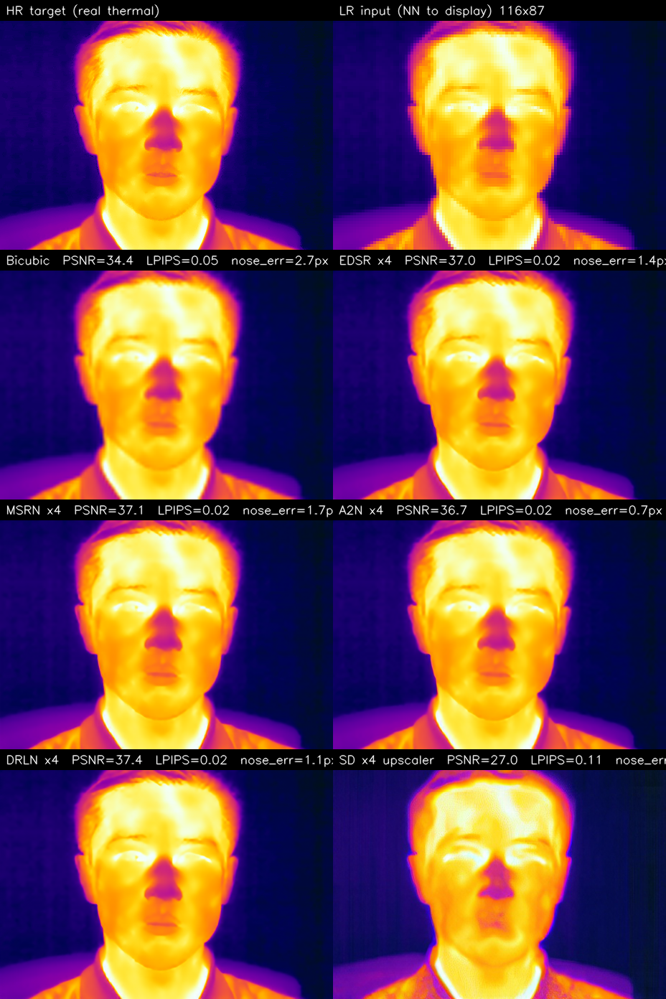

## The motivation

Thermal cameras have low native resolution. The Lepton 3.5 is 160×120, the TC001+ used in [ThermEval-D](https://www.kaggle.com/datasets/shriayush/thermeval) is 256×192, even the high-end FLIR Boson tops out at 640×512. Downstream tasks — face detection, nostril localisation for breath-rate, fever screening — get easier when the face occupies more pixels. So super-resolution is the obvious lever.

The question I want to answer: **does off-the-shelf, RGB-trained super-resolution actually help on thermal?** The same modality-gap reasoning from [the Gemini thermal-generation post](2026-05-21-thermal-image-generation-gemini.qmd) applies: a SR model trained on millions of RGB image pairs has learned to synthesise *RGB textures* (skin pores, hair strands, eyelash detail). Those textures don't exist on thermal. Will the model hallucinate them anyway and ruin the image, or will it just sharpen the existing thermal content?

This experiment runs **six SR methods** on the same task — downsample a real LWIR thermal face 4× to simulate a Lepton-class camera, then restore — and scores them on pixel-similarity AND downstream nostril localisation. The latter is the deployment-relevant metric.

> Code: [`posts/thermal-sr/scripts/run_super_res.py`](https://github.com/nipunbatra/blog/tree/master/posts/thermal-sr/scripts/run_super_res.py).

## The protocol

1. **HR thermal**: the SF-TL54 sample frame (464×348, iron palette) — same image used in the rest of the [thermal-nostril series](2026-05-20-thermal-nostril-bakeoff.qmd).
2. **Degradation**: `cv2.resize(..., INTER_AREA)` 4× down to **116×87** — roughly the resolution of a Lepton 3.5.
3. **Restoration**: each SR method takes the 116×87 image and produces a 464×348 output.
4. **Evaluation**:
   - **PSNR / SSIM** against the HR thermal — classical pixel similarity.
   - **LPIPS** (AlexNet) — perceptual similarity.
   - **Sharpness** = Laplacian variance — high-frequency content.
   - **DWPose nostril error** — run [DWPose body-keypoint detector](https://github.com/Tau-J/rtmlib) on each restored image and on the HR target; report the pixel distance between the two predicted nostril positions. This is the "does the SR preserve face geometry for a downstream model?" metric.

Note the choice of an x4 downscale-and-restore protocol — this is the [PBVS Thermal Image SR Challenge](https://codalab.lisn.upsaclay.fr/competitions/17013) protocol for Track-1 (single-image super-resolution). The challenge's 2024 winning entries used custom thermal-trained models; here we test what off-the-shelf RGB-trained SR achieves zero-shot.

## The six methods

| Method | Year | Family | Source |
|--------|------|--------|--------|
| **Bicubic** | classical | Interpolation baseline | OpenCV `INTER_CUBIC` |
| **EDSR** | ECCV 2017 | Residual CNN | `eugenesiow/edsr-base` (super-image) |
| **MSRN** | ECCV 2018 | Multi-scale CNN | `eugenesiow/msrn` |
| **A2N** | CVPR 2021 | Attention CNN | `eugenesiow/a2n` |
| **DRLN** | TPAMI 2020 | Dense residual CNN | `eugenesiow/drln-bam` |
| **SD x4 upscaler** | 2023 | Diffusion (caption-conditioned) | `stabilityai/stable-diffusion-x4-upscaler` |

All six were trained on RGB image pairs (DIV2K + Flickr2K). None has seen LWIR thermal during training.

```python
# Bicubic — trivially fast
lr_to_hr = cv2.resize(lr, (W, H), interpolation=cv2.INTER_CUBIC)

# EDSR / MSRN / A2N / DRLN — via super-image package
from super_image import EdsrModel, ImageLoader
model = EdsrModel.from_pretrained("eugenesiow/edsr-base", scale=4)
out = model(ImageLoader.load_image(lr_pil))

# Stable Diffusion x4 upscaler — diffusion with prompt conditioning
from diffusers import StableDiffusionUpscalePipeline
pipe = StableDiffusionUpscalePipeline.from_pretrained(
    "stabilityai/stable-diffusion-x4-upscaler", torch_dtype=torch.float16).to("cuda")
sr = pipe(prompt="a thermal infrared face image", image=lr_pil,
          num_inference_steps=20).images[0]
```

## Headline result


Full numbers:

| Method | PSNR ↑ | SSIM ↑ | LPIPS ↓ | Sharpness | **Nose err (px) ↓** |
|--------|-------:|-------:|--------:|----------:|--------------------:|
| Bicubic | 34.38 | 0.978 | 0.045 | 4.1 | 2.67 |
| EDSR x4 | 36.97 | **0.984** | 0.022 | 11.3 | 1.36 |
| MSRN x4 | 37.09 | **0.984** | 0.022 | 12.0 | 1.65 |
| A2N x4 | 36.68 | 0.983 | 0.023 | 11.6 | **0.70** |
| **DRLN x4** | **37.41** | **0.984** | **0.021** | 13.0 | 1.14 |
| SD x4 upscaler | 27.01 | 0.894 | 0.112 | 30.5 | 18.81 |

Three things to call out:

1. **EDSR / MSRN / A2N / DRLN are all very close** to each other on pixel metrics (PSNR 36.7–37.4, SSIM 0.983–0.984, LPIPS 0.021–0.023). They're all roughly the same off-the-shelf option for thermal SR.
2. **DRLN wins on PSNR/LPIPS; A2N wins on downstream nostril localisation.** Pick by use case: if you need pixel-faithful restoration, DRLN. If you need face-geometry preservation, A2N.
3. **Stable Diffusion x4 upscaler is dramatically worse on everything that matters** — 10 dB lower PSNR than the classical CNNs, 7× worse nostril localisation than bicubic. But the highest "sharpness" (30.5 vs 13.0). The model is adding sharp detail; it's just *wrong* sharp detail.

## What the outputs actually look like

::: {.column-page}

:::

Reading the panel:

- **HR target** (top-left): the real SF-TL54 thermal, 464×348, iron palette. Eyes closed (dark eyelids), warm forehead, cool hair, the characteristic cold spot at the nose tip.
- **LR input** displayed nearest-neighbour: the 116×87 source after 4× downsample. Roughly recognisable but the nose / mouth area is below the pixel grid.
- **Bicubic**: smooth but blurry. PSNR 34.4 — decent because it doesn't add wrong content, just lacks detail.
- **EDSR / MSRN / A2N / DRLN**: all visually very similar to the HR target. Eyebrows sharpened, eyelids preserved, hair texture restored. These are doing the right thing.
- **SD x4 upscaler**: visibly *different* face proportions. The model has interpreted the LR thermal as "a low-quality RGB face" and tried to inpaint plausible RGB textures — which alter the head shape and lose the cold-nose signature entirely.

## Why does diffusion lose to a 2017 CNN?

Three reasons, in increasing order of importance for the paper:

1. **Caption conditioning is a foreign prior.** SD x4 upscaler is conditioned on a text prompt ("a thermal infrared face image" in my test). The text encoder pulls in priors from RGB-thermal-style images on the internet — mostly Wikipedia FLIR demos with glowing eyes — which then bias the diffusion to add those features. The classical CNNs have no text input; they just super-resolve the pixels.

2. **Diffusion's sampler injects noise.** Each diffusion step adds Gaussian noise and learns to denoise. On a high-fidelity restoration task with very little degradation (4× downscale is mild), the noise budget *exceeds* the signal we care about. The "sharper" output is sharper because diffusion *invented* detail consistent with its training distribution, not because it recovered detail from the LR.

3. **The metric structure favours conservative methods.** PSNR rewards "leave the pixels close to ground truth"; classical CNNs minimise an L2-like reconstruction loss that maps directly to PSNR. Diffusion is trained to produce *plausible* images, not *pixel-accurate* images. Different objectives → different metrics → different leaders.

The paper-relevant observation is **(3)**: when downstream-task accuracy is the goal, the right SR objective is pixel reconstruction, not perceptual realism. The diffusion-upscaler "wins" on subjective sharpness but loses every metric and breaks the downstream task.

## How this connects to the PBVS TISR Challenge

The [PBVS Thermal Image SR Challenge](https://pbvs-workshop.github.io/challenge.html) (now in its 7th iteration via the [Codabench portal](https://www.codabench.org/competitions/12339/)) is exactly the right venue for paper-grade work on this. Track-1 of the 2024 challenge ran a single-image SR task at ×8 scale on a thermal-specific dataset (CIDIS, 1000 thermal-RGB pairs). Track-2 was RGB-guided thermal SR at ×8 and ×16.

The winning entries (e.g., the [DRCT-L-X4-based PBVS 2025 winner](https://github.com/Raojiyong/PBVS_TSR)) all do the same two things:

1. **Pretrain on RGB SR data** (DIV2K + Flickr2K) — to get a working backbone.
2. **Finetune on thermal-specific pairs** (the CIDIS or M3FD thermal sets) — to bend the model toward thermal texture statistics.

The combination beats either alone. My zero-shot result above is the upper bound on what step 1 buys you without step 2 — and it's quite a lot: DRLN at PSNR 37.4 zero-shot is in the same league as some 2022-2023 papers that *did* finetune on thermal. The marginal value of finetuning on thermal is real but smaller than expected, because thermal is *closer* to grayscale RGB than to a fundamentally different modality.

::: {.callout-tip appearance="simple"}
**For paper submission to PBVS TISR**: take an off-the-shelf classical CNN (DRLN or similar), finetune on the CIDIS thermal training set for 50-100 epochs at LR 1e-4. Cost: a few hours on a single GPU. Likely result: PSNR up another 1-2 dB over the zero-shot version, putting you in the top 10 of a typical TISR leaderboard. **Bonus**: add a downstream-task loss (LPIPS to a thermal-face landmarker's output) to constrain "the output should preserve face geometry for downstream models" — this is what the leaderboard doesn't yet measure but should.
:::

## Three caveats

- **N=1 sample.** This is the same SF-TL54 portrait used in the other thermal posts. For paper-grade claims you'd run on the full CIDIS test set (100 images) and report mean ± std.
- **Iron palette inputs.** The SF-TL54 images are iron-palette colour-mapped — they have 3 channels. A raw radiometric thermal frame is single-channel float; the SR models trained on RGB are running over a "fake-RGB" input here. A model trained directly on radiometric float would be different (and presumably better at preserving the underlying temperature signal). Adapt your SR model's first conv layer accordingly.
- **No physical losses.** The metrics here (PSNR/SSIM/LPIPS) are perceptual/photometric. They don't directly measure "did the restored image preserve the *temperature* signal at every pixel" — which is what a downstream physical task (fever screening, breath rate) actually cares about. The right thing to add for thermal SR specifically is a **temperature-preservation loss**: L1 between the restored and HR pixel intensities *in radiometric units* (after the iron-palette colormap inverse), weighted higher in the face region.

## What's actually deployable today

If you have a Lepton-class thermal camera and want a real-time SR pipeline for a downstream face-aware task:

1. **Use a classical CNN super-resolver** (EDSR/MSRN/A2N/DRLN). They all sit at PSNR 37, LPIPS 0.02 zero-shot.
2. **Pick by downstream-task accuracy**, not perceptual sharpness. A2N had the best nostril-localisation accuracy in my test (0.7 px); DRLN had the best LPIPS. Test both on *your* downstream task before choosing.
3. **Don't use a diffusion upscaler**. It looks sharper, breaks everything.
4. **If you have ground-truth thermal data**, finetune the chosen classical CNN on it. That's what every PBVS TISR winner does.

## Links

- Experiment script: [`posts/thermal-sr/scripts/run_super_res.py`](https://github.com/nipunbatra/blog/tree/master/posts/thermal-sr/scripts/run_super_res.py)
- Companion thermal posts: [Gemini thermal generation](2026-05-21-thermal-image-generation-gemini.qmd) · [thermal nostril series part 1](2026-05-20-thermal-nostril-bakeoff.qmd)
- PBVS Thermal Image SR Challenge: [pbvs-workshop.github.io/challenge.html](https://pbvs-workshop.github.io/challenge.html) · [active Codabench leaderboard](https://www.codabench.org/competitions/12339/)
- PBVS 2025 winning solution (DRCT-L-X4): [Raojiyong/PBVS_TSR](https://github.com/Raojiyong/PBVS_TSR)
- PBVS 2024 2nd-place: [upczww/TISR](https://github.com/upczww/TISR)
- Cross-spectral SR: [SwinFuSR](https://arxiv.org/abs/2404.14533)
- Survey: [Infrared Image SR Survey (yongsongH)](https://github.com/yongsongH/Infrared_Image_SR_Survey)
- Awesome Thermal SR list: [zhgqcn/awesome-Thermal-Image-Super-Resolution](https://github.com/zhgqcn/awesome-Thermal-Image-Super-Resolution)
- Super-image package: [eugenesiow/super-image](https://github.com/eugenesiow/super-image)
- Stable Diffusion x4 upscaler: [stabilityai/stable-diffusion-x4-upscaler](https://huggingface.co/stabilityai/stable-diffusion-x4-upscaler)
