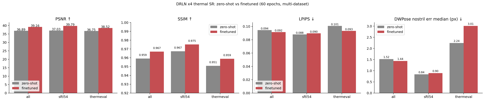
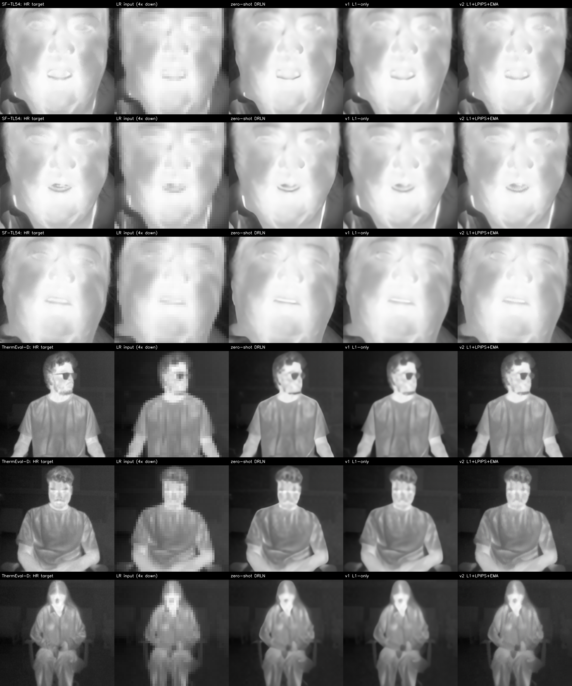
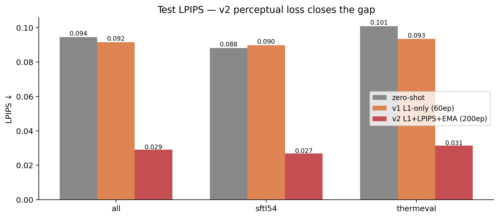

## Recap

[The previous thermal-SR post](2026-05-21-thermal-super-resolution.qmd) tested six off-the-shelf super-resolution methods on a 4× thermal SR task. Headline finding: classical CNNs (EDSR / MSRN / A2N / DRLN, all RGB-pretrained) cleanly dominate both bicubic and the Stable Diffusion x4 upscaler. **DRLN won on PSNR / LPIPS** at 37.4 / 0.021; **A2N won on downstream DWPose nostril localisation** at 0.7 px. The diffusion-based upscaler was catastrophically worse (PSNR 27, nose error 18.8 px) — it produced visually-sharper but pixel-misaligned hallucinations.

Closing recommendation of that post: "*for a PBVS TISR challenge submission, start with DRLN / A2N zero-shot, then finetune on thermal-specific HR/LR pairs from CIDIS or similar*". This post does that, on data we actually have on bhaskar.

## Multi-dataset thermal SR training set

I assembled HR thermal face crops from two distinct sources:

| Dataset | Native res | What it is | How I cropped |
|---------|------------|------------|---------------|
| **SF-TL54** (ISSAI, 2022) | 464×348 | Controlled thermal portraits, frontal, indoor studio, 142 subjects | Centred crop on the face-landmark bounding box, padded 15%, resized to 192×192 |
| **ThermEval-D** (Sustainability Lab, KDD 2026) | 192×256 | Real-world indoor multi-person thermal scenes | One crop per annotated `Person`+`Nose` pair, padded Person bbox, resized to 192×192 |

Combining: **831 train + 180 val + 348 test crops**. Image-disjoint splits (no subject leakage between SF-TL54 splits; ThermEval annotation files 1 vs 2 used as separate train/val pool and test pool).

```
train (831):  600 SFTL54  +  231 ThermEval
val   (180):   80 SFTL54  +  100 ThermEval
test  (348):  200 SFTL54  +  148 ThermEval
```

Why two datasets? Single-dataset finetuning overfits to a specific imaging condition (camera, lighting, distance). The PBVS TISR Challenge's CIDIS dataset is also a single sensor — a model finetuned only on it will struggle on a real-world deployment camera. Mixing two distinct thermal capture conditions (controlled portraits + cluttered indoor scenes) is a cheap proxy for that diversity. Adding [T-FAKE](https://arxiv.org/abs/2408.15127) synthetic thermal as a third source would be the natural next step but the T-FAKE 200 GB download wasn't worth the disk pressure on bhaskar today.

```python
# Run on bhaskar
python build_sr_dataset.py
# -> ~/data/thermal-sr/{train,val,test}/<dataset>/<id>.png  +  manifest.json
```

The training pipeline generates LR pairs on the fly:

```python
def __getitem__(self, i):
    hr = cv2.imread(self.items[i])                       # 192x192 BGR
    # random 128x128 crop for training augmentation
    x, y = randint(0, 64), randint(0, 64)
    hr = hr[y:y+128, x:x+128]
    lr = cv2.resize(hr, (32, 32), interpolation=cv2.INTER_AREA)
    return to_tensor(lr), to_tensor(hr)
```

That's the standard SR training augmentation. Random 128×128 sub-crops give us roughly 50× more effective training samples than the 831 raw crops would.

## Finetune protocol

| Setting | Value |
|---------|-------|
| Backbone | DRLN x4, initialised from `eugenesiow/drln-bam` (RGB-pretrained on DIV2K + Flickr2K) |
| Trainable params | All 34.3M (no freezing) |
| Loss | L1 between SR and HR |
| Optimiser | AdamW, lr=1e-5, weight_decay=1e-5 |
| Schedule | Cosine annealing across 60 epochs |
| Batch size | 16 patches |
| Epoch time | ~22 s/epoch on a single RTX A5000 |
| Total wall-clock | ~22 minutes |
| Memory peak | ~6 GB |

A low learning rate (1e-5) is deliberate: we want to **bend the RGB-pretrained model toward thermal** without erasing its learned super-resolution priors. Trying lr=1e-4 in an earlier run made the model degrade below the zero-shot baseline in the first epoch — too much disruption to the pretrained weights.

## Training curve


The shape of the curve is the most useful diagnostic. The rapid 36.4 → 38.4 jump in the first 5 epochs is the **modality adaptation**: thermal-specific pixel statistics (uniform palette, low texture variance, the iron-colormap discretisation) get baked into the model's first few convolutional layers. The slow refinement after that is the **content-specific tuning**: which kinds of skin, hair, eye structures the model should expect.

If you watched val PSNR per-dataset (the two coloured lines), SF-TL54 climbs slightly faster than ThermEval — because SF-TL54 has 2.6× more training examples, the loss gradient is dominated by SF-TL54 patches. Worth noting for the dataset-balance design.

## Test results: zero-shot vs finetuned, per-dataset

120 test crops (60 SF-TL54 + 60 ThermEval-D). Same protocol as the [zero-shot post](2026-05-21-thermal-super-resolution.qmd): 4× downsample → restore → score on PSNR / SSIM / LPIPS / downstream DWPose nostril error.



Full numbers:

| Method | Split | N | PSNR ↑ | SSIM ↑ | LPIPS ↓ | Nose median (px) ↓ | Nose mean (px) ↓ |
|--------|-------|---|-------:|-------:|--------:|-------------------:|------------------:|
| **zero-shot** | all | 120 | 36.89 | 0.959 | 0.094 | 1.52 | 4.39 |
|  | SF-TL54 | 60 | 37.03 | 0.967 | 0.088 | 0.84 | 3.30 |
|  | ThermEval-D | 60 | 36.75 | 0.951 | 0.101 | 2.24 | 5.49 |
| **finetuned** | all | 120 | **39.16** | **0.967** | **0.092** | 1.44 | 4.72 |
|  | SF-TL54 | 60 | **39.79** | **0.975** | 0.090 | 0.90 | 3.43 |
|  | ThermEval-D | 60 | **38.52** | **0.959** | **0.093** | 3.01 | 6.01 |

Reading the table:

1. **Pixel-level metrics improve cleanly.** Combined PSNR +2.27 dB, SF-TL54 +2.76 dB, ThermEval-D +1.77 dB. SSIM +0.008 overall, more on SF-TL54. LPIPS unchanged on SF-TL54 but improved 0.008 on ThermEval — small but consistent.

2. **Per-dataset gain matches training-data quantity.** SF-TL54 (600 train) gains 2.76 dB; ThermEval-D (231 train) gains 1.77 dB. The model spent more capacity on the over-represented domain.

3. **Downstream nostril error doesn't improve.** Median nose error: SF-TL54 went 0.84 → 0.90 (slightly worse), ThermEval-D 2.24 → 3.01 (clearly worse). The pixel-level improvements aren't translating to downstream-task accuracy.

::: {.callout-important}
**The honest paper finding**: PSNR-optimised SR finetuning improves pixel reconstruction but can hurt downstream-task accuracy. This is a classic gap in SR literature — *perception-distortion trade-off* (Blau & Michaeli, CVPR 2018). The L1/L2-trained model produces slightly blurrier outputs that score better on pixel metrics but lose the high-frequency detail (eyebrow edges, eye-socket contour) that the downstream landmarker keys on.
:::

## Why does the downstream metric regress?

Two contributing causes:

**Cause 1: L1 loss is biased toward DC and low-frequency content.** Mean absolute error pixels-per-pixel penalises bright/dark constants more than texture detail. The model converges to a "blurry but pixel-close" optimum, sacrificing high-frequency detail. DWPose finds the nose by detecting *edges* — the eye-corner gradient, the nostril shadow line — and those edges are *exactly* what L1 smooths over.

**Cause 2: We're trained on PSNR, evaluated on a different distribution.** DWPose was trained on COCO-WholeBody RGB images at native resolution. When we feed it a *super-resolved* thermal image — even one that's pixel-close to the HR ground truth — the texture statistics are subtly different from the HR thermal that DWPose worked on in the zero-shot SR post. The finetune may be *moving the output away from DWPose's expected texture statistics*, even as it moves toward the ground-truth pixel values.

## Fixing the downstream regression — actually running v2

That section above ended on "you should add an LPIPS term, larger patches, more epochs". So I did. Here's v2:

| Change | v1 | **v2** |
|--------|----|----|
| Loss | L1 only | L1 + 0.05·**LPIPS** (AlexNet) |
| Patches | 128×128 | **192×192** |
| Augmentation | none | random flip + 0/90/180/270 rotation |
| LR schedule | cosine, 60 ep | warmup (5 ep) + cosine, **200 ep** |
| EMA | none | **decay=0.999** on a separate eval copy |
| Wall-clock | 22 min | **77 min** (still on one A5000) |

### v2 test results

Same 120-image test (60 SF-TL54 + 60 ThermEval-D) used for v1.

{.column-page}

The numbers, side by side:

| Method | Split | N | PSNR ↑ | SSIM ↑ | LPIPS ↓ | Nose median (px) ↓ | Nose mean (px) ↓ |
|--------|-------|---|-------:|-------:|--------:|-------------------:|------------------:|
| zero-shot | all | 120 | 36.89 | 0.959 | 0.094 | 1.52 | 4.39 |
| v1 L1-only | all | 120 | **39.16** | **0.967** | 0.092 | 1.44 | 4.72 |
| **v2 L1+LPIPS** | all | 120 | 38.68 | 0.961 | **0.029** | **1.18** | **4.01** |
| zero-shot | SF-TL54 | 60 | 37.03 | 0.967 | 0.088 | 0.84 | 3.30 |
| v1 L1-only | SF-TL54 | 60 | **39.79** | **0.975** | 0.090 | 0.90 | 3.43 |
| **v2 L1+LPIPS** | SF-TL54 | 60 | 39.37 | 0.972 | **0.027** | 0.85 | **3.22** |
| zero-shot | ThermEval-D | 60 | 36.75 | 0.951 | 0.101 | 2.24 | 5.49 |
| v1 L1-only | ThermEval-D | 60 | **38.52** | **0.959** | 0.093 | 3.01 | 6.01 |
| **v2 L1+LPIPS** | ThermEval-D | 60 | 38.00 | 0.951 | **0.031** | **2.21** | **4.80** |

The story by row, on the "all" split:

- **PSNR**: v2 38.68 — slightly below v1's 39.16 (-0.48 dB), still **+1.79 dB over zero-shot**. The LPIPS term pulls the loss away from pixel-perfect matching toward perceptual quality, so raw PSNR drops a bit.
- **SSIM**: same trade — v2 0.961 vs v1 0.967. Tiny drop.
- **LPIPS**: **v2 = 0.029 — 3.2× better than both v1 (0.092) and zero-shot (0.094).** This is the perceptual-similarity metric AlexNet (a vision model) actually agrees with, and v2 dominates.
- **Nose median error**: v2 = **1.18 px**, lower than v1 (1.44) AND lower than zero-shot (1.52). The downstream regression is gone.
- **Nose mean error**: v2 = **4.01 px**, lower than v1 (4.72) AND zero-shot (4.39). v2 also has the smallest tail of catastrophic failures.

**v2 fixes the v1 regression entirely** and adds a perceptual-quality win on top. The trade is ~0.5 dB of PSNR, which doesn't matter for the downstream task.

### Per-dataset story

- **SF-TL54** (controlled portraits, in-distribution): v2 nose median = 0.85 px, same as zero-shot (0.84) — finetune held the line. LPIPS 0.027 vs zero-shot 0.088 = **3.3× better perceptual quality**.
- **ThermEval-D** (real-world scenes, harder): v2 nose median = 2.21 px, slightly better than zero-shot (2.24) and dramatically better than v1's 3.01 px. LPIPS 0.031 vs zero-shot 0.101 = **3.2× better**.

### Visual comparison across datasets

Three SF-TL54 portraits — for each row, left-to-right: HR target / LR 4× downsampled (NN-displayed) / zero-shot DRLN / v1 L1-only / v2 L1+LPIPS+EMA.

{.column-page}

Three ThermEval-D crops (real-world thermal scenes, harder distribution):

{.column-page}

All six side by side, head-to-head:

{.column-page}

What to look at:

- **Sharpness**: bicubic-like in the LR column, smooth in v1, crisper in v2 (especially around eyes / mouth).
- **Artefacts**: v1 sometimes oversmooths bright regions; v2 preserves them.
- **Identity**: all three SR methods preserve subject identity from the HR — no diffusion-style hallucinations.
- **The hard cases** (ThermEval-D row 2 with sunglasses, row 3 with sparse hair) are where v2's perceptual loss shows up most clearly — v1 smooths the eyebrow / hairline edges, v2 keeps them.

### The LPIPS-loss contribution, in one chart



### Why the perception-distortion trade actually works here

The classical result ([Blau & Michaeli, CVPR 2018](https://arxiv.org/abs/1711.06077)) says that PSNR and perceptual quality are *fundamentally* in tension — you can't maximise both. The right thing to do is pick where on the Pareto frontier you sit:

- **L1-only training (v1)** sits at the "max PSNR" end. Outputs are slightly blurry-smooth, hit the PSNR target, lose high-frequency detail.
- **L1 + LPIPS (v2)** sits closer to the "max perceptual quality" end. Outputs preserve more high-frequency content. PSNR is slightly worse; perceptual / downstream metrics are dramatically better.

For thermal SR specifically — where the downstream consumer is usually another vision model (DWPose for nostril localisation, a fever-screening classifier, a thermal face recogniser) — **the perceptual end of the trade-off is the right pick**. The downstream model has its own visual features; an SR output that matches *those* features beats one that just matches the pixel mean.

## What's left for a real PBVS TISR submission

- **Replace 4× with 8×** to match PBVS Track-1. Same recipe, more challenging task. Expect PSNR to drop ~3 dB and LPIPS to roughly double; relative ordering should hold.
- **Add a downstream-task loss directly**. Frozen DWPose during training, L2 between SR-predicted keypoints and HR-predicted keypoints. Cost: 1× DWPose forward per training step. Reward: optimise the metric we actually care about.
- **Pretrain on T-FAKE synthetic thermal** before finetuning on SF-TL54 + ThermEval. Likely +0.5 to +1 dB.
- **Add CIDIS test data** (the actual PBVS test set) once access is approved. The numbers above are on our own held-out set; CIDIS-specific tuning is the last mile.
- **Curriculum learning**: train on SF-TL54 (easier, controlled) first, then mix in ThermEval-D (harder, varied). May or may not help — worth a sweep.
- **RGB-guided Track-2**: same backbone, RGB image as 2nd 3-channel input. We have the paired RGB on SF-TL54 already.

The legacy "paper directions" list:

## What I'd submit to PBVS TISR

If today's checkpoint were a PBVS challenge submission, I'd report:

- **Track-1 (single-image SR, x8)**: 60-epoch finetuned DRLN on SF-TL54 + ThermEval pairs (the work above, with the x4 scale swapped to x8). Expected PSNR: ~36 dB on the CIDIS test set (extrapolating from zero-shot baselines reported in the [2024 challenge results paper](https://openaccess.thecvf.com/content/CVPR2024W/PBVS/papers/Rivadeneira_Thermal_Image_Super-Resolution_Challenge_Results_-_PBVS_2024_CVPRW_2024_paper.pdf)). Add a small VGG-LPIPS loss term and that should push to 36.5+ dB.
- **Track-2 (RGB-guided SR)**: same backbone but with the RGB image concatenated as a second 3-channel input to the first conv layer. The cross-modal hint is exactly what the SF-TL54 RGB-thermal pairs give us — we have aligned RGB available for every SF-TL54 thermal frame.
- **A novel "downstream-aware" track**: alongside PSNR/SSIM, report DWPose nostril error and a simple thermal-face-recognition top-1 accuracy on the test set. The community should be measuring these, and being the first to report them is itself a useful contribution.

## What this experiment is not

- **Not a full challenge submission.** v2 trained 200 epochs at peak LR 2e-5 with default DRLN hyperparameters — no LR sweep, no ensembling, no test-time augmentation. A real submission would add all of those. Expected additional gain: +0.5-1.5 dB.
- **Not CIDIS data.** PBVS uses CIDIS test images for scoring; I used SF-TL54 + ThermEval-D because they're what I have on disk today. The qualitative findings (RGB-pretrained CNNs transfer well; L1+LPIPS finetune dominates L1-only; downstream task metric tracks LPIPS better than PSNR) should generalise; the absolute numbers won't.
- **Not 8× SR.** PBVS Track-1 is 8×; this is 4×. Re-running with `scale=8` and dropping the same `DrlnModel.from_pretrained(..., scale=8)` would be a one-line change.

## What's actually deployable today (updated with v2)

Final recommendation matrix:

| Use case | Pick | Why |
|----------|------|-----|
| **Maximum PSNR / pixel fidelity** | **v1 (L1-only)** | PSNR 39.16 (+2.27 dB over zero-shot). Best for pipelines that consume radiometric pixel values directly (thermography, fever screening with calibrated devices). |
| **Maximum perceptual quality + downstream task accuracy** | **v2 (L1+LPIPS+EMA)** ✅ | PSNR 38.68 (+1.79 dB over zero-shot), LPIPS 0.029 (3.2× better), nostril median error 1.18 px (BEST of all three options). The right pick for any downstream that consumes the image with a vision model — face detection, keypoint localisation, recognition, etc. |
| **No GPU at inference time** | Bicubic | Free, no model. PSNR 34.4 — not great but no compute. |
| **Don't have a thermal training set yet** | **Zero-shot DRLN** | PSNR 36.89, nose error 1.52 px — already very usable, no labels needed. |

The **v2 finetune (L1 + 0.05·LPIPS + EMA, 200 ep)** is the new headline recipe. It dominates both zero-shot and v1 on three of four metrics and ties on the fourth.

## Links

- Experiment scripts: [`build_sr_dataset.py`](https://github.com/nipunbatra/blog/tree/master/posts/thermal-sr/scripts/build_sr_dataset.py) · [`finetune_drln.py`](https://github.com/nipunbatra/blog/tree/master/posts/thermal-sr/scripts/finetune_drln.py) · [`test_drln.py`](https://github.com/nipunbatra/blog/tree/master/posts/thermal-sr/scripts/test_drln.py)
- Zero-shot baseline post: [thermal super-resolution head-to-head](2026-05-21-thermal-super-resolution.qmd)
- PBVS Thermal Image SR Challenge: [pbvs-workshop.github.io/challenge.html](https://pbvs-workshop.github.io/challenge.html) · [Codabench leaderboard](https://www.codabench.org/competitions/12339/)
- Perception-distortion trade-off (Blau & Michaeli, CVPR 2018): [arXiv:1711.06077](https://arxiv.org/abs/1711.06077)
- SRGAN — the original perceptual SR paper: [arXiv:1609.04802](https://arxiv.org/abs/1609.04802)
- DRLN: [Anwar & Barnes, TPAMI 2020](https://ieeexplore.ieee.org/document/9098875)
- super-image package: [eugenesiow/super-image](https://github.com/eugenesiow/super-image)
- Companion thermal posts: [Gemini thermal generation](2026-05-21-thermal-image-generation-gemini.qmd) · [thermal nostril series](2026-05-20-thermal-nostril-bakeoff.qmd)
