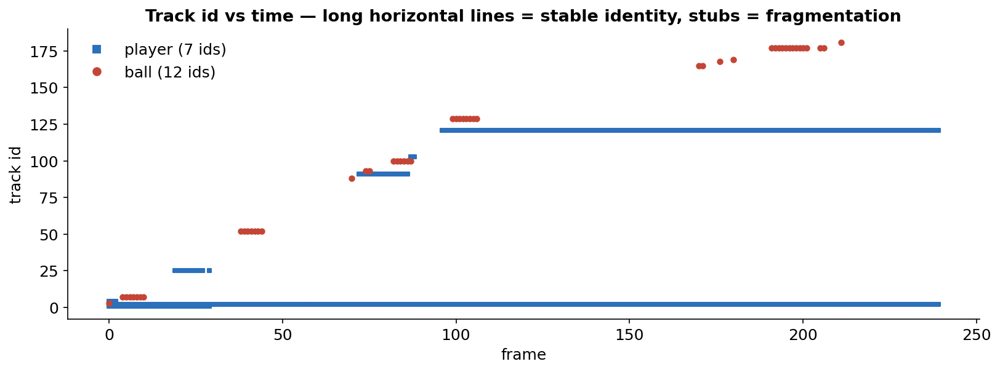

## The one-sentence difference

**Object detection** answers "what is in *this* frame?" — independently, every frame, with no memory of the frame before. **Tracking** answers "which object is *this*, and is it the same one I saw a moment ago?" — it adds a temporal layer on top of detection that links boxes across frames into *identities*.

That difference sounds small. It is the whole game when you move from images to video, and the cleanest place to feel it is a clip with two very different kinds of object in it:

- **Players** — slow, large, almost always on screen. The easy case.
- **The ball** — small, fast, and *frequently absent* (out of frame, behind a player, blurred past the detector). The hard case, and the one that matters if your real goal is to track something that comes and goes.

This post runs **one** detector — `YOLOv8l`, COCO-pretrained — two ways on the same 9.6 s clip, and measures exactly what the tracking layer buys you and where it falls apart.

> The clip is a short **padel** rally (the racquet sport; close enough to tennis for our purposes — a small fast ball plus players on an enclosed court). It's a 240-frame, 25 fps, 1920×1080 stock clip.

### How the two differ, in one picture

![Per-frame detection vs tracking. **Top:** object detection treats every frame independently — there is no link between frames, no identity, and a missed frame is simply a hole. **Bottom:** tracking wraps a loop around the detector — *detect* the boxes, *predict* where each tracked object goes next with a motion model, then *associate* the new detections with existing identities. A short miss (frame 4) is bridged by coasting the motion model, so the object keeps the same id (`#1`) when it re-appears. Everything in the rest of this post is a consequence of this one structural difference.](tracking-vs-od/outputs/how_tracking_works.svg)

## The setup

The key methodological choice: **hold the detector identical** so the only thing that changes between the two videos is the temporal association layer.

```python
from ultralytics import YOLO
model = YOLO("yolov8l.pt")
CLASSES = [0, 32]          # COCO: person, sports ball
CONF, IMGSZ = 0.25, 1280

# DETECTION — each frame is independent. No identity, no memory.
for r in model.predict(SRC, conf=CONF, classes=CLASSES, imgsz=IMGSZ, stream=True):
    boxes = r.boxes               # .xyxy, .conf, .cls   — but NO .id

# TRACKING — same detector, plus ByteTrack association across frames.
for r in model.track(SRC, conf=CONF, classes=CLASSES, imgsz=IMGSZ,
                     tracker="bytetrack.yaml", persist=True, stream=True):
    boxes = r.boxes               # now each box carries a persistent .id
```

ByteTrack ([Zhang et al., ECCV 2022](https://arxiv.org/abs/2110.06864)) is the classic baseline tracker: a Kalman-filter motion model per track, plus Hungarian matching of new detections to existing tracks by IoU. No appearance model — association is purely *where the box is* and *where the motion model predicts it should be*. That assumption is the hero of this story, and also its villain.

## Watch it first

Left: per-frame detection. Right: the same detections fed through ByteTrack — persistent id + a short motion trail. Same model, same frames.

<video controls muted loop playsinline width="100%">
  <source src="tracking-vs-od/outputs/compare_od_vs_track.mp4" type="video/mp4">
</video>

Two things to watch for:

1. **The players** get a colour and a number on the right and *keep* them. On the left they're just "player 0.93" every frame, with no thread connecting one frame to the next.
2. **The ball** flickers in and out on the left (the detector blinks). On the right it... mostly isn't there at all. That is not a rendering bug — it's the finding, and it's worth dwelling on.

## What detection alone gives you

Per-frame, the detector is doing fine on raw recall:

| Detection (per-frame) | value |
|---|--:|
| Ball found in | **173 / 240** frames (72%) |
| Ball on→off / off→on flickers | **39** |
| Longest ball absence gap | 14 frames (**0.56 s**) |
| Players per frame | 1–4 (mean 1.95) |

But every one of those 173 ball boxes is an *island*. The detector has no notion that the ball in frame 41 is "the same ball" as in frame 40 — there is no `.id`, no velocity, no expectation. When the ball blurs or goes behind a player, the box simply vanishes; when it reappears, a brand-new, unrelated box appears. Detection cannot tell you "the ball that was here is now *there*," and it cannot tell you "the ball is temporarily occluded" versus "there is no ball." It has no memory to reason with.


## What tracking adds — and it depends entirely on the object

Tracking is often described as "detection + ids." That undersells it and oversells it at the same time. What ByteTrack actually does is **filter the detections down to the ones it can explain temporally, and attach an identity to those.** Whether that's a gift or a tax depends on the object.

### Players: a clean win

For the players, tracking is pure upside. Every frame that had a player detection keeps it (**240/240**), and the players resolve into long, stable id lines — the dominant player holds id #1 across all 240 frames, the second settles onto a single id for the back half of the clip (the long horizontal lines below). The trail and the stable number are exactly what you want for any downstream task (who hit the ball, who covered which side, speed, distance).



There *are* seven player ids for what's really two-or-three people, so even the easy case isn't perfect — a player who walks off and returns, or is occluded long enough, comes back with a fresh id. Hold that thought; it's the same failure that wrecks the ball, just rarer.

### The ball: tracking makes it *worse* on recall

Here is the uncomfortable result. The detector found the ball in 173 frames. ByteTrack emits a confirmed ball id in only **50** frames — and splits even those across **12 distinct ids** for a single physical ball.

| ByteTrack on the ball | value |
|---|--:|
| Frames with a confirmed ball id | **50 / 240** (vs 173 detected) |
| Distinct ids for one ball | **12** |
| Longest single ball track | 13 frames (~0.5 s) |
| Ball reappearances after a blink that kept the same id | **1** of 12 |

Why does adding tracking *throw away* 123 of 173 ball detections? Because ByteTrack will not output a track until it has been *confirmed* by matching across consecutive frames. An isolated, one-frame ball detection that can't be linked to a neighbour never gets confirmed — it's treated as probable noise and suppressed. For a fast ball that the motion model keeps mispredicting, most detections are exactly these unlinkable islands. Tracking trades the detector's twitchy recall for identity it can stand behind — and for the ball, that trade costs most of the recall.

You can see it frame-by-frame over a single blink. The detector finds the ball in 5 of these 6 consecutive frames (top); ByteTrack shows nothing (bottom), because none of them got linked into a confirmed track:


## Why the ball breaks: it's association, not memory length

The instinct, once you see fragmentation, is to reach for the obvious knob: `track_buffer` — how many frames a "lost" track is kept alive waiting to be re-matched. Surely keeping tracks alive longer will bridge the gaps?

It does **nothing**. Sweeping `track_buffer` from 15 to 120 frames leaves the ball at exactly 50 frames and 12 ids:


The reason is the core of how motion-based tracking works. ByteTrack associates a new detection to an existing track by **IoU** between the detection and the track's Kalman-predicted box. A padel ball can cross a large fraction of the frame between two frames at 25 fps. After even a couple of missed frames, the Kalman prediction has coasted far from where the ball actually re-emerges, so the IoU between prediction and detection is ~**0**. No overlap → no match → the old track stays "lost" (uselessly, however long `track_buffer` keeps it) while the re-detected ball starts a *fresh* track with a new id.

`track_buffer` extends a track's *lifetime*. It does nothing for its *reach*. For fast, small, gappy objects the binding constraint is reach — and IoU has almost none.

## What actually helps: change how association works

The right lever is the **association mechanism**, not its timeout. Swapping ByteTrack for **BoT-SORT** ([Aharon et al., 2022](https://arxiv.org/abs/2206.14651)) — same detector, same thresholds — more than doubles ball recall (50 → 116 frames) and collapses the ball from 12 ids to 5. BoT-SORT adds **global motion compensation** (it estimates camera/scene motion with sparse optical flow and corrects the Kalman predictions for it) and a better motion formulation, so its predicted boxes land closer to where fast objects actually reappear → IoU clears threshold → matches happen.

Turning on **appearance ReID** (`with_reid: True`, matching tracks by a learned embedding, not just geometry) nudges it further — 125 ball-frames, 4 ids. Appearance lets the tracker say "this *looks like* the ball I lost" even when the geometry has drifted.

The same clip, three ways: per-frame detection, then the two trackers. Watch the **ball** — it barely survives under ByteTrack (middle) and is held far more often under BoT-SORT (right) — while the **players** are tracked cleanly by both. This is "tracking helps much more" made visible: the win is largest exactly where per-frame detection is weakest.

<video controls muted loop playsinline width="100%">
  <source src="tracking-vs-od/outputs/compare_3up.mp4" type="video/mp4">
</video>

::: {.callout-note appearance="simple"}
**The ladder of association**, weakest to strongest, for objects that move fast and vanish:

1. **IoU only** (ByteTrack) — needs boxes to overlap frame-to-frame. Great for pedestrians, hopeless for a struck ball.
2. **+ motion compensation** (BoT-SORT) — corrects predictions for camera/scene motion. The single biggest win here.
3. **+ appearance ReID** — match by what the object *looks like*, surviving geometric drift.
4. **+ object-specific priors** — e.g. [TrackNet](https://arxiv.org/abs/1907.03698) for sports balls models the ball's trajectory across 3 frames directly, instead of bolting a generic tracker onto a generic detector.
:::

## The bridge: tracking through real absence

Even the best setting here still gives 4 ids for one ball and misses ~half its frames. That gap *is* the next problem — and it's the one I actually care about: **tracking an object that is present in some frames and absent in others over a real motion video.**

Every tracker in this post handles short gaps by *coasting* a motion model and re-matching by position. That works for a 1–3 frame occlusion of a slow object. It fails the moment the object is gone *long enough that position is no longer a usable cue* — a ball that flies out of frame for a second, a player who leaves the court and returns, an object that ducks behind something and re-emerges across the scene. At that point geometry is useless and the only thing that can re-bind the identity is **appearance** — "is this the same-looking object I lost?" That's the **re-identification** problem, and it's a different beast from frame-to-frame tracking:

- **Short gap (occlusion):** motion model + buffer. Solved-ish — this is what ByteTrack/BoT-SORT do.
- **Long gap / re-entry:** appearance-based re-ID, or a memory of what the object looked like. This is where generic trackers stop and where the interesting work is.

For the "appears, disappears, comes back" regime specifically, the options worth reaching for are: BoT-SORT/Deep-OC-SORT with a real ReID model; query-based video models that carry an explicit object memory; or **promptable video segmentation** like SAM 2 / SAM 3, which propagate a *masklet* with a memory bank and are built to survive disappearance and re-appearance (I poked at exactly this on a similar clip in the [SAM 3 video tracking post](2025-12-23-sam3-video-tracking.ipynb)). For a ball specifically, a trajectory model (TrackNet-style) beats any of them because it encodes the physics.

## A mental model to keep

| | Object detection | Tracking |
|---|---|---|
| Question | "What's in this frame?" | "Which object is this, over time?" |
| Scope | One frame, independent | A sequence, linked |
| Output | boxes + classes | boxes + classes + **persistent id** |
| State | none (memoryless) | motion model (+ optional appearance) |
| Wins on | recall per frame | identity, trajectories, occlusion |
| Fails by | flicker, no identity | id switches / fragmentation |
| Breaks when | (it doesn't "track") | objects move fast or vanish long |

Detection without tracking gives you a bag of unlinked boxes. Tracking with a motion-only model gives you identities *for objects whose position is predictable*. Real motion video — things that come and go — needs the next rung up: appearance-based re-identification.

## Caveats

- **N = 1 clip.** One 9.6 s padel rally. The exact numbers (50, 12, 116) are illustrative, not benchmark figures; the *pattern* (slow object easy, fast/gappy object breaks; buffer useless, association decisive) is the transferable result.
- **COCO detector, not ball-specialised.** `YOLOv8l`'s `sports ball` class is generic. A detector fine-tuned on padel/tennis balls would lift the 72% detection rate and give every tracker more to work with — but the association problem on a fast small object remains.
- **No ground-truth MOT metrics.** Proper MOTA/IDF1/HOTA need hand-labelled tracks. "12 ids for one ball" is an unambiguous fragmentation proxy because there is exactly one ball; the player id counts are softer (no GT on how many distinct people).
- **ByteTrack suppression is a feature, not a bug.** The 173→50 drop is ByteTrack correctly refusing to vouch for unconfirmable detections. If you want every detection drawn, that's the per-frame detector's job — tracking is the layer that decides what's *trustworthy over time*.

## Reproduce

All four scripts are self-contained and read the clip already in the repo.

- [`extract.py`](https://github.com/nipunbatra/blog/tree/master/posts/tracking-vs-od/scripts/extract.py) — run detection and tracking passes, cache to JSON.
- [`metrics.py`](https://github.com/nipunbatra/blog/tree/master/posts/tracking-vs-od/scripts/metrics.py) — the numbers + the flicker / identity figures.
- [`visualize.py`](https://github.com/nipunbatra/blog/tree/master/posts/tracking-vs-od/scripts/visualize.py) — the side-by-side video, frame strip, stills.
- [`sweep.py`](https://github.com/nipunbatra/blog/tree/master/posts/tracking-vs-od/scripts/sweep.py) — the `track_buffer` sweep and ByteTrack vs BoT-SORT comparison.

## Links

- ByteTrack: [paper](https://arxiv.org/abs/2110.06864) · BoT-SORT: [paper](https://arxiv.org/abs/2206.14651) · [Ultralytics tracking docs](https://docs.ultralytics.com/modes/track/)
- TrackNet (sports-ball trajectory model): [paper](https://arxiv.org/abs/1907.03698)
- SAM 2 / SAM 3 promptable video segmentation: [my SAM 3 video tracking post](2025-12-23-sam3-video-tracking.ipynb)
- `supervision` (annotators + tracking utilities): [roboflow/supervision](https://github.com/roboflow/supervision)
- Survey of multi-object tracking: [Awesome-MOT](https://github.com/luanshiyinyang/awesome-multiple-object-tracking)
