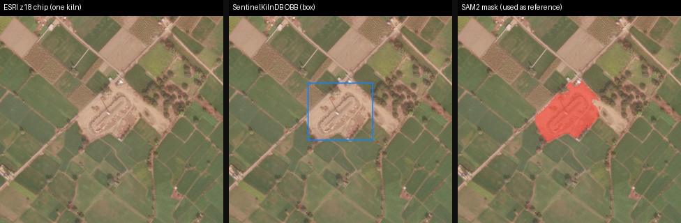
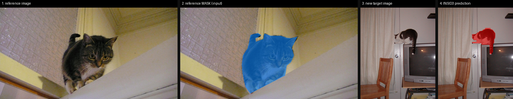
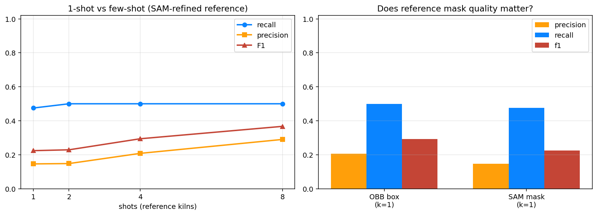
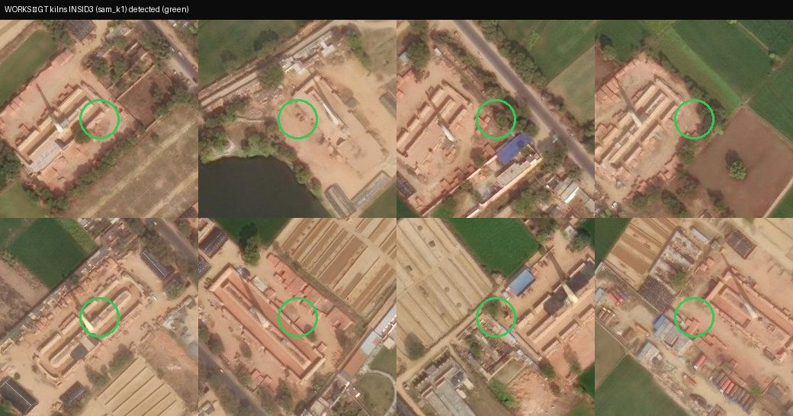

> **TL;DR.** With **one** labelled kiln and **zero training**, [INSID3](https://github.com/visinf/INSID3)
> segments **half of the 40 ground-truth kilns** (recall ~0.50) across a 5×5 km slice of
> Bulandshahr from 0.5 m ESRI imagery. Going from **1 → 8 reference kilns** barely moves
> recall but **nearly doubles precision** (0.15 → 0.29) — more references mostly *suppress
> false alarms*. Two honest surprises: (1) a **tight SAM2 mask reference slightly
> under-performed the raw oriented box**, because SAM leaked onto the surrounding field;
> (2) the **misses are not invisible kilns** — they are *dense clusters* where adjacent
> kilns merge into one blob, and most **false alarms are red-soil fields and brick-built
> villages** that share a kiln's texture.

## The question

Brick kilns are one of the most mapped-and-remapped objects in South-Asian remote
sensing — they are major sources of air pollution, they are everywhere across the
Indo-Gangetic plain, and labelling them is slow, manual GIS work. The usual recipe
is *supervised*: collect thousands of boxes, train a detector, hope it transfers
to the next district.

This post asks a deliberately lazy question:

> **Can I take a *single* labelled kiln, draw *zero* training curves, and segment
> kilns across an entire district of high-resolution imagery?**

The tool that makes this plausible is **[INSID3](https://github.com/visinf/INSID3)**
(*Training-Free In-Context Segmentation with DINOv3*, CVPR 2026 oral). You give it
a **reference image + reference mask** of one object, and a **target image**, and it
segments every instance of that object in the target — **no fine-tuning, no decoder
training**, just frozen [DINOv3](https://github.com/facebookresearch/dinov3)
features and some clever matching. INSID3 already reports results on aerial data
(iSAID), so brick kilns from above are squarely in scope.

The plan:

1. Take **one** kiln from **[SentinelKilnDB](https://huggingface.co/datasets/SustainabilityLabIITGN/SentinelKilnDB)** (NeurIPS 2025 D&B), turn its annotation into a clean mask, and use it as the *single* reference.
2. Pull **ESRI World Imagery at zoom 18** (~0.5 m/px) over a real district — **Bulandshahr, Uttar Pradesh** — and cut it into tiles.
3. Run INSID3 on every tile and aggregate the masks into kiln detections.
4. Check the detections against SentinelKilnDB's own ground truth, then push on: **1-shot vs few-shot**, **box vs mask references**, and **where it breaks**.

Everything ran on a single **RTX A5000**. All scripts are in
[`posts/kiln-insid3/scripts/`](https://github.com/nipunbatra/blog/tree/master/posts/kiln-insid3/scripts).

## The study area: Bulandshahr, and a 5 km AOI inside it

SentinelKilnDB is 114k Sentinel-2 tiles (10 m/px) labelled with oriented boxes for
three kiln types — **CFCBK** (circular), **FCBK** (oval), **Zigzag** (rectangular).
Each tile's filename is `{lat}_{lon}.png`, so every kiln comes with free GPS. I
read just the `image_name` + `dota_label` columns straight from the parquet (never
downloading the images), clipped to the **GADM Bulandshahr district polygon**, and
picked the densest ~5 km window as the Area of Interest.


```python
# read only the light columns from the HF parquet — no images downloaded
df = pd.read_parquet("hf://datasets/SustainabilityLabIITGN/SentinelKilnDB/test/test.parquet",
                     columns=["image_name", "dota_label"])
```

## The input nobody talks about: a *box* is not a *mask*

Here is the first real-world snag, and it matters. SentinelKilnDB (like most aerial
detection datasets) ships **oriented bounding boxes**, but INSID3 needs a
**segmentation mask** for its reference. An OBB rectangle is a lazy mask: for a
rectangular Zigzag kiln it is *almost* the footprint, but it still rakes in roads,
fields and tree-shadow at the corners — and those background pixels pollute the
reference prototype INSID3 builds.

So I turn each box into a tight mask with **SAM2** (box-prompted), and later I
*measure* whether that refinement actually helps.



## A reproducibility gotcha: the DINOv3 weights are gated

INSID3 loads DINOv3 via `torch.hub` and a local checkpoint in the *original* Meta
key layout (`cls_token`, `blocks.N.attn.qkv`). The official weights are **gated**
(license wall + 403 on the CDN). The only freely-mirrored checkpoints are in
**HuggingFace-transformers** key layout (`embeddings.*`, `layer.N.attention.q_proj`),
which `torch.hub` refuses with a wall of *missing/unexpected keys*.

The fix is a small, verifiable converter ([`00_convert_dinov3_weights.py`](https://github.com/nipunbatra/blog/tree/master/posts/kiln-insid3/scripts/00_convert_dinov3_weights.py)):
build the hub architecture with `pretrained=False` to get the correct **buffers**
(RoPE periods, the qkv bias-mask), remap the learned tensors (concatenate
`q/k/v → qkv`; k has no bias in HF and the original masks it anyway), merge, and
`load_state_dict(strict=True)`. The proof that it's right is functional — INSID3's
own cat demo segments the cat perfectly with the converted weights:



## One shot, one district

The reference is **one** kiln (chip + SAM mask) from *outside* the AOI. I tile the
AOI's ESRI z18 mosaic (9508×9537 px, **0.525 m/px**) into **169 overlapping 1024 px
targets** and run INSID3 on each — `set_reference(...)`, `set_target(tile)`,
`segment()`. Connected components of the predicted mask (≥ ~53 m, the smallest
plausible kiln) become detections, deduplicated across tile overlaps (within 70 m)
and matched to the **40** ground-truth kilns (within 100 m). Each tile takes ~1.3 s.

```python
from models import build_insid3
model = build_insid3(model_size="large", image_size=1024)   # frozen DINOv3-L, no training
model.set_reference("ref_kiln.jpg", "ref_kiln_sam.png")     # ONE labelled kiln
model.set_target("aoi_tile.jpg")
mask = model.segment()                                        # boolean kiln mask
```


From **one** SAM-masked kiln, INSID3 recovers **19 of 40** labelled kilns
(**recall 0.47**) — and with the raw oriented box as the reference instead,
**20 of 40** (**recall 0.50**). Half a district's labelled kilns, from a single
example and no training, is a genuinely strong starting point.

The catch is **precision against the labels: ~0.15–0.21** — there are 110-odd
extra detections. Two very different things are mixed into that number, and the
rest of the post pulls them apart: (a) **genuine confusion** with kiln-like land
cover, and (b) **real kilns the benchmark never labelled** (SentinelKilnDB is a
*tile-sampled* dataset, not a wall-to-wall census of this AOI).

## 1-shot vs few-shot: does more help?

INSID3 averages its reference prototype over all shots, so adding references is
cheap. I sweep **k = 1, 2, 4, 8** reference kilns (all from outside the AOI) and
also run the **box-vs-mask** ablation at k = 1.



| shots | detections | recall | precision | F1 |
|------:|-----------:|-------:|----------:|----:|
| 1 | 130 | 0.47 | 0.15 | 0.22 |
| 2 | 135 | 0.50 | 0.15 | 0.23 |
| 4 | 96  | 0.50 | 0.21 | 0.29 |
| 8 | 69  | 0.50 | **0.29** | **0.37** |

**Few-shot barely changes recall — it buys precision.** Recall is essentially
pinned at 0.50 from k = 2 onward; what changes is that the detector stops
over-firing (130 → 69 detections), so precision climbs 0.15 → 0.29 and F1 0.22 →
0.37. Intuition: INSID3 builds a *prototype* by averaging masked DINOv3 features
over the reference kilns. One reference carries that kiln's idiosyncrasies
(its exact soil colour, a neighbouring field); averaging over eight references
washes those out and tightens the "kiln" concept, killing spurious matches. The
kilns it *fundamentally* can't separate (the dense-cluster misses below) stay
missed no matter how many references you add — hence the recall plateau.

**The surprise: the box beat the mask.** I assumed a tight SAM2 footprint would be
a cleaner reference than a loose oriented box. At one shot it was the *opposite* —
the raw box scored higher on every metric (R 0.50/P 0.21 vs R 0.47/P 0.15). Looking
back at the reference, SAM2 — prompted on a single kiln embedded in fields — leaked
slightly **onto the surrounding field**, so the prototype absorbed field texture and
fired more often on fields. The lesson isn't "SAM is bad"; it's that **reference
mask quality matters, and 'add a segmentation model' is not automatically an
upgrade** — a sloppy mask can be worse than an honest box.

## Where it works, and where it breaks

The aggregate numbers hide *why* INSID3 succeeds or fails. Cropping the imagery
around the detected kilns, the missed kilns, and the false alarms makes it obvious
— and none of the three failure modes is "the model can't see kilns".

::: {layout-ncol=1}



:::

### So are the "false positives" actually wrong?

Precision against SentinelKilnDB is **unfair on its own**: the benchmark labels a
*sample* of tiles, not every kiln in the AOI, so a correct detection on an
unlabelled kiln is scored as a false positive. To separate genuine errors from
dataset gaps, I sampled the one-shot unmatched detections and looked at each.


Eyeballing the sample, **roughly a fifth** of the unmatched detections look like
real (unlabelled) kilns, and most of the rest are honest mistakes on kiln-coloured
fields and villages. So the truth is in between the two extremes: precision is
**better than the naive 0.15** once you credit the unlabelled kilns, but INSID3 at
one shot genuinely does **confuse red-soil agriculture and brick villages** with
kilns. Both halves of that sentence matter.

## What I'd do next (and honest caveats)

- **Instance-ify it.** The recall ceiling is a *counting* problem, not a *seeing*
  problem. A watershed/peak split on the similarity map, or running INSID3 on
  smaller tiles so clusters separate, should lift recall well past 0.50.
- **A cleaner reference.** Since the box beat the leaky SAM mask, the obvious move is
  a hand-checked tight mask (or a SAM prompt that's *constrained* to the kiln), and
  to pick the one reference kiln deliberately rather than at random.
- **Imagery vs label date.** The ESRI z18 basemap and the Sentinel-2 labels are from
  different times; a few labelled kilns have changed in the basemap, which nudges both
  recall and the "false" alarms.
- **Scope.** These numbers are for **western-UP Zigzag kilns at z18** over one 5×5 km
  AOI; CFCBK/FCBK shapes, other regions, and a wall-to-wall ground truth each deserve
  their own pass. Treat the precision numbers as *relative*, since the benchmark is
  tile-sampled, not exhaustive.

None of this needs a single training step — that's the whole point. One labelled
kiln gets you a working half-a-district detector in an afternoon, and every knob
above is a refinement on top of a frozen backbone.

## Reproduce

All scripts (`00`–`07`) are in
[`posts/kiln-insid3/scripts/`](https://github.com/nipunbatra/blog/tree/master/posts/kiln-insid3/scripts):
`00` DINOv3 HF→hub weight converter, `01`–`02` GT extraction + AOI/district map,
`03`/`03b`/`03c` ESRI z18 fetch + tiling + SAM2 reference masks, `04` the INSID3
1-/few-shot sweep, `05` metrics + figures, `06` qualitative grids, `07` the
false-positive spot-check. Everything ran on a **single RTX A5000**, no fine-tuning.
