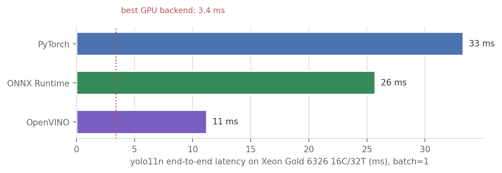

> **TL;DR.** Same YOLO11 weights, same RTX A5000, six ways to run them. Scored on **time,
> accuracy, and adoption cost** against the original `model.predict()` on the `.pt` file:
> **TensorRT FP16** is the clear winner — **~2× lower end-to-end latency** (7.5 → 3.8 ms for
> yolo11s), **4–5× faster on the network itself** (5.3 → 1.3 ms), **2.6× higher batched
> throughput** (472 → 1241 img/s), **zero accuracy loss**, for a one-time ~90 s engine build
> that is locked to this GPU model and TensorRT version. Four honest surprises: PyTorch's
> `half=True` does **nothing** at batch 1 (it pays only at batch ≥ 4); **TensorRT INT8 is
> strictly dominated by FP16** on the n/s models (slower *and* −0.02 to −0.05 mAP); **ONNX
> Runtime helps the nano but is slower than plain PyTorch on the medium**; and a
> **dynamic-batch engine costs 1.7×** at batch 1 vs a static one. Once TensorRT shrinks
> inference to 1.3 ms, **preprocessing + NMS are two-thirds of every frame** — the next
> milliseconds live outside the network.

## The question

You trained (or just downloaded) a YOLO model. You call `model.predict()` and it feels fast —
a few milliseconds on a decent GPU. Most people stop there.

But the *weights* and the *runtime that executes them* are two different choices, and the second
one is a knob that costs no retraining and no new data. The same `yolo11s.pt` can be executed by
PyTorch eager mode, by ONNX Runtime, or compiled into a TensorRT engine at FP32, FP16, or INT8.
Vendor benchmarks promise big multipliers at the fast end of that list. This post measures the
whole menu, holding everything else fixed, and scores every strategy on **three axes against the
original**:

1. **Time** — batch-1 latency and batched throughput.
2. **Accuracy** — does mAP survive the trip?
3. **Adoption cost** — what the strategy *demands*: code changes, new dependencies, build time,
   calibration data, and what you give up in portability.

## The contenders

| Strategy | What it is | Why it should be fast |
|---|---|---|
| **PyTorch FP32** | `model.predict()` on the `.pt` — the original | baseline: eager kernels, full precision |
| **PyTorch FP16** | same call, `half=True` | half precision on tensor cores; one flag |
| **ONNX Runtime (CUDA)** | graph exported to `.onnx`, run by ORT's CUDA provider | graph-level fusion + optimized kernels |
| **TensorRT FP32** | ONNX further compiled into a GPU-specific `.engine` | kernel auto-tuning *for this exact GPU* |
| **TensorRT FP16** | same, half precision | fusion + tensor cores |
| **TensorRT INT8** | same, 8-bit, calibrated on sample images | 8-bit tensor cores, least memory traffic |

The mental model: PyTorch executes the network **op by op**, each op a separate pre-compiled CUDA
kernel launch. ONNX Runtime first **rewrites the graph** (folds constants, fuses adjacent ops) and
then executes it. TensorRT goes furthest: it **compiles** the graph offline for one specific GPU,
trying multiple kernel implementations per layer and keeping the fastest, at a chosen precision.
The further right you go, the more build-time work, the less portability — and, usually, the more
speed.

The *entire* code delta between these strategies, thanks to ultralytics wrapping every backend
behind one API:

```python
from ultralytics import YOLO

model = YOLO("yolo11s.pt")                               # the original
model.predict(img, half=True)                            # strategy: FP16, one flag

model.export(format="onnx")                              # strategy: ONNX, one-time export
model.export(format="engine", half=True)                 # strategy: TensorRT FP16
model.export(format="engine", int8=True,
             data="coco128.yaml")                        # strategy: INT8 (needs calib images)

YOLO("yolo11s.engine").predict(img)                      # inference code: unchanged
```

## The setup

- **Hardware:** one NVIDIA RTX A5000 (24 GB, Ampere) in our lab server; Xeon Gold 6326
  (16C/32T) for the CPU section.
- **Software:** Python 3.11, torch 2.8.0+cu126, ultralytics 8.4.92, TensorRT 11.1 (cu12 build),
  onnxruntime-gpu 1.24.4, OpenVINO 2026.2. Driver CUDA 12.4.
- **Models:** YOLO11 n / s / m, COCO-pretrained, 640×640 throughout.
- **Latency protocol:** `model.predict()` on a pre-loaded image (ultralytics' `bus.jpg`; disk
  I/O excluded), 30 warmup + 200 timed calls, batch = 1. I report **medians**, and use
  ultralytics' own per-stage timers for the preprocess / inference / postprocess split.
- **Throughput protocol:** pure forward pass on a resident CUDA tensor with explicit
  `torch.cuda.synchronize()` — no image decode, no NMS — to isolate what the runtime actually
  accelerates.
- **Accuracy protocol:** mAP50-95 on COCO128 for every backend of every model.
- **Fairness rule:** every backend gets ultralytics' defaults — no per-backend tuning for
  anyone. All detectors returned the **same 5 detections** on the test image, INT8 included.

## Axis 1a: batch-1 latency


The same data for yolo11s, with the inference-only time that the runtimes actually compete on:

| yolo11s, batch=1 | end-to-end (ms) | vs original | inference only (ms) | vs original |
|---|--:|--:|--:|--:|
| PyTorch FP32 (original) | 7.54 | 1.0× | 5.27 | 1.0× |
| PyTorch FP16 | 7.84 | **0.96×** | 5.54 | 0.95× |
| ONNX Runtime | 7.33 | 1.03× | 4.78 | 1.10× |
| TensorRT FP32 | 4.87 | 1.55× | 2.45 | 2.15× |
| **TensorRT FP16** | **3.76** | **2.0×** | **1.30** | **4.1×** |
| TensorRT INT8 | 4.18 | 1.8× | 1.75 | 3.0× |

Three findings that vendor decks won't show you:

1. **`half=True` is a placebo at batch 1.** On all three models, PyTorch FP16 is marginally
   *slower* than FP32 (7.8 vs 7.5 ms on yolo11s). At batch 1 the GPU is nowhere near saturated —
   the time goes to kernel *launches*, not kernel *math* — so halving the math changes nothing,
   and the input/output casts add a little. Hold this thought until the batching section, where
   the same flag becomes a 1.6× win.
2. **INT8 is *slower* than FP16 for yolo11n and yolo11s** (3.82 vs 3.41, 4.18 vs 3.76 ms), and
   only reaches parity on yolo11m (4.73 vs 4.85 ms). TensorRT 11 quantizes via explicit
   quantize/dequantize nodes, and for small networks at 640 px their overhead eats the 8-bit
   savings on Ampere. "INT8 = fastest" is not a law; it's a hypothesis to test on your model,
   your GPU.
3. **ONNX Runtime's value depends on model size**: 1.6× on the nano, a wash on the small,
   **0.8× (slower than the original!) on the medium.** Its CUDA kernels beat eager PyTorch on
   launch-bound tiny models but lose on compute-bound bigger ones.

And the headline I did not expect when I started: **yolo11m on TensorRT FP16 (4.85 ms) is faster
end-to-end than yolo11n on vanilla PyTorch (7.22 ms)** — while scoring +0.12 mAP50-95. The
runtime choice outweighs *two* model-size steps. If you picked the nano because the small felt
too slow, you may have paid accuracy for speed that a one-line export would have bought for free.

## Where the milliseconds actually go


This is Amdahl's law with a bounding box. TensorRT FP16 makes the *network* 4.1× faster, but the
`predict()` call only gets 2.0× faster, because ~2.2 ms of every frame is spent outside the
network — resizing and normalizing the image, and running NMS on the raw predictions. Once
inference costs 1.3 ms, **the model is no longer the bottleneck; the pipeline is.**

Two practical corollaries:

- Below ~4 ms of end-to-end budget, further *model* optimization (INT8, pruning, a smaller
  model) buys almost nothing. The next wins are pipeline wins: GPU-side preprocessing (e.g.
  DALI), batching the NMS, or exporting with NMS fused *into* the engine (`nms=True`).
- This is why "up to N× faster" claims and your stopwatch disagree: the N× is the blue segment,
  your stopwatch times the whole bar.

## Axis 1b: throughput, and PyTorch FP16's redemption

Batch-1 latency is the streaming-camera number. If you are chewing through a folder of images or
a recorded video, what matters is **images per second at the best batch size** — so here is the
pure GPU forward pass (no NMS, no preprocessing) for yolo11s, batch 1 → 32:

![Pure forward-pass throughput vs batch size, yolo11s, RTX A5000. TensorRT FP16 (red) leads everywhere and peaks at 1241 img/s. PyTorch FP16 (solid blue) is indistinguishable from FP32 (dashed blue) until batch 4, then pulls away to a 1.65× win — precision pays only once there is enough parallel work. ONNX Runtime on a dynamic-shape graph (green) *degrades* with batch size. The open diamond: the same TensorRT FP16 model compiled as a static batch-1 engine is 1.7× faster at batch 1 than the dynamic-batch engine.](yolo-speed/outputs/throughput_batch.png)

| yolo11s, pure forward | batch 1 | batch 32 (peak) |
|---|--:|--:|
| PyTorch FP32 (original) | 205 img/s | 472 img/s |
| PyTorch FP16 | 197 img/s | **778 img/s** |
| ONNX Runtime (dynamic) | 145 img/s | 131 img/s (peak 180 @ b4) |
| TensorRT FP16 (dynamic) | 459 img/s | **1241 img/s** |
| TensorRT FP16 (static b=1) | **771 img/s** | — |

- **The `half=True` story completes**: useless at batch 1, +65% at batch 32. FP16 needs
  saturation to matter. If you serve single frames, skip the flag; if you batch, take it — it's
  still free.
- **Shape flexibility has a price.** The dynamic-batch TensorRT engine does 459 img/s at batch 1;
  a static batch-1 engine of the *same model at the same precision* does 771 img/s — **1.7×**.
  TensorRT tunes kernels for the shapes you promise it; promise less, get more. If your batch
  size is fixed in production, build a static engine for exactly that shape.
- **ONNX Runtime collapses on the dynamic graph** — throughput *falls* as batch grows (180 →
  131 img/s), 9.5× behind TensorRT at batch 32. With static shapes (the batch-1 latency test
  above) it behaves; dynamic shapes are its unhappy path, at least with default session options.
  A tuned ORT setup (IO binding, its own TensorRT execution provider) would close some of this
  gap — but "needs tuning" is itself an adoption cost, and everyone here got defaults.

## Axis 2: does the fast path cost accuracy?


(COCO128 is a 128-image slice of COCO *train*, so the absolute values are optimistic; what
matters here is the *relative* drop across backends of identical weights — which is exactly what
precision changes affect.)

- **FP16 is free.** Across all three models and both FP16 backends, mAP moves by at most ±0.005
  — noise. Combined with the speed results: there is **no accuracy reason to ever run TensorRT
  at FP32** for these models.
- **INT8's tax is real and biggest where you'd want it most.** The nano loses 0.048 mAP50-95
  (~10% relative). Small models have less redundancy to absorb quantization error. Put together
  with Axis 1 — INT8 was also *slower* than FP16 on n/s — and the verdict on this GPU is blunt:
  **TensorRT INT8 is strictly dominated by TensorRT FP16 for yolo11n/s: slower AND less
  accurate.** For yolo11m it buys 0.1 ms for 0.016 mAP — still a bad trade in most settings.
  (A larger, more careful calibration set than my 128 train images would likely shrink the mAP
  gap somewhat; it cannot fix "not faster.")

## Axis 3: what adopting each strategy actually takes

Speed and accuracy tell you what you *get*. Here is what each strategy *demands* — the axis that
never makes it into benchmark charts. Build times and artifact sizes are measured
(`exports.json`), for yolo11s:

| Strategy | Code change | New dependencies | One-time build | Artifact | Runs on | Accuracy risk | Payoff (e2e / peak throughput) |
|---|---|---|--:|--:|---|---|---|
| PyTorch FP32 (original) | — | — | — | 19 MB `.pt` | anywhere PyTorch runs | — | 1.0× / 472 img/s |
| PyTorch FP16 | `half=True` | none | none | same `.pt` | any modern NVIDIA GPU | none (±0.001) | 1.0× / 778 img/s |
| ONNX Runtime | 1-line export, once | `onnx`, `onnxslim`, `onnxruntime-gpu` | ~1–2 s | 38 MB `.onnx` | ~any platform with an ORT build | none | 1.0–1.6× / 180 img/s |
| TensorRT FP32 | 1-line export, once | `tensorrt-cu12` (+`nvidia-modelopt`) | 83 s | 46 MB `.engine` | **this GPU model + this TRT version only** | none | 1.5× / — |
| **TensorRT FP16** | 1-line export, once | same | **90 s** (159 s dynamic) | 22 MB `.engine` | same lock-in | none | **2.0× / 1241 img/s** |
| TensorRT INT8 | export + **calibration images** | same | 146 s | 15 MB `.engine` | same lock-in | **−0.02 to −0.05 mAP** | 1.8× (≤ FP16) |
| OpenVINO (CPU) | 1-line export, once | `openvino` | 4 s | 11 MB dir | any x86 CPU | not re-measured here | 3.0× vs PyTorch CPU |

The non-obvious costs, in words:

- **The `.engine` file is a compilation artifact, not a model.** It is specific to the GPU
  architecture it was built on *and* the TensorRT major version that built it. New GPU model →
  rebuild. TensorRT upgrade → rebuild. Ship to a fleet of mixed GPUs → one build per GPU type.
  The ~90 s is per model × per precision × per shape profile × per GPU type. (My full 10-engine
  build for this post: ~21 GPU-minutes.)
- **INT8 additionally demands data** — representative calibration images. That's a small
  pipeline to maintain, and a silent way to go stale as your deployment domain drifts.
- **ONNX is the portability sweet spot**: a 2-second export to an artifact that runs on NVIDIA,
  CPUs, mobile — but as Axis 1 showed, on this GPU its *speed* is only worth it for small models.

::: {.callout-warning appearance="simple"}
**The install log they don't show you (mid-2026 edition).** Getting the fast lane running on a
CUDA 12.4-driver machine took four non-obvious fixes, each failing late and cryptically:

1. `pip install tensorrt` now silently resolves to **CUDA-13 wheels** that an R550 driver cannot
   load — you want `tensorrt-cu12`.
2. TensorRT ≥ 11 removed implicit quantization, so ultralytics builds FP16/INT8 engines through
   **`nvidia-modelopt`** — which it auto-installs by shelling out to pip… which **doesn't exist
   in a `uv` venv** by default.
3. modelopt requires **torch ≥ 2.8** and will happily drag in a `+cu130` torch your driver can't
   use; pin `torch==2.8.0 torchvision==0.23.0` from the cu126 index, *last*.
4. onnxruntime-gpu finds cuDNN via `LD_LIBRARY_PATH`; when it doesn't, it **silently falls back
   to CPU** while still *listing* CUDA as available — verify with `session.get_providers()`
   after creating a real session, never with `get_available_providers()`.

None of this is hard once you know it; all of it is part of the true cost of the fast lane.
The working recipe is in [`setup_env.sh`](https://github.com/nipunbatra/blog/tree/master/posts/yolo-speed/scripts/setup_env.sh).
:::

## No GPU? The CPU story, briefly

Same protocol, yolo11n on the host Xeon (PyTorch capped at 8 threads by ultralytics' default;
ORT and OpenVINO manage their own pools):



The ordering repeats, amplified: the vendor-optimized runtime (Intel's OpenVINO, on an Intel
CPU) is **3× faster than eager PyTorch** — from a 4-second export. A 30 fps nano detector on a
plain Xeon is entirely practical; and if your "GPU plan" was PyTorch eager on a nano, know that
a well-run CPU gets within 1.6× of it.

## What I'd actually do

::: {.callout-note appearance="simple"}
**Decision rules from these numbers:**

- **Streaming, single camera, NVIDIA GPU** → TensorRT FP16, **static** engine at your exact
  shape. 2× end-to-end now, and your next win is pipeline work (fused NMS, GPU preprocessing),
  not more model compression.
- **Offline / batched processing** → TensorRT FP16 dynamic engine at batch ≥ 16 (2.6× throughput).
  Can't take the TensorRT dependency? `half=True` + batching gets you 62% of its throughput
  for literally zero effort.
- **Must run on heterogeneous / unknown hardware** → ONNX. Portability is its product;
  treat any GPU speedup as a bonus, and benchmark per model size — it can be *slower* than
  PyTorch (yolo11m here).
- **CPU-only** → OpenVINO, no contest (3× over PyTorch).
- **INT8** → only after FP16 is proven insufficient, only with a real calibration set, and only
  if measurement on *your* GPU + model shows it winning. Here it lost to FP16 on both axes for
  two of three models.
- **Whatever you pick: re-run a val set through the exported artifact** (one `model.val()` call)
  before shipping. Accuracy surviving the export is an empirical claim, not a guarantee.
:::

## Caveats

- **One GPU, one architecture.** A5000 = Ampere. On Ada/Hopper/Blackwell the FP8/INT8 tensor-core
  story is different and INT8 may well win where it lost here. The *method* transfers; the
  verdicts are per-GPU.
- **One test image for latency.** NMS time depends on how many boxes a scene produces; `bus.jpg`
  (5 detections) is easy. Crowded scenes shift the postprocess share up — strengthening, not
  weakening, the Amdahl point.
- **COCO128 for accuracy** is 128 *training* images: inflated absolute mAP, small sample. Fine
  for backend-relative deltas; do not quote the absolute values. A proper COCO val run (or your
  own val set) is the pre-ship check.
- **`predict()` includes Python-loop overhead** (~1–1.5 ms) that a C++ / Triton / DeepStream
  deployment wouldn't pay. Pure-runtime gaps are bigger than the end-to-end ones — see the
  throughput section.
- **Defaults for everyone.** ORT without IO-binding/TRT-EP tuning, TensorRT with default
  workspace, OpenVINO in latency mode, torch CPU capped at ultralytics' 8 threads. Tuning any
  backend moves its numbers; tuning is also adoption cost.
- **INT8 calibration used 128 train images** — the lazy path. More/better calibration data
  typically recovers some mAP; it does not change that INT8 was not faster than FP16 here.

## Reproduce

Everything ran on one RTX A5000; total compute ≈ 45 GPU-minutes, half of it engine builds.
Scripts in [`posts/yolo-speed/scripts/`](https://github.com/nipunbatra/blog/tree/master/posts/yolo-speed/scripts):

- [`setup_env.sh`](https://github.com/nipunbatra/blog/tree/master/posts/yolo-speed/scripts/setup_env.sh) — the environment, including the four landmine fixes.
- [`export_all.py`](https://github.com/nipunbatra/blog/tree/master/posts/yolo-speed/scripts/export_all.py) — every artifact (ONNX static/dynamic, TensorRT FP32/FP16/INT8 × n/s/m, OpenVINO), with build times → `exports.json`.
- [`bench_latency.py`](https://github.com/nipunbatra/blog/tree/master/posts/yolo-speed/scripts/bench_latency.py) — batch-1 `predict()` latency with per-stage split.
- [`bench_batch.py`](https://github.com/nipunbatra/blog/tree/master/posts/yolo-speed/scripts/bench_batch.py) — pure-forward throughput vs batch size, incl. the static-vs-dynamic engine comparison.
- [`bench_accuracy.py`](https://github.com/nipunbatra/blog/tree/master/posts/yolo-speed/scripts/bench_accuracy.py) — mAP50-95 on COCO128 per backend.
- [`bench_cpu.py`](https://github.com/nipunbatra/blog/tree/master/posts/yolo-speed/scripts/bench_cpu.py) — the CPU shootout.
- [`visualize.py`](https://github.com/nipunbatra/blog/tree/master/posts/yolo-speed/scripts/visualize.py) — all figures from the result JSONs (also in [`outputs/`](https://github.com/nipunbatra/blog/tree/master/posts/yolo-speed/outputs)).

## Links

- [Ultralytics export docs](https://docs.ultralytics.com/modes/export/) · [TensorRT integration guide](https://docs.ultralytics.com/integrations/tensorrt/) (their T4 benchmarks make a nice cross-GPU comparison to these A5000 numbers)
- [TensorRT](https://developer.nvidia.com/tensorrt) · [ONNX Runtime CUDA provider](https://onnxruntime.ai/docs/execution-providers/CUDA-ExecutionProvider.html) · [OpenVINO](https://docs.openvino.ai/)
- [nvidia-modelopt](https://github.com/NVIDIA/TensorRT-Model-Optimizer) — the explicit-quantization toolchain TensorRT ≥ 11 exports go through
- Related posts: [Detection Has No Memory (YOLO + ByteTrack)](2026-06-06-detection-vs-tracking.qmd) — what tracking adds on top of detection; this post is about making the detection itself cheap.
